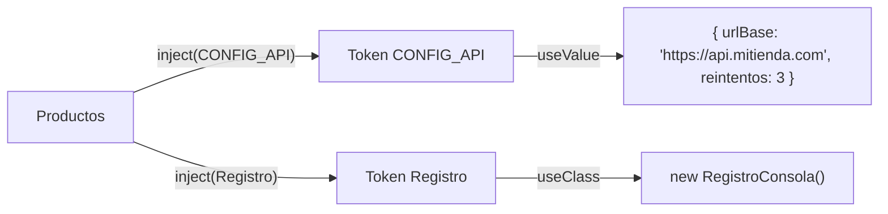

Tu servicio de productos necesita saber la dirección del servidor: `https://api.mitienda.com`. No quieres escribirla dentro del servicio, porque en pruebas será otra. Tampoco es una clase: es un simple objeto de configuración. ¿Cómo se lo das a Angular para que lo inyecte? Y si mañana quieres que el registro de mensajes escriba en la consola en desarrollo pero no en producción, ¿cómo cambias la pieza sin tocar a quien la usa?

La respuesta está en los **proveedores**: las recetas que el inyector sigue.

> [!analogia]
> Un proveedor es una entrada de un catálogo de recambios: «cuando alguien pida la pieza **X** (el *token*), entrégale **esto**». Lo de la derecha puede ser una pieza fija, una pieza de otra marca compatible o una máquina que la fabrica en el momento.

## La forma larga de un proveedor

Cuando escribes `providers: [Contador]`, en realidad es una abreviatura de:

```typescript
providers: [{ provide: Contador, useClass: Contador }]
```

- `provide`: el **token**, la «etiqueta» con la que se pide la pieza (`inject(Contador)`).
- `useClass`, `useValue`, `useFactory` o `useExisting`: **cómo** se obtiene.

| Receta | Qué entrega | Ejemplo |
| --- | --- | --- |
| `useClass` | Una instancia de **otra** clase | `{ provide: Registro, useClass: RegistroConsola }` |
| `useValue` | Un valor ya hecho | `{ provide: LOCALE_ID, useValue: 'es' }` |
| `useFactory` | Lo que devuelva una función | `{ provide: Registro, useFactory: () => isDevMode() ? new RegistroConsola() : new RegistroSilencioso() }` |
| `useExisting` | Lo mismo que otro token (un alias) | `{ provide: RegistroAntiguo, useExisting: Registro }` |

## Tokens que no son clases: `InjectionToken`

Para inyectar un objeto, un texto o un número necesitas un token, y una interfaz de TypeScript no sirve (desaparece al compilar). Para eso existe `InjectionToken`:

```typescript
// src/app/config-api.ts
import { EnvironmentProviders, InjectionToken, makeEnvironmentProviders } from '@angular/core';

export interface ConfigApi {
  urlBase: string;
  reintentos: number;
}

export const CONFIG_API = new InjectionToken<ConfigApi>('CONFIG_API');

export function provideConfigApi(config: ConfigApi): EnvironmentProviders {
  return makeEnvironmentProviders([{ provide: CONFIG_API, useValue: config }]);
}
```

- `new InjectionToken<ConfigApi>('CONFIG_API')`: crea un token único. El tipo entre `< >` hace que `inject(CONFIG_API)` devuelva un `ConfigApi` bien tipado. El texto solo aparece en los mensajes de error.
- `provideConfigApi(...)`: una **función `provide*`**, la forma moderna de empaquetar proveedores. Es lo mismo que hacen `provideRouter()` o `provideHttpClient()`.
- `makeEnvironmentProviders(...)`: marca la lista como proveedores «de entorno», que solo se pueden usar en `appConfig` (o en rutas, módulo 11), no en un componente.

## Cambiar una pieza por otra: `useClass` con una clase abstracta

```typescript
// src/app/registro.ts
export abstract class Registro {
  abstract escribir(mensaje: string): void;
}

export class RegistroConsola implements Registro {
  escribir(mensaje: string): void {
    console.log('[registro]', mensaje);
  }
}

export class RegistroSilencioso implements Registro {
  escribir(_mensaje: string): void {}
}
```

Una **clase abstracta** define qué métodos hay sin implementarlos, y además existe en tiempo de ejecución, así que sirve de token. Quien usa el registro solo conoce `Registro`:

```typescript
// src/app/productos.ts
import { Service, inject } from '@angular/core';
import { CONFIG_API } from './config-api';
import { Registro } from './registro';

@Service()
export class Productos {
  private readonly config = inject(CONFIG_API);
  private readonly registro = inject(Registro);

  url(ruta: string): string {
    this.registro.escribir('Pidiendo ' + ruta);
    return this.config.urlBase + ruta;
  }
}
```

Y en `appConfig` decides qué piezas reales se usan:

```typescript
// src/app/app.config.ts
import { ApplicationConfig, provideBrowserGlobalErrorListeners } from '@angular/core';
import { provideRouter } from '@angular/router';
import { routes } from './app.routes';
import { provideConfigApi } from './config-api';
import { Registro, RegistroConsola } from './registro';

export const appConfig: ApplicationConfig = {
  providers: [
    provideBrowserGlobalErrorListeners(),
    provideRouter(routes),
    provideConfigApi({ urlBase: 'https://api.mitienda.com', reintentos: 3 }),
    { provide: Registro, useClass: RegistroConsola },
  ],
};
```



Un componente que muestre `productos.url('/libros')` pinta:

```pantalla
@url localhost:4200/
<p>https://api.mitienda.com/libros</p>
```

Y en la consola aparece `[registro] Pidiendo /libros`. Para silenciarlo basta con cambiar **una línea** de `appConfig`: `useClass: RegistroSilencioso`. `Productos` no se toca.

## Tokens con valor por defecto

Un `InjectionToken` puede traer su propia receta, como un `@Service()`:

```typescript
export const NOMBRE_TIENDA = new InjectionToken<string>('NOMBRE_TIENDA', {
  providedIn: 'root',
  factory: () => 'Mi tienda',
});
```

Si nadie lo provee, `inject(NOMBRE_TIENDA)` devuelve `'Mi tienda'`. Si alguien pone `{ provide: NOMBRE_TIENDA, useValue: 'Forja Shop' }`, gana ese.

Con `@Service()` puedes hacer lo mismo en una clase: la opción `factory` le da su receta por defecto. Así `Registro` funciona aunque nadie lo provea en `appConfig`:

```typescript
// src/app/registro.ts
import { Service, isDevMode } from '@angular/core';

@Service({ factory: () => (isDevMode() ? new RegistroConsola() : new RegistroSilencioso()) })
export abstract class Registro {
  abstract escribir(mensaje: string): void;
}
```

`isDevMode()` devuelve `true` con `ng serve` y `false` en una compilación de producción. Si `appConfig` provee `Registro`, ese proveedor gana a la `factory`.

> [!cuidado]
> No inyectes una interfaz: `inject(ConfigApi)` no compila, porque las interfaces no existen cuando el código se ejecuta. Usa un `InjectionToken` o una clase abstracta. Y si dos proveedores usan el mismo token en el mismo inyector, gana **el último** de la lista.

> [!prueba]
> En tu proyecto, crea `NOMBRE_TIENDA` con su `factory` y muéstralo en `App` con `protected readonly nombre = inject(NOMBRE_TIENDA)`. Después añade `{ provide: NOMBRE_TIENDA, useValue: 'Mi tienda de prueba' }` a `appConfig` y guarda: el título cambia.

> [!resumen]
> - Un proveedor une un token con una receta: `useClass`, `useValue`, `useFactory` o `useExisting`.
> - `InjectionToken<T>` sirve para inyectar valores que no son clases, como una configuración.
> - Una clase abstracta como token permite cambiar la implementación sin tocar a quien la usa.
> - Las funciones `provide*` empaquetan proveedores para `appConfig`.
