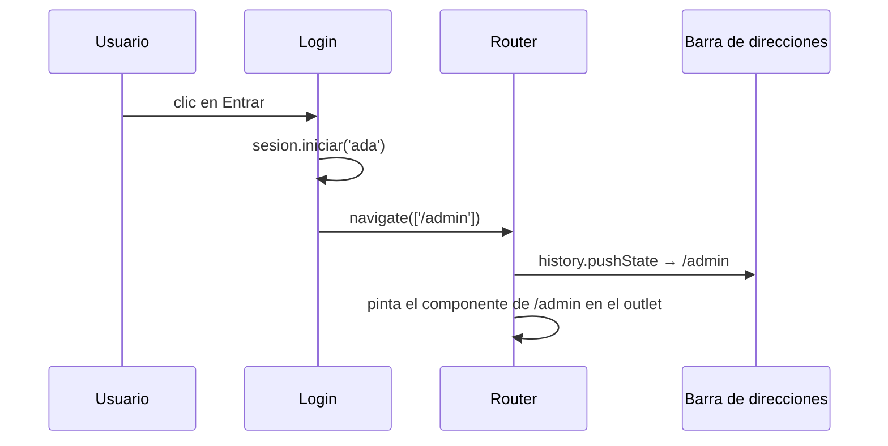

Ya tienes dos páginas, pero para cambiar de una a otra hay que escribir en la barra de direcciones. Necesitas un menú. Tu primer impulso será escribir `<a href="/productos">`… y funcionará, pero **mal**: cada clic recarga toda la aplicación desde cero, se pierde el estado (el carrito vacío otra vez) y se vuelve a descargar todo. Hay que pedirle al router que navegue **sin recargar**.

> [!analogia]
> `href` es salir del edificio por la puerta y volver a entrar por recepción: te piden la identificación otra vez. `routerLink` es tomar el ascensor interno: llegas a otra planta sin salir.

## `routerLink`: enlaces que no recargan

```typescript
// src/app/app.ts
import { Component } from '@angular/core';
import { RouterLink, RouterLinkActive, RouterOutlet } from '@angular/router';

@Component({
  selector: 'app-root',
  imports: [RouterLink, RouterLinkActive, RouterOutlet],
  template: `
    <nav>
      <a routerLink="/" routerLinkActive="activo" [routerLinkActiveOptions]="{ exact: true }">Inicio</a>
      <a routerLink="/productos" routerLinkActive="activo" ariaCurrentWhenActive="page">Productos</a>
    </nav>
    <router-outlet />
  `,
  styles: `.activo { font-weight: bold; }`,
})
export class App {}
```

Línea a línea:

- `RouterLink`, `RouterLinkActive`: dos directivas de `@angular/router`. Como toda directiva, se importan en TypeScript y en `imports`.
- `routerLink="/productos"`: la directiva rellena el `href` real (para que funcione «abrir en otra pestaña» y los lectores de pantalla) **y** escucha el clic: cancela la recarga y le pide al router que navegue.
- `routerLinkActive="activo"`: pone la clase `activo` en el enlace cuando su ruta es la actual. Perfecto para resaltar la sección en el menú.
- `[routerLinkActiveOptions]="{ exact: true }"`: sin esto, el enlace de `/` estaría activo **siempre**, porque toda dirección empieza por `/`. Con `exact`, solo cuando la dirección es exactamente `/`.
- `ariaCurrentWhenActive="page"`: añade `aria-current="page"` al enlace activo, para que los lectores de pantalla anuncien «página actual».

Estando en el catálogo:

```pantalla
@url localhost:4200/productos
<nav><a href="/">Inicio</a> · <a href="/productos" class="activo" aria-current="page"><b>Productos</b></a></nav>
<h1>Catálogo</h1>
```

Pulsas **Inicio** y la barra cambia sin recargar:

```pantalla
@url localhost:4200/
<nav><a href="/" class="activo"><b>Inicio</b></a> · <a href="/productos">Productos</a></nav>
<h1>Bienvenida a la tienda</h1>
```

## Rutas absolutas y relativas

- `routerLink="/productos"` (con barra): **absoluta**, desde la raíz.
- `routerLink="pedidos"` (sin barra): **relativa** a la ruta del componente donde está el enlace. Dentro de `/admin`, lleva a `/admin/pedidos`. La usarás con las rutas hijas (lección 4).
- `[routerLink]="['/productos', producto.id]"`: un array de **segmentos** que el router une con `/`. Ideal cuando parte de la dirección es un dato (lección 3).

## Navegar desde el código: `Router`

A veces la navegación no la provoca un enlace, sino tu lógica: tras iniciar sesión, tras guardar un formulario… Para eso se inyecta el servicio `Router`:

```typescript
// src/app/login/login.ts
import { Component, inject } from '@angular/core';
import { Router } from '@angular/router';
import { Sesion } from '../sesion';

@Component({
  selector: 'app-login',
  template: `<button (click)="entrar()">Entrar</button>`,
})
export class Login {
  private readonly sesion = inject(Sesion);
  private readonly router = inject(Router);

  entrar(): void {
    this.sesion.iniciar('ada');
    this.router.navigate(['/admin']);
  }
}
```

- `inject(Router)`: `provideRouter` registró este servicio en el inyector raíz, así que cualquier componente puede pedirlo (módulo 10).
- `this.router.navigate(['/admin'])`: navega con un array de segmentos, como `[routerLink]`. También existe `navigateByUrl('/admin')`, que recibe la dirección como texto.

Ambos devuelven una `Promise<boolean>`: `true` si la navegación terminó y `false` si algo la impidió (por ejemplo, un guard, lección 5).



`history.pushState` es la función del navegador que cambia la dirección **y** añade una entrada al historial sin recargar. Por eso el botón **Atrás** sigue funcionando.

> [!cuidado]
> No uses `href` para navegar dentro de tu app. Funciona, pero recarga la página entera: se pierde el estado de los servicios y el usuario ve un parpadeo. Reserva `href` para enlaces a **otras** webs. Y si `routerLink` no hace nada, revisa que `RouterLink` esté en `imports`: sin la directiva, el atributo es solo texto.

> [!prueba]
> En tu proyecto, pon un menú con un enlace `href="/productos"` y otro con `routerLink="/productos"`. Abre las herramientas del navegador (F12), pestaña **Red** (*Network*), y pulsa cada uno: el `href` vuelve a descargarlo todo; el `routerLink`, nada.

> [!resumen]
> - `routerLink` navega sin recargar y rellena el `href` real.
> - `routerLinkActive` pone una clase al enlace de la ruta actual (con `exact: true` para `/`).
> - Con barra inicial, el enlace es absoluto; sin ella, relativo a la ruta actual.
> - `inject(Router)` y `navigate([...])` navegan desde el código.
