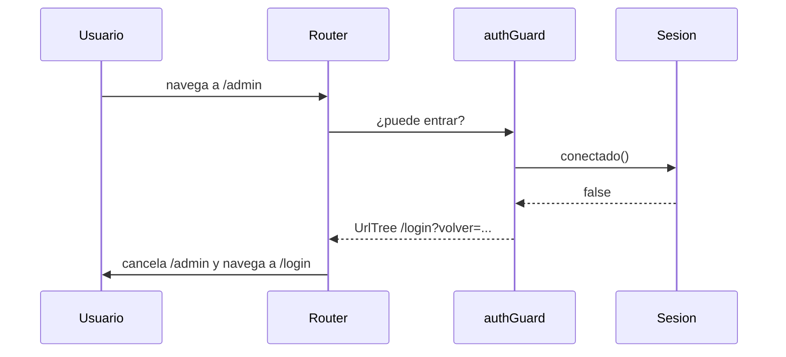

Cualquiera que escriba `/admin` en la barra de direcciones entra al panel, aunque no haya iniciado sesión. Alguien que está a mitad de rellenar un formulario pulsa un enlace sin querer y pierde todo. Y la ficha de producto aparece vacía durante medio segundo mientras llegan los datos. El router tiene tres herramientas para intervenir **durante** la navegación: los **guards** (guardias) que dejan pasar o no, y los **resolvers** que preparan datos antes de mostrar la página.

> [!analogia]
> Un guard es el portero de una discoteca: antes de dejarte entrar mira tu entrada; si no la tienes, te manda a la taquilla. Un resolver es el camarero que te sienta cuando la mesa ya está puesta, en lugar de sentarte y luego traer los cubiertos.

## Un guard funcional con `ng generate guard`

```bash
ng generate guard auth
CREATE src/app/auth-guard.spec.ts (460 bytes)
CREATE src/app/auth-guard.ts (128 bytes)
```

La CLI te pregunta qué tipo de guard quieres (por defecto, `CanActivate`) y genera una **función**, no una clase:

```typescript
// src/app/auth-guard.ts (tal como lo crea la CLI)
import { CanActivateFn } from '@angular/router';

export const authGuard: CanActivateFn = (route, state) => {
  return true;
};
```

Fíjate: archivo `auth-guard.ts`, constante `authGuard` en *camelCase* (empieza en minúscula), porque es una función. Lo completamos:

```typescript
// src/app/auth-guard.ts
import { inject } from '@angular/core';
import { CanActivateFn, Router } from '@angular/router';
import { Sesion } from './sesion';

export const authGuard: CanActivateFn = (route, state) => {
  const sesion = inject(Sesion);
  const router = inject(Router);
  if (sesion.conectado()) {
    return true;
  }
  return router.createUrlTree(['/login'], { queryParams: { volver: state.url } });
};
```

- `CanActivateFn`: el tipo de un guard que decide si se puede **activar** (entrar a) una ruta. Recibe `route` (la ruta que se intenta abrir) y `state` (el estado completo, con `state.url`, la dirección de destino).
- `inject(Sesion)`, `inject(Router)`: los guards se ejecutan en un **contexto de inyección** (módulo 10), así que pueden pedir servicios.
- `return true`: deja pasar.
- `router.createUrlTree(['/login'], ...)`: devolver un `UrlTree` (una dirección ya construida) significa «no pases, **ve aquí**». Mejor que devolver `false`, que deja a la persona en una pantalla sin explicación. Guardamos en `volver` adónde quería ir, para llevarla allí tras iniciar sesión.

Se engancha en la ruta:

```typescript
// src/app/app.routes.ts (fragmento)
{
  path: 'admin',
  canActivate: [authGuard],
  loadChildren: () => import('./admin/admin.routes').then((m) => m.adminRoutes),
},
```

Sin sesión, escribir `/admin` acaba aquí:

```pantalla
@url localhost:4200/login?volver=%2Fadmin%2Fpedidos
<h1>Inicia sesión</h1>
<button>Entrar</button>
```

`%2F` es la barra `/` codificada para poder ir dentro de un query param.



## Otros tipos de guard

| Tipo | Cuándo se ejecuta | Uso típico |
| --- | --- | --- |
| `CanActivateFn` | Antes de entrar a una ruta | Exigir sesión o un rol |
| `CanActivateChildFn` | Antes de entrar a cualquier hija | Proteger todo un bloque de `children` |
| `CanDeactivateFn<T>` | Antes de **salir** de una ruta | «Tienes cambios sin guardar» |
| `CanMatchFn` | Al decidir si la ruta coincide | Dos versiones de una página según el usuario |

```typescript
// src/app/cambios-guard.ts
import { CanDeactivateFn } from '@angular/router';

export interface ConCambios {
  hayCambios(): boolean;
}

export const cambiosGuard: CanDeactivateFn<ConCambios> = (component) => {
  if (component.hayCambios()) {
    return confirm('Tienes cambios sin guardar. ¿Salir igualmente?');
  }
  return true;
};
```

`CanDeactivateFn` recibe el **componente** que se va a abandonar, así que puede preguntarle. Se engancha con `canDeactivate: [cambiosGuard]`.

## Resolvers: datos listos antes de pintar

```typescript
// src/app/producto-resolver.ts
import { ResolveFn } from '@angular/router';

export interface Ficha {
  id: string;
  nombre: string;
}

export const productoResolver: ResolveFn<Ficha> = (route) => {
  const id = route.paramMap.get('id')!;
  return Promise.resolve({ id, nombre: 'Producto ' + id });
};
```

- `ResolveFn<Ficha>`: una función que devuelve los datos (o una `Promise` u Observable con ellos). El router **espera** a que lleguen antes de mostrar la página. Aquí simulamos la respuesta; en el módulo 13 la pedirás a un servidor con `HttpClient`.
- `route.paramMap.get('id')`: lee el parámetro `:id` de la ruta que se está abriendo.

```typescript
// src/app/app.routes.ts (fragmento)
{
  path: 'fichas/:id',
  loadComponent: () => import('./ficha-producto/ficha-producto').then((m) => m.FichaProducto),
  resolve: { ficha: productoResolver },
},
```

Con `withComponentInputBinding()`, el resultado llega al `input()` que se llama como la clave de `resolve`:

```typescript
// src/app/ficha-producto/ficha-producto.ts
import { Component, input } from '@angular/core';
import { Ficha } from '../producto-resolver';

@Component({
  selector: 'app-ficha-producto',
  template: `<h1>{{ ficha().nombre }}</h1>`,
})
export class FichaProducto {
  readonly ficha = input.required<Ficha>();
}
```

```pantalla
@url localhost:4200/fichas/3
<h1>Producto 3</h1>
```

Un resolver también puede dar el **título** de la pestaña: `title: (route) => 'Producto ' + route.paramMap.get('id')` pone «Producto 3».

> [!cuidado]
> Un guard en el navegador **no es seguridad**: cualquiera puede leer y modificar el código JavaScript que se descarga. El guard mejora la experiencia (no mostrar un panel vacío); quien protege los datos de verdad es el **servidor**, que debe comprobar los permisos en cada petición (módulo 20). Y un resolver lento deja la pantalla quieta sin aviso: si los datos tardan, a menudo es mejor mostrar la página con un «Cargando…» (módulo 13).

## En proyectos antiguos verás…

Guards como **clases** que implementan `CanActivate` (`class AuthGuard implements CanActivate { canActivate() {...} }`) y `ng generate guard --functional=false`. Desde Angular 15 se prefieren las funciones, que son lo que genera la CLI.

> [!prueba]
> En tu proyecto, genera `ng generate guard auth`, haz que devuelva `false` y engánchalo a una ruta. Pulsa el enlace: no pasa nada. Cámbialo para que devuelva `inject(Router).createUrlTree(['/'])` y verás cómo te lleva a la portada.

> [!resumen]
> - Un guard funcional (`CanActivateFn`, `CanDeactivateFn`…) decide si la navegación sigue.
> - Devuelve `true` para pasar o un `UrlTree` para redirigir; `false` solo la cancela.
> - Un resolver (`ResolveFn`) prepara datos antes de mostrar la página; llegan al `input()` con el nombre de su clave.
> - Los guards del navegador no sustituyen a la seguridad del servidor.
