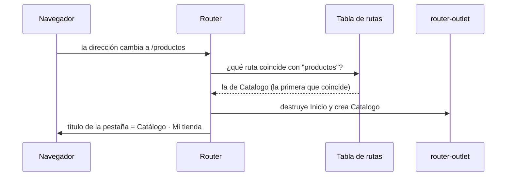

Tu tienda ya tiene portada, catálogo y ficha de producto. En una web tradicional serían tres archivos HTML y cada clic pediría una página nueva al servidor: pantalla en blanco, todo se vuelve a descargar. Una aplicación Angular es una **SPA** (*Single Page Application*, aplicación de una sola página, módulo 1): solo hay un `index.html` y Angular cambia lo que se ve. Pero la gente sigue esperando cosas de una web normal:

- que la barra de direcciones diga dónde están (`/productos`);
- poder copiar ese enlace y que otra persona llegue a la misma pantalla;
- que el botón **Atrás** del navegador funcione.

Quien se encarga de todo eso es el **router** (enrutador) de Angular, que vive en la librería `@angular/router`.

> [!analogia]
> El router es como el panel de un ascensor. La dirección (`/productos`) es el botón que pulsas; el router mira su tabla de plantas (las **rutas**) y te lleva a la planta correcta (el componente) sin salir del edificio (sin recargar la página).

## Lo que `ng new` ya preparó

El proyecto viene con el router conectado. Son tres piezas:

```arbol
src/
  app/
    app.routes.ts    # La tabla de rutas: qué componente va con cada dirección
    app.config.ts    # Registra el router con provideRouter(routes)
    app.ts           # Importa RouterOutlet para poder usar <router-outlet>
    app.html         # Contiene <router-outlet />, el hueco donde se pinta cada página
```

```typescript
// src/app/app.config.ts (generado por ng new)
import { ApplicationConfig, provideBrowserGlobalErrorListeners } from '@angular/core';
import { provideRouter } from '@angular/router';
import { routes } from './app.routes';

export const appConfig: ApplicationConfig = {
  providers: [provideBrowserGlobalErrorListeners(), provideRouter(routes)],
};
```

`provideRouter(routes)` es una función `provide*` como las del módulo 10: registra en el inyector raíz el servicio `Router` y todo lo que necesita, y le da tu tabla de rutas.

## La tabla de rutas

```typescript
// src/app/app.routes.ts
import { Routes } from '@angular/router';
import { Inicio } from './inicio/inicio';
import { Catalogo } from './catalogo/catalogo';

export const routes: Routes = [
  { path: '', component: Inicio, title: 'Inicio · Mi tienda' },
  { path: 'productos', component: Catalogo, title: 'Catálogo · Mi tienda' },
];
```

- `Routes`: el tipo de la tabla, un array de objetos `Route`. Viene de `@angular/router`.
- `path`: la dirección **sin la barra inicial**. `''` es la portada (`localhost:4200/`) y `'productos'` es `localhost:4200/productos`.
- `component`: el componente que se pinta cuando la dirección coincide. Los creas con `ng generate component inicio`, como en el módulo 5.
- `title`: el texto de la **pestaña del navegador**. El router lo pone solo al llegar a la ruta.

## El hueco: `<router-outlet>`

```typescript
// src/app/app.ts
import { Component } from '@angular/core';
import { RouterOutlet } from '@angular/router';

@Component({
  selector: 'app-root',
  imports: [RouterOutlet],
  template: `
    <header>Mi tienda</header>
    <router-outlet />
  `,
})
export class App {}
```

`<router-outlet />` es una directiva de `@angular/router` que marca **dónde** se pinta el componente de la ruta actual. Lo que está fuera (la cabecera) se queda fijo; lo de dentro cambia.

Al abrir la portada:

```pantalla
@url localhost:4200/
<header><b>Mi tienda</b></header>
<h1>Bienvenida a la tienda</h1>
```

Al escribir `/productos` en la barra de direcciones:

```pantalla
@url localhost:4200/productos
<header><b>Mi tienda</b></header>
<h1>Catálogo</h1>
<a href="/productos/1">Libro</a> <a href="/productos/2">Taza</a>
```

## Qué ocurre al navegar



El router recorre la tabla **en orden** y se queda con la **primera** ruta que coincide. Lo que pasa entre medias (guards, resolvers, carga diferida) lo verás en las próximas lecciones.

> [!cuidado]
> No escribas la barra inicial en `path`: es `'productos'`, no `'/productos'`. Si lo haces, Angular lanza un error al arrancar: `NG04014: Invalid configuration of route '/productos': path cannot start with a slash`. Y si la página sale vacía, comprueba que `app.html` tiene `<router-outlet />` y que `RouterOutlet` está en `imports`.

> [!prueba]
> En tu proyecto, genera `ng generate component inicio` y `ng generate component catalogo`, añade las dos rutas y pon `<router-outlet />` en `app.html`. Escribe a mano `localhost:4200/productos` en la barra de direcciones, después pulsa **Atrás**: vuelves a la portada sin recargar.

> [!resumen]
> - El router hace que una SPA tenga direcciones, enlaces compartibles y botón Atrás.
> - `Routes` es la tabla: cada entrada une un `path` con un `component` (y un `title` opcional).
> - `provideRouter(routes)` en `app.config.ts` activa el router.
> - `<router-outlet />` es el hueco donde se pinta la página actual.
