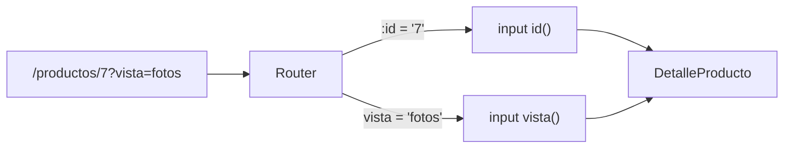

Tu catálogo tiene 500 productos. No vas a escribir 500 rutas (`productos/1`, `productos/2`…) ni 500 componentes. Quieres **una** ruta que diga «`productos/` seguido de lo que sea» y **un** componente que lea ese «lo que sea» y muestre el producto correspondiente. Eso es un **parámetro de ruta**.

> [!analogia]
> Es como las taquillas numeradas de un gimnasio. Hay una sola regla («taquilla número **N**») y una sola llave maestra, pero el número cambia según quién llega. `:id` es el hueco donde va el número.

## Declarar el parámetro: `:id`

```typescript
// src/app/app.routes.ts
import { Routes } from '@angular/router';
import { Catalogo } from './catalogo/catalogo';
import { DetalleProducto } from './detalle-producto/detalle-producto';

export const routes: Routes = [
  { path: 'productos', component: Catalogo },
  { path: 'productos/:id', component: DetalleProducto },
];
```

Los dos puntos convierten el segmento en un **comodín con nombre**: `productos/7`, `productos/42` o `productos/teclado` coinciden, y el router guarda `id = '7'`, `'42'` o `'teclado'`. Siempre es **texto**, aunque parezca un número.

## Leerlo como un `input()`: `withComponentInputBinding()`

La forma moderna es que el router entregue el parámetro como una **entrada** del componente (las del módulo 8). Primero se activa esa función en el router:

```typescript
// src/app/app.config.ts
import { ApplicationConfig, provideBrowserGlobalErrorListeners } from '@angular/core';
import { provideRouter, withComponentInputBinding } from '@angular/router';
import { routes } from './app.routes';

export const appConfig: ApplicationConfig = {
  providers: [provideBrowserGlobalErrorListeners(), provideRouter(routes, withComponentInputBinding())],
};
```

`withComponentInputBinding()` es una **característica opcional** del router (las funciones `with*` se pasan a `provideRouter` para añadirle cosas). Con ella, el router copia los parámetros de la ruta, los *query params* y los datos de la ruta en los `input()` del componente que tengan **el mismo nombre**.

```typescript
// src/app/detalle-producto/detalle-producto.ts
import { Component, input } from '@angular/core';

@Component({
  selector: 'app-detalle-producto',
  template: `<h1>Producto {{ id() }}</h1>`,
})
export class DetalleProducto {
  readonly id = input.required<string>();
}
```

- `input.required<string>()`: una entrada obligatoria de tipo texto. Se llama `id`, igual que `:id`, y por eso el router la rellena.
- Como es una signal, si navegas de `/productos/7` a `/productos/8`, Angular **reutiliza** el mismo componente y `id()` cambia a `'8'`: todo lo que dependa de ella se actualiza solo.

```pantalla
@url localhost:4200/productos/7
<h1>Producto 7</h1>
```

## Enlazar con un parámetro

En el catálogo, cada producto enlaza a su ficha con un array de segmentos:

```typescript
// src/app/catalogo/catalogo.ts
import { Component } from '@angular/core';
import { RouterLink } from '@angular/router';

@Component({
  selector: 'app-catalogo',
  imports: [RouterLink],
  template: `
    <h1>Catálogo</h1>
    @for (producto of productos; track producto.id) {
      <a [routerLink]="['/productos', producto.id]">{{ producto.nombre }}</a>
    }
    <a routerLink="/productos" [queryParams]="{ orden: 'precio' }">Ordenar por precio</a>
  `,
})
export class Catalogo {
  protected readonly productos = [
    { id: 1, nombre: 'Libro' },
    { id: 2, nombre: 'Taza' },
  ];
}
```

```pantalla
@url localhost:4200/productos
<h1>Catálogo</h1>
<a href="/productos/1">Libro</a> <a href="/productos/2">Taza</a> <a href="/productos?orden=precio">Ordenar por precio</a>
```

## Query params: lo que va tras `?`

`[queryParams]="{ orden: 'precio' }"` añade `?orden=precio` a la dirección. Los **query params** son opcionales y no forman parte de la ruta: sirven para filtros, orden o la página de resultados. Con `withComponentInputBinding()` también llegan a un `input()` con el mismo nombre: `readonly orden = input<string>()` valdría `'precio'` (o `undefined` si no está).



## En proyectos antiguos verás… `ActivatedRoute`

Antes de `withComponentInputBinding()` (y todavía hoy, en servicios o cuando no puedes activarlo) se leía la ruta inyectando `ActivatedRoute`:

```typescript
import { Component, inject } from '@angular/core';
import { ActivatedRoute } from '@angular/router';
import { toSignal } from '@angular/core/rxjs-interop';
import { map } from 'rxjs';

@Component({
  selector: 'app-detalle-producto',
  template: `<h1>Producto {{ id() }}</h1>`,
})
export class DetalleProducto {
  private readonly ruta = inject(ActivatedRoute);
  protected readonly id = toSignal(this.ruta.paramMap.pipe(map((p) => p.get('id'))));
}
```

`paramMap` es un Observable (módulo 14) que emite cada vez que cambian los parámetros. Más largo, pero verás mucho código así.

> [!cuidado]
> El parámetro siempre llega como **texto**. Si comparas `id() === 7` nunca será cierto, porque `'7'` no es `7`. Conviértelo con `Number(id())` o usa una entrada con transformación: `input.required({ transform: numberAttribute })` (módulo 8). Y si el `input` no recibe nada, comprueba que añadiste `withComponentInputBinding()` y que el nombre coincide **exactamente** con el de la ruta.

> [!prueba]
> En tu proyecto, añade la ruta `productos/:id` y el `DetalleProducto`. Escribe a mano `localhost:4200/productos/hola` en la barra: verás `Producto hola`. El router no sabe qué es un id válido; eso lo decide tu código.

> [!resumen]
> - `path: 'productos/:id'` crea un parámetro llamado `id` que coincide con cualquier segmento.
> - Con `withComponentInputBinding()`, los parámetros llegan a `input()` con el mismo nombre.
> - `[routerLink]="['/productos', p.id]"` construye enlaces con datos; `[queryParams]` añade `?clave=valor`.
> - Los parámetros siempre son texto.
