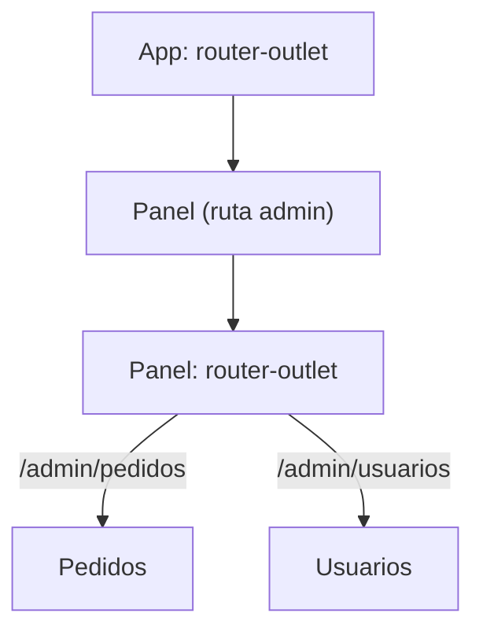
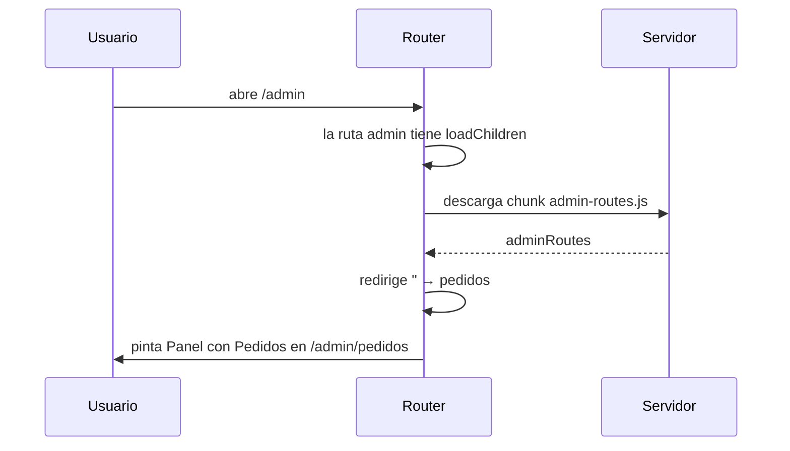

Tu tienda crece: ahora hay un panel de administración con su propio menú (Pedidos, Usuarios) que debe quedarse fijo mientras cambia lo de debajo. Alguien escribe `/tienda`, que era la dirección antigua de la portada. Otra persona escribe `/ofertsa` con una errata y ve una página en blanco. Y el panel de admin, que solo usan tres personas, se descarga en el móvil de todos los clientes. Esta lección arregla las cuatro cosas.

> [!analogia]
> Piensa en un centro comercial. Las **rutas hijas** son las tiendas dentro de una planta: la planta (el panel) tiene su pasillo fijo y dentro cambian los escaparates. Las **redirecciones** son carteles de «nos hemos mudado, sigue la flecha». La **ruta comodín** es el mostrador de información para quien se pierde. Y la **carga diferida** es el almacén: la mercancía de la planta de administración solo se sube cuando alguien va allí.

## Rutas hijas: un outlet dentro de otro

```typescript
// src/app/admin/admin.routes.ts
import { Routes } from '@angular/router';
import { Panel } from './panel';
import { Pedidos } from './pedidos';
import { Usuarios } from './usuarios';

export const adminRoutes: Routes = [
  {
    path: '',
    component: Panel,
    children: [
      { path: '', redirectTo: 'pedidos', pathMatch: 'full' },
      { path: 'pedidos', component: Pedidos, title: 'Pedidos' },
      { path: 'usuarios', component: Usuarios, title: 'Usuarios' },
    ],
  },
];
```

- `children`: las rutas **dentro** de `Panel`. Sus `path` se suman al del padre: `pedidos` dentro de `admin` es `/admin/pedidos`.
- `{ path: '', redirectTo: 'pedidos', pathMatch: 'full' }`: si alguien entra a `/admin` a secas, lo manda a `/admin/pedidos`.
- `pathMatch: 'full'`: solo redirige si lo que queda de la dirección es **exactamente** `''`. Sin esto, `''` coincidiría como prefijo con todo.

El `Panel` tiene su propio `<router-outlet />` para pintar al hijo:

```typescript
// src/app/admin/panel.ts
import { Component } from '@angular/core';
import { RouterLink, RouterLinkActive, RouterOutlet } from '@angular/router';

@Component({
  selector: 'app-panel',
  imports: [RouterLink, RouterLinkActive, RouterOutlet],
  template: `
    <h1>Panel de administración</h1>
    <nav>
      <a routerLink="pedidos" routerLinkActive="activo">Pedidos</a>
      <a routerLink="usuarios" routerLinkActive="activo">Usuarios</a>
    </nav>
    <router-outlet />
  `,
})
export class Panel {}
```

Los enlaces son **relativos** (sin barra): `pedidos` desde `/admin` lleva a `/admin/pedidos`.

```pantalla
@url localhost:4200/admin/usuarios
<h1>Panel de administración</h1>
<nav><a href="/admin/pedidos">Pedidos</a> · <a href="/admin/usuarios" class="activo"><b>Usuarios</b></a></nav>
<h2>Usuarios</h2>
```



## La tabla principal: redirecciones, carga diferida y 404

```typescript
// src/app/app.routes.ts
import { Routes } from '@angular/router';
import { Inicio } from './inicio/inicio';
import { Catalogo } from './catalogo/catalogo';
import { DetalleProducto } from './detalle-producto/detalle-producto';
import { NoEncontrada } from './no-encontrada/no-encontrada';

export const routes: Routes = [
  { path: '', component: Inicio, title: 'Inicio · Mi tienda' },
  { path: 'tienda', redirectTo: '' },
  { path: 'productos', component: Catalogo, title: 'Catálogo · Mi tienda' },
  { path: 'productos/:id', component: DetalleProducto },
  {
    path: 'ofertas',
    loadComponent: () => import('./ofertas/ofertas').then((m) => m.Ofertas),
  },
  {
    path: 'admin',
    loadChildren: () => import('./admin/admin.routes').then((m) => m.adminRoutes),
  },
  { path: '**', component: NoEncontrada, title: 'No encontrada' },
];
```

- `{ path: 'tienda', redirectTo: '' }`: `/tienda` se convierte en `/`. La barra de direcciones cambia: es una redirección de verdad.
- `loadComponent: () => import(...)`: **carga diferida** de un componente. `import()` con paréntesis es la importación **dinámica** de JavaScript: descarga el archivo cuando se ejecuta, no al arrancar. `.then((m) => m.Ofertas)` saca la clase del módulo descargado.
- `loadChildren`: lo mismo, pero para un **array de rutas** entero. Todo lo que importa `admin.routes.ts` (Panel, Pedidos, Usuarios) va a parar a un archivo aparte.
- `path: '**'`: el **comodín**: coincide con cualquier dirección. Como el router se queda con la **primera** ruta que coincide, debe ir **la última**; si no, se tragaría todas las demás.

## La carga diferida, en el `ng build`

Al compilar, `ng build` muestra los trozos que se descargan aparte (los nombres con *hash* y los tamaños cambian en cada proyecto):

```bash
ng build
Initial chunk files | Names          |  Raw size
main-JOT5CPLX.js    | main           | 143.38 kB
...
Lazy chunk files    | Names          |  Raw size
chunk-JMQAwdQy.js   | admin-routes   |   1.23 kB
chunk-BMAbRhJ7.js   | ofertas        |   0.40 kB
```



Los clientes que nunca entran en `/admin` **nunca descargan** ese código: la primera carga es más rápida. Lo medirás en el módulo 17.

## La página 404

Con el comodín, `/ofertsa` muestra el componente `NoEncontrada` y la barra conserva lo que la persona escribió, para que vea su errata:

```pantalla
@url localhost:4200/ofertsa
<h1>Página no encontrada</h1>
<a href="/">Volver al inicio</a>
```

> [!cuidado]
> El orden de la tabla importa: el router prueba las rutas de arriba abajo y usa la primera que coincide. Si pones `{ path: '**', ... }` al principio, **todas** las direcciones mostrarán la página 404. Y si pones `productos/:id` antes que `productos/nuevo`, la dirección `/productos/nuevo` irá al detalle con `id = 'nuevo'`.

> [!prueba]
> En tu proyecto, convierte una de tus rutas a `loadComponent`, ejecuta `ng build` y busca la sección «Lazy chunk files». Después, con `ng serve`, abre la pestaña **Red** de las herramientas del navegador y navega a esa ruta: verás aparecer la descarga del trozo justo en ese momento.

> [!resumen]
> - `children` crea rutas dentro de otra; el padre necesita su propio `<router-outlet />`.
> - `redirectTo` manda de una dirección a otra; con `path: ''` usa `pathMatch: 'full'`.
> - `loadComponent` y `loadChildren` con `import()` descargan el código solo cuando hace falta.
> - `path: '**'` atrapa todo lo demás (la página 404) y va siempre al final.
