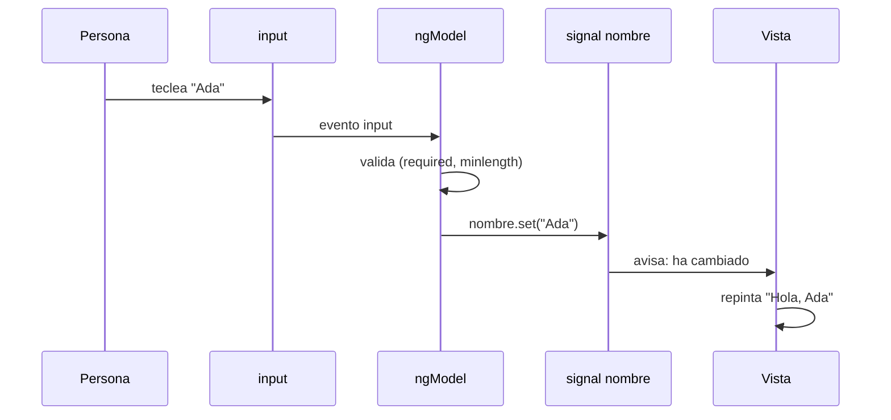

Casi todas las aplicaciones piden datos: iniciar sesión, darse de alta, escribir un comentario, pagar. Un formulario parece sencillo (unas cajas de texto y un botón), pero detrás hay mucho trabajo: guardar lo que escribe la persona, comprobar que está bien, avisar de los errores en el momento justo y enviar los datos solo cuando todo es correcto.

Angular te ofrece **tres formas** de construir formularios. En este módulo las verás todas:

| Forma | Librería | Dónde vive la lógica | Cuándo usarla |
| --- | --- | --- | --- |
| De plantilla | `FormsModule` (`@angular/forms`) | En el HTML, con `ngModel` | Formularios pequeños y simples |
| Reactivos | `ReactiveFormsModule` (`@angular/forms`) | En la clase, con `FormGroup` y `FormControl` | Formularios medianos y grandes; el estándar en proyectos reales |
| Signal Forms | `@angular/forms/signals` | En la clase, con `form()` sobre un signal | La forma más nueva, pensada para signals |

Empezamos por la más sencilla.

> [!analogia]
> Un formulario de plantilla es como un cuaderno de hojas calcables: lo que escribes arriba (la caja de texto) aparece copiado abajo (la variable de tu clase), y si alguien cambia la hoja de abajo, también cambia la de arriba. Esa copia en los dos sentidos se llama **enlace bidireccional** (*two-way binding*).

## Un formulario de contacto

```typescript
// src/app/contacto/contacto.ts
import { Component, signal } from '@angular/core';
import { FormsModule } from '@angular/forms';

@Component({
  selector: 'app-contacto',
  imports: [FormsModule],
  templateUrl: './contacto.html',
})
export class Contacto {
  protected readonly nombre = signal('');

  protected enviar() {
    console.log('Enviado:', this.nombre());
  }
}
```

```html
<!-- src/app/contacto/contacto.html -->
<form #f="ngForm" (ngSubmit)="enviar()">
  <label>
    Nombre
    <input name="nombre" [(ngModel)]="nombre" required minlength="2" #campo="ngModel" />
  </label>
  @if (campo.invalid && campo.touched) {
    <p class="error">Escribe al menos 2 letras.</p>
  }
  <button type="submit" [disabled]="f.invalid">Enviar</button>
</form>
<p>Hola, {{ nombre() }}</p>
```

Pieza a pieza:

- `import { FormsModule } from '@angular/forms'`: `@angular/forms` es la librería de formularios de Angular (la instaló `ng new`, está en `dependencies` de `package.json`). `FormsModule` es un paquete de directivas: `ngModel`, `ngForm` y los validadores como atributos (`required`, `minlength`…).
- `imports: [FormsModule]`: sin esta línea la plantilla no sabe qué es `ngModel` y el compilador da error. Cada componente declara lo que usa.
- `nombre = signal('')`: el dato vive en un signal (módulo 7). Empieza vacío.
- `[(ngModel)]="nombre"`: la sintaxis «plátano en una caja» `[( )]`. Los corchetes llevan el valor del signal a la caja; los paréntesis traen lo que escribe la persona de vuelta al signal. Funciona con signals escribibles: Angular llama a `nombre.set(...)` por ti.
- `name="nombre"`: dentro de un `<form>`, `ngModel` **necesita** un `name` para registrar el campo en el formulario.
- `required minlength="2"`: validadores escritos como atributos de HTML. `FormsModule` los convierte en reglas de Angular.
- `#campo="ngModel"`: una variable de plantilla (módulo 6) que apunta al control de ese campo. Con ella preguntas su estado: `campo.invalid`, `campo.touched`.
- `#f="ngForm"`: Angular añade la directiva `ngForm` a **todo** `<form>` cuando importas `FormsModule`. Así `f.invalid` dice si el formulario entero tiene algún error.
- `(ngSubmit)="enviar()"`: el evento de envío de Angular. Se dispara al pulsar el botón `type="submit"` o Intro, y evita que el navegador recargue la página.

## Así se ve

Antes de escribir nada, el botón está desactivado porque `nombre` es obligatorio:

```pantalla
@url localhost:4200/contacto
<form>
  <label>Nombre <input value=""></label>
  <button disabled>Enviar</button>
</form>
<p>Hola, </p>
```

La persona escribe una letra y sale de la caja:

```pantalla
@url localhost:4200/contacto
<form>
  <label>Nombre <input value="A"></label>
  <p style="color: crimson">Escribe al menos 2 letras.</p>
  <button disabled>Enviar</button>
</form>
<p>Hola, A</p>
```

## Qué pasa al teclear



> [!prueba]
> En tu proyecto, cambia `minlength="2"` por `minlength="5"` y guarda: el navegador se recarga solo. Escribe «Ana» y sal de la caja: aparece el mensaje de error y el botón sigue desactivado.

> [!cuidado]
> Si olvidas `name` en un `<input>` con `ngModel` dentro de un `<form>`, Angular lanza un error en la consola: *«If ngModel is used within a form tag, either the name attribute must be set…»*. Y si olvidas `FormsModule` en `imports`, el compilador dice *«Can't bind to 'ngModel' since it isn't a known property of 'input'»*.

## Límites de esta forma

Los formularios de plantilla son cómodos, pero la lógica queda repartida por el HTML: las reglas son atributos, el estado se consulta con variables `#campo` y es difícil probarlo sin pintar la página. En cuanto el formulario crece (campos que dependen de otros, listas de campos, validaciones complejas), conviene pasar la lógica a la clase. Eso son los **formularios reactivos**, la siguiente lección.

> [!resumen]
> - Angular tiene tres formas de hacer formularios: de plantilla, reactivos y Signal Forms.
> - Los de plantilla usan `FormsModule` y `[(ngModel)]`, que copia el valor en los dos sentidos.
> - Dentro de un `<form>`, cada `ngModel` necesita `name`; `(ngSubmit)` envía sin recargar la página.
> - Sirven para formularios pequeños; para los grandes, mejor reactivos o Signal Forms.
