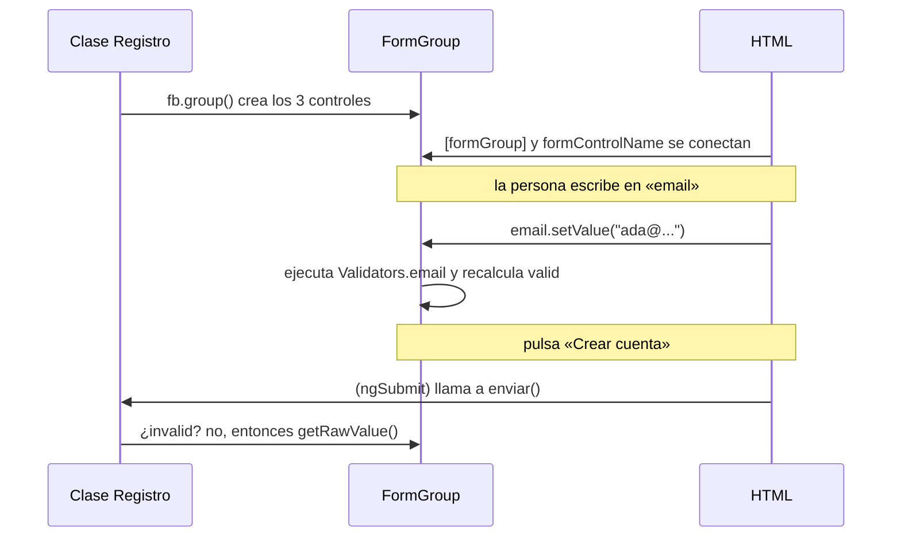

Imagina el alta de una tienda: nombre, email y edad. El email debe tener formato de email, la edad debe ser 18 o más, y el botón solo envía si todo está bien. Además quieres probar esas reglas sin abrir el navegador. Con `ngModel` la lógica estaría desperdigada por el HTML. Con un **formulario reactivo**, el formulario entero es un objeto de TypeScript que vive en la clase.

> [!analogia]
> Un formulario reactivo es como la ficha de un expediente en papel con casillas. La ficha (el `FormGroup`) existe antes de que nadie la rellene; cada casilla (un `FormControl`) sabe qué valor tiene, si es obligatoria y si alguien la ha tocado. La plantilla solo pone el bolígrafo encima de cada casilla.

## Las tres piezas

| Pieza | Qué representa | Ejemplo |
| --- | --- | --- |
| `FormControl` | Un campo: su valor, sus validadores y su estado | El email |
| `FormGroup` | Un grupo de campos con nombre | El formulario de alta |
| `FormArray` | Una lista de campos de longitud variable | Los teléfonos (lección 4) |

Todas vienen de `@angular/forms`, y las directivas para conectarlas con el HTML (`formGroup`, `formControlName`…) vienen en `ReactiveFormsModule`.

## Un alta con `FormBuilder`

```typescript
// src/app/registro/registro.ts
import { JsonPipe } from '@angular/common';
import { Component, inject } from '@angular/core';
import { NonNullableFormBuilder, ReactiveFormsModule, Validators } from '@angular/forms';

@Component({
  selector: 'app-registro',
  imports: [ReactiveFormsModule, JsonPipe],
  templateUrl: './registro.html',
})
export class Registro {
  private readonly fb = inject(NonNullableFormBuilder);

  protected readonly form = this.fb.group({
    nombre: ['', Validators.required],
    email: ['', [Validators.required, Validators.email]],
    edad: [18, [Validators.required, Validators.min(18)]],
  });

  protected enviar() {
    if (this.form.invalid) {
      this.form.markAllAsTouched();
      return;
    }
    const datos = this.form.getRawValue(); // { nombre: string; email: string; edad: number }
    console.log('Nueva cuenta', datos);
  }
}
```

```html
<!-- src/app/registro/registro.html -->
<form [formGroup]="form" (ngSubmit)="enviar()">
  <input formControlName="nombre" placeholder="Nombre" />
  <input formControlName="email" placeholder="Email" />
  <input formControlName="edad" type="number" />
  <button type="submit">Crear cuenta</button>
</form>
<pre>{{ form.value | json }}</pre>
```

Línea a línea:

- `NonNullableFormBuilder`: un servicio de `@angular/forms` que fabrica controles con menos código. Lo pides con `inject()` (módulo 10). La versión *NonNullable* hace que cada campo, al reiniciarse, vuelva a su valor inicial en lugar de a `null`, y por eso sus tipos no incluyen `null`.
- `Validators`: una clase con los validadores incluidos: `required`, `email`, `min`, `max`, `minLength`, `maxLength`, `pattern`…
- `this.fb.group({...})`: crea un `FormGroup`. Cada propiedad es un campo: `[valorInicial, validadores]`. Un validador solo o una lista de ellos.
- `[formGroup]="form"`: conecta el `<form>` del HTML con el objeto `form` de la clase.
- `formControlName="email"`: conecta este `<input>` con el campo `email` del grupo. Ya no hace falta `name` ni `ngModel`.
- `(ngSubmit)="enviar()"`: igual que en la lección anterior, envía sin recargar.
- `markAllAsTouched()`: marca todos los campos como «tocados» para que se vean sus errores aunque la persona no haya pasado por ellos.
- `getRawValue()`: devuelve todos los valores (también los de campos desactivados). `form.value` deja fuera los desactivados.
- `JsonPipe` y `| json`: un pipe (módulo 9) que muestra un objeto como texto. Útil para ver el valor mientras desarrollas.

## Formularios tipados

Desde Angular 14 los formularios reactivos son **tipados**: TypeScript sabe qué hay en cada campo. Pasa el ratón por `datos` en tu editor y verás `{ nombre: string; email: string; edad: number }`. Si escribes `this.form.controls.emial`, el editor lo subraya en rojo antes de ejecutar nada.

## Así se ve

Al escribir, el `<pre>` muestra el valor al momento:

```pantalla
@url localhost:4200/registro
<form>
  <input value="Ada"> <input value="ada@ejemplo.com"> <input type="number" value="36">
  <button>Crear cuenta</button>
</form>
<pre>{
  "nombre": "Ada",
  "email": "ada@ejemplo.com",
  "edad": 36
}</pre>
```

## Qué pasa en cada momento



## Sin `FormBuilder`

`FormBuilder` es solo un atajo. Esto es lo mismo escrito a mano:

```typescript
import { FormControl, FormGroup, Validators } from '@angular/forms';

const login = new FormGroup({
  usuario: new FormControl('', { nonNullable: true, validators: [Validators.required] }),
  clave: new FormControl('', { nonNullable: true, validators: [Validators.minLength(8)] }),
});
```

Verás las dos formas en proyectos reales.

> [!prueba]
> En tu proyecto, añade un campo `ciudad: ['Lima']` al grupo y su `<input formControlName="ciudad" />`. Guarda y mira cómo aparece en el `<pre>`. Después escribe mal el nombre en `formControlName` («cuidad») y abre la consola del navegador: Angular da el error *«Cannot find control with name: 'cuidad'»*.

> [!cuidado]
> No mezcles las dos formas en el mismo formulario: un `[(ngModel)]` dentro de un `[formGroup]` provoca el error *«ngModel cannot be used to register form controls with a parent formGroup directive»*. Elige una forma por formulario. Y recuerda importar `ReactiveFormsModule`; si no, `[formGroup]` da el error *«Can't bind to 'formGroup' since it isn't a known property of 'form'»*.

> [!resumen]
> - Un formulario reactivo es un objeto en la clase: `FormGroup` con `FormControl` dentro.
> - `NonNullableFormBuilder` los crea con poco código: `campo: [valorInicial, validadores]`.
> - En el HTML, `[formGroup]` conecta el formulario y `formControlName` cada campo.
> - Son tipados: TypeScript conoce el tipo de cada campo y de `getRawValue()`.
