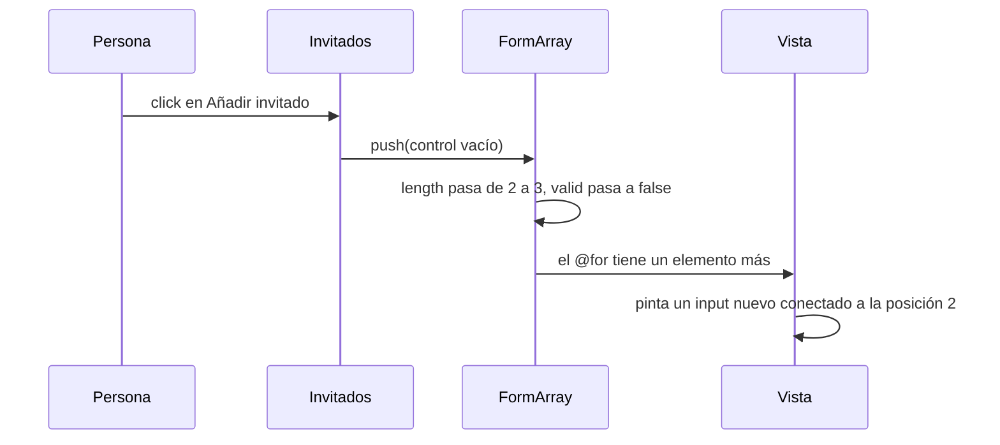

Organizas una fiesta y el formulario pide los nombres de los invitados. ¿Cuántas cajas de texto pones? No lo sabes: unos invitan a dos personas y otros a veinte. Necesitas un botón «Añadir invitado» que cree un campo nuevo y un botón «Quitar» al lado de cada uno. Para eso existe `FormArray`: una **lista de controles** que crece y encoge mientras la persona usa el formulario.

> [!analogia]
> Un `FormGroup` es un formulario de papel con casillas fijas y con nombre («Nombre», «Email»). Un `FormArray` es una libreta de hojas numeradas: puedes arrancar una hoja o añadir otra al final, y cada hoja se identifica por su posición (0, 1, 2…), no por un nombre.

## El código

```typescript
// src/app/invitados/invitados.ts
import { Component, inject } from '@angular/core';
import { NonNullableFormBuilder, ReactiveFormsModule, Validators } from '@angular/forms';

@Component({
  selector: 'app-invitados',
  imports: [ReactiveFormsModule],
  templateUrl: './invitados.html',
})
export class Invitados {
  private readonly fb = inject(NonNullableFormBuilder);

  protected readonly fiesta = this.fb.group({
    titulo: ['Cumpleaños', Validators.required],
    invitados: this.fb.array([this.fb.control('Ada', Validators.required)]),
  });

  protected agregar() {
    this.fiesta.controls.invitados.push(this.fb.control('', Validators.required));
  }

  protected quitar(i: number) {
    this.fiesta.controls.invitados.removeAt(i);
  }
}
```

```html
<!-- src/app/invitados/invitados.html -->
<form [formGroup]="fiesta">
  <input formControlName="titulo" />
  <div formArrayName="invitados">
    @for (invitado of fiesta.controls.invitados.controls; track invitado; let i = $index) {
      <input [formControlName]="i" />
      <button type="button" (click)="quitar(i)">Quitar</button>
    }
  </div>
  <button type="button" (click)="agregar()">Añadir invitado</button>
  <p>{{ fiesta.controls.invitados.length }} invitados</p>
</form>
```

Qué hace cada parte:

- `this.fb.array([...])`: crea un `FormArray` con una lista inicial de controles. Aquí empieza con uno que vale «Ada».
- `this.fb.control('', Validators.required)`: crea un `FormControl` suelto, listo para meterlo en la lista.
- `push(control)`: añade al final. También existen `insert(posicion, control)`, `removeAt(posicion)`, `clear()` y `at(posicion)` para leer uno.
- `formArrayName="invitados"`: le dice a la plantilla «lo de dentro pertenece a la lista `invitados`».
- `[formControlName]="i"`: dentro de una lista, cada campo se identifica por su **posición**, por eso es un número y va entre corchetes (es una expresión, no un texto fijo).
- `track invitado`: `@for` necesita saber qué fila es cuál (módulo 6). Cada control es un objeto distinto, así que sirve como identidad aunque cambien las posiciones.
- `type="button"`: sin él, un `<button>` dentro de un `<form>` es de tipo *submit* y **enviaría** el formulario al pulsarlo.

## Así se ve

Tras pulsar dos veces «Añadir invitado» y escribir un nombre:

```pantalla
@url localhost:4200/fiesta
<form>
  <input value="Cumpleaños">
  <div>
    <input value="Ada"> <button>Quitar</button><br>
    <input value="Grace"> <button>Quitar</button><br>
    <input value=""> <button>Quitar</button>
  </div>
  <button>Añadir invitado</button>
  <p>3 invitados</p>
</form>
```

El valor del grupo es un objeto con un array dentro:

```json
{ "titulo": "Cumpleaños", "invitados": ["Ada", "Grace", ""] }
```

Y el formulario es **inválido**, porque el tercer invitado está vacío y es obligatorio. La validez de una lista es la de todos sus elementos.

## Qué pasa al pulsar «Añadir»



## Listas de grupos

Cada elemento de un `FormArray` puede ser un grupo entero. Por ejemplo, invitados con nombre y alergias:

```typescript
invitados: this.fb.array([
  this.fb.group({ nombre: ['Ada'], alergias: [''] }),
]),
```

En la plantilla, cada fila usa `[formGroupName]="i"` y dentro `formControlName="nombre"`.

> [!prueba]
> En tu proyecto, cambia `agregar()` para que use `insert(0, ...)` en lugar de `push(...)`. Guarda y pulsa «Añadir»: los campos nuevos aparecen arriba. Escribe algo en ellos antes de añadir otro y comprueba que cada texto se queda en su caja.

> [!cuidado]
> Si escribes `formControlName="i"` sin corchetes, Angular busca un control llamado literalmente «i» y falla con *«Cannot find control with path: 'invitados -> i'»*. Dentro de un `FormArray` la posición es una expresión: `[formControlName]="i"`.

> [!resumen]
> - `FormArray` es una lista de controles que crece y encoge: `push`, `insert`, `removeAt`, `clear`.
> - En la plantilla: `formArrayName` para la lista y `[formControlName]="i"` para cada elemento.
> - Una lista es válida solo si todos sus elementos lo son.
> - Los botones que no envían deben llevar `type="button"`.
