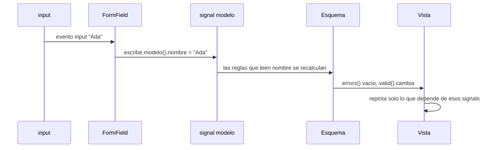

En el módulo 7 aprendiste que los signals mantienen la pantalla al día sin que tengas que avisar a nadie. Los formularios reactivos son anteriores a los signals: su estado (`valid`, `touched`…) son propiedades normales y sus cambios llegan por observables (`valueChanges`). **Signal Forms** es la forma nueva de hacer formularios en Angular, construida desde cero sobre signals: tus datos son un signal, y cada campo, su valor, sus errores y su estado también lo son.

> [!idea]
> **Estado en Angular 22.** El paquete `@angular/forms/signals` llegó como experimental y en Angular 22 es **API pública estable**: en sus tipos (`node_modules/@angular/forms/types/signals.d.ts`), `form`, `FormField`, `FormRoot`, `required`, `validate`, `submit` y el resto llevan la etiqueta `@publicApi 22.0`. Solo hay dos piezas marcadas `@experimental`: `provideExperimentalWebMcpForms()` y la opción `experimentalWebMcpTool` (para exponer formularios a agentes de IA). Esas no las uses todavía. Los formularios reactivos siguen siendo estables y los encontrarás en casi todos los proyectos existentes, así que conviene dominar los dos.

> [!analogia]
> Con los formularios reactivos tienes **dos copias** de los datos: la del formulario y la tuya, y las sincronizas a mano. Con Signal Forms hay **una sola**: tu signal es la fuente de verdad y el formulario es una lupa encima que añade reglas y estado. Lo que escribes en la caja se guarda directamente en tu signal.

## Un registro con Signal Forms

```typescript
// src/app/registro-signal/registro-signal.ts
import { Component, signal } from '@angular/core';
import { email, form, FormField, FormRoot, minLength, required } from '@angular/forms/signals';

interface DatosRegistro {
  nombre: string;
  email: string;
  clave: string;
}

@Component({
  selector: 'app-registro-signal',
  imports: [FormRoot, FormField],
  templateUrl: './registro-signal.html',
})
export class RegistroSignal {
  protected readonly modelo = signal<DatosRegistro>({ nombre: '', email: '', clave: '' });

  protected readonly registro = form(
    this.modelo,
    (campo) => {
      required(campo.nombre, { message: 'El nombre es obligatorio' });
      required(campo.email, { message: 'Falta el email' });
      email(campo.email, { message: 'Ese email no es válido' });
      minLength(campo.clave, 8, { message: 'Mínimo 8 caracteres' });
    },
    {
      submission: {
        action: async (f) => {
          console.log('Enviando', f().value());
          return undefined;
        },
      },
    },
  );
}
```

```html
<!-- src/app/registro-signal/registro-signal.html -->
<form [formRoot]="registro">
  <input [formField]="registro.nombre" placeholder="Nombre" />
  @if (registro.nombre().touched() && registro.nombre().invalid()) {
    @for (error of registro.nombre().errors(); track error.kind) {
      <p class="error">{{ error.message }}</p>
    }
  }
  <input [formField]="registro.email" placeholder="Email" />
  <input [formField]="registro.clave" type="password" />
  <button type="submit" [disabled]="registro().submitting()">Crear cuenta</button>
</form>
<p>Modelo: {{ modelo().nombre }} · válido: {{ registro().valid() }}</p>
```

Pieza a pieza:

- `from '@angular/forms/signals'`: es un **punto de entrada** secundario del mismo paquete `@angular/forms` que ya tienes instalado. No hay que instalar nada.
- `modelo = signal<DatosRegistro>(...)`: tus datos, en un signal normal. Es la única fuente de verdad.
- `form(this.modelo, esquema, opciones)`: crea el formulario encima del signal. Devuelve un **árbol de campos** (`FieldTree`) con la misma forma que tus datos: `registro.nombre`, `registro.email`, `registro.clave`.
- El **esquema** `(campo) => { ... }` es una función donde declaras las reglas: `required`, `email`, `minLength`, `min`, `max`, `pattern`… Cada una recibe la ruta del campo y, si quieres, un `message`.
- `registro.nombre()`: al **llamar** a un campo obtienes su estado. Cada parte es un signal: `.value()`, `.valid()`, `.invalid()`, `.touched()`, `.dirty()`, `.errors()`, `.disabled()`.
- `registro()`: el estado del formulario entero. `submitting()` vale `true` mientras se ejecuta el envío.
- `[formField]="registro.nombre"`: la directiva `FormField` conecta la caja con el campo en los dos sentidos y marca el campo como tocado al salir.
- `[formRoot]="registro"`: la directiva `FormRoot` sobre el `<form>` desactiva la validación del navegador, evita la recarga y, al enviar, ejecuta la `action` de `submission` **solo si el formulario es válido** (si no, marca todo como tocado para que se vean los errores).
- `action: async (f) => ...`: lo que hace el envío. Es asíncrona porque normalmente llamará a un servidor (módulo 13). Devolver `undefined` significa «sin errores del servidor».

## Así se ve

La persona entra en «Nombre», sale sin escribir, y escribe su email:

```pantalla
@url localhost:4200/registro
<form>
  <input placeholder="Nombre" value="" style="border: 2px solid crimson">
  <p style="color: crimson">El nombre es obligatorio</p>
  <input placeholder="Email" value="ada@ejemplo.com">
  <input type="password" value="">
  <button>Crear cuenta</button>
</form>
<p>Modelo: · válido: false</p>
```

## Qué pasa al teclear



No hay suscripciones ni `valueChanges`: todo es un grafo de signals, como el que viste en el módulo 7.

## Reglas propias con `validate`

```typescript
import { form, required, validate } from '@angular/forms/signals';

protected readonly datos = signal({ usuario: '' });
protected readonly f = form(this.datos, (c) => {
  required(c.usuario);
  validate(c.usuario, ({ value }) =>
    value().includes(' ') ? { kind: 'sinEspacios', message: 'Sin espacios' } : undefined,
  );
});
```

`validate` recibe una función que lee el valor (un signal) y devuelve un error `{ kind, message }` o `undefined` si todo está bien. Como lee signals, se recalcula sola cuando el valor cambia.

> [!prueba]
> En tu proyecto, cambia el `minLength` de la clave a 12 y guarda. Escribe una clave de 10 caracteres: `registro().valid()` sigue en `false`. Después añade `<p>{{ registro.clave().value().length }} caracteres</p>` y mira cómo cuenta mientras escribes.

> [!cuidado]
> Los campos se **llaman** para leer su estado: `registro.nombre().invalid()`, con dos pares de paréntesis. `registro.nombre.invalid()` (sin el primer par) da un error de TypeScript, porque `registro.nombre` es el campo, no su estado. Y en artículos de la época experimental puedes ver otros nombres (como `[field]` o `[control]`): fíate de los tipos de la versión que tengas instalada.

> [!resumen]
> - Signal Forms (`@angular/forms/signals`) es estable en Angular 22 (`@publicApi 22.0`), salvo las piezas de WebMCP, que son experimentales.
> - `form(modelo, esquema)` crea un árbol de campos encima de tu signal, que sigue siendo la única fuente de verdad.
> - Las reglas se declaran en el esquema (`required`, `email`, `minLength`, `validate`) y el estado se lee con signals: `campo().valid()`.
> - `[formField]` conecta cada caja y `[formRoot]` gestiona el envío.
