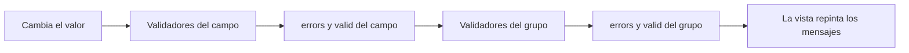

Un buen formulario no grita «¡ERROR!» en cuanto la página se abre. Espera a que la persona haya pasado por un campo, le dice qué está mal con palabras claras y no la deja enviar hasta que todo esté correcto. Para eso necesitas dos cosas: **reglas** (validadores) y **estado** (¿lo ha tocado?, ¿lo ha cambiado?, ¿es válido?).

> [!analogia]
> Un validador es como el revisor de un tren: mira tu billete (el valor) y devuelve «todo bien» o una nota con lo que falla. El estado del campo es lo que el revisor apunta en su libreta: si ya pasó por tu asiento, si cambiaste de asiento, si tu billete es válido.

## El estado de un control

Todo `FormControl`, `FormGroup` y `FormArray` tiene estas propiedades:

| Propiedad | Es `true` cuando… | Su contraria |
| --- | --- | --- |
| `valid` | Todos sus validadores dicen que está bien | `invalid` |
| `touched` | La persona entró en el campo y salió de él (evento *blur*) | `untouched` |
| `dirty` | La persona cambió el valor al menos una vez | `pristine` |
| `pending` | Hay un validador asíncrono esperando respuesta | |

Además, `errors` es un objeto con un error por regla que falla (`{ required: true }`, `{ minlength: { requiredLength: 8, actualLength: 3 } }`) o `null` si no hay errores. `hasError('required')` pregunta por uno concreto.

Angular también pone **clases CSS** en el elemento: `ng-valid`/`ng-invalid`, `ng-touched`/`ng-untouched`, `ng-dirty`/`ng-pristine`. Puedes darles estilo en `styles.css`:

```css
/* src/styles.css */
input.ng-invalid.ng-touched {
  border: 2px solid crimson;
}
```

## Validadores propios

Un validador es **una función**: recibe el control y devuelve `null` si todo está bien o un objeto con el error.

```typescript
// src/app/validadores.ts
import { AbstractControl, ValidationErrors, ValidatorFn } from '@angular/forms';

export function sinEspacios(control: AbstractControl): ValidationErrors | null {
  const valor = String(control.value ?? '');
  return valor.includes(' ') ? { sinEspacios: true } : null;
}

export function prohibido(palabra: string): ValidatorFn {
  return (control) =>
    String(control.value ?? '').toLowerCase() === palabra ? { prohibido: { palabra } } : null;
}

export const clavesIguales: ValidatorFn = (grupo) => {
  const clave = grupo.get('clave')?.value;
  const repetida = grupo.get('repetida')?.value;
  return clave === repetida ? null : { clavesDistintas: true };
};
```

- `AbstractControl`: el tipo padre de `FormControl`, `FormGroup` y `FormArray`. Así el validador sirve para cualquiera.
- `ValidationErrors`: un objeto `{ nombreDelError: detalles }`.
- `sinEspacios`: un validador directo. La clave `sinEspacios` es el nombre que usarás en `hasError('sinEspacios')`.
- `prohibido('admin')`: una **fábrica** de validadores. Recibe un parámetro y devuelve el validador. Así funciona `Validators.min(18)` por dentro.
- `clavesIguales`: un validador **de grupo**. Recibe el `FormGroup` y compara dos campos entre sí, algo que un validador de un solo campo no puede hacer.

## Usarlos y mostrar los errores

```typescript
// src/app/cuenta/cuenta.ts
import { Component, inject } from '@angular/core';
import { NonNullableFormBuilder, ReactiveFormsModule, Validators } from '@angular/forms';
import { clavesIguales, prohibido, sinEspacios } from '../validadores';

@Component({
  selector: 'app-cuenta',
  imports: [ReactiveFormsModule],
  templateUrl: './cuenta.html',
})
export class Cuenta {
  private readonly fb = inject(NonNullableFormBuilder);

  protected readonly form = this.fb.group(
    {
      usuario: ['', [Validators.required, sinEspacios, prohibido('admin')]],
      clave: ['', [Validators.required, Validators.minLength(8)]],
      repetida: [''],
    },
    { validators: clavesIguales },
  );
}
```

```html
<!-- src/app/cuenta/cuenta.html -->
<form [formGroup]="form">
  <input formControlName="usuario" />
  @let usuario = form.controls.usuario;
  @if (usuario.touched && usuario.errors; as errores) {
    @if (errores['required']) { <p>Falta el usuario.</p> }
    @if (errores['sinEspacios']) { <p>Sin espacios, por favor.</p> }
    @if (errores['prohibido']) { <p>"{{ errores['prohibido'].palabra }}" no está permitido.</p> }
  }
  <input formControlName="clave" type="password" />
  <input formControlName="repetida" type="password" />
  @if (form.hasError('clavesDistintas') && form.controls.repetida.dirty) {
    <p>Las contraseñas no coinciden.</p>
  }
</form>
```

- El segundo argumento de `fb.group(campos, { validators: clavesIguales })` pone validadores **al grupo**. Su error vive en `form.errors`, no en un campo.
- `@let usuario = ...` (módulo 6) acorta las expresiones.
- `usuario.touched && usuario.errors; as errores`: solo muestra errores si la persona ya pasó por el campo, y guarda el objeto de errores en `errores`.

## Así se ve

La persona escribe «mi usuario», sale del campo, y escribe dos contraseñas distintas:

```pantalla
@url localhost:4200/cuenta
<form>
  <input value="mi usuario" style="border: 2px solid crimson">
  <p>Sin espacios, por favor.</p>
  <input type="password" value="12345678"> <input type="password" value="1234">
  <p>Las contraseñas no coinciden.</p>
</form>
```

## Cuándo se ejecutan los validadores



Cada cambio de valor ejecuta los validadores del campo y después los de sus padres. Por defecto ocurre en cada tecla; con `{ updateOn: 'blur' }` en las opciones se ejecutan al salir del campo.

> [!prueba]
> En tu proyecto, añade `Validators.maxLength(12)` al usuario y un mensaje con `@if (errores['maxlength'])`. Fíjate: la clave del error va en **minúsculas** (`maxlength`, `minlength`), aunque la función se llame `maxLength`.

> [!cuidado]
> Fíjate en los paréntesis. `Validators.required` y `sinEspacios` **son** validadores: se pasan sin llamarlos. `Validators.minLength(8)` y `prohibido('admin')` son **fábricas**: se llaman con su parámetro y devuelven el validador. Escribir `Validators.required()` da un error de TypeScript (*«Expected 1 arguments, but got 0»*). Y un validador debe devolver `null` cuando todo está bien, ser rápido y no hacer peticiones HTTP (para eso existen los validadores asíncronos, `asyncValidators`).

> [!resumen]
> - Cada control tiene estado: `valid`, `touched`, `dirty`, `pending` y `errors`.
> - Un validador es una función que devuelve `null` (bien) o un objeto con el error.
> - Las fábricas como `prohibido('admin')` reciben parámetros; los validadores de grupo comparan campos.
> - Muestra los errores solo cuando el campo está `touched` (o `dirty`) para no regañar antes de tiempo.
