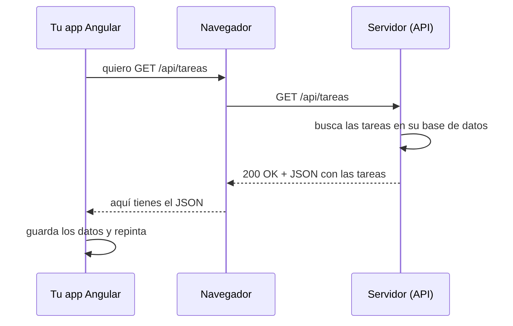

Tu aplicación de tareas funciona, pero las tareas viven en la memoria del navegador: si recargas la página, desaparecen. Y si abres la app en el móvil, no ves las del ordenador. Los datos tienen que guardarse en otro sitio, en un **servidor**, y tu aplicación Angular tiene que pedírselos y enviárselos. Esa conversación se hace con **HTTP** y, casi siempre, con una **API REST** que habla **JSON**.

> [!analogia]
> Una API es como la ventanilla de una oficina. Tú no entras al archivo a buscar papeles: te acercas a la ventanilla, pides algo con un formulario concreto («quiero el expediente 7») y te devuelven una respuesta. La ventanilla tiene unas reglas fijas: qué puedes pedir, cómo pedirlo y qué te van a dar.

## La petición y la respuesta

Cada vez que tu aplicación necesita datos, el navegador envía una **petición HTTP** a una dirección (una URL) y el servidor contesta con una **respuesta**.



Una petición tiene:

- Un **método** (el verbo): qué quieres hacer.
- Una **URL**: sobre qué cosa.
- **Cabeceras** (*headers*): datos extra, como quién eres (`Authorization`) o en qué formato hablas (`Content-Type: application/json`).
- A veces un **cuerpo** (*body*): los datos que envías.

## Los verbos de REST

**REST** es una forma de organizar una API: cada tipo de cosa (tareas, usuarios…) tiene una URL, y el verbo dice qué haces con ella.

| Verbo | URL | Qué hace | Lleva cuerpo |
| --- | --- | --- | --- |
| `GET` | `/api/tareas` | Lista todas las tareas | No |
| `GET` | `/api/tareas/7` | Obtiene la tarea 7 | No |
| `POST` | `/api/tareas` | Crea una tarea nueva | Sí: la tarea |
| `PUT` | `/api/tareas/7` | Reemplaza la tarea 7 | Sí: la tarea completa |
| `PATCH` | `/api/tareas/7` | Cambia parte de la tarea 7 | Sí: solo lo que cambia |
| `DELETE` | `/api/tareas/7` | Borra la tarea 7 | No |

## JSON: el idioma de los datos

**JSON** (*JavaScript Object Notation*) es texto con forma de objeto de JavaScript. Es lo que viaja por la red:

```json
[
  { "id": 1, "titulo": "Comprar pan", "hecha": false },
  { "id": 2, "titulo": "Estudiar Angular", "hecha": true }
]
```

Las claves van siempre entre comillas dobles, y los valores pueden ser textos, números, `true`/`false`, `null`, listas `[ ]` u objetos `{ }`. Como es texto, hay que **convertirlo** en objetos para usarlo; `HttpClient` lo hace por ti.

En TypeScript describes su forma con una interfaz (módulo 2), para que el editor sepa qué campos tiene:

```typescript
// src/app/tareas/tarea.ts
export interface Tarea {
  id: number;
  titulo: string;
  hecha: boolean;
}
```

## Los códigos de estado

Cada respuesta trae un número que resume qué pasó:

| Código | Significa | Ejemplo |
| --- | --- | --- |
| `200` OK | Todo bien | Lista de tareas |
| `201` Created | Creado | Tras un `POST` |
| `204` No Content | Hecho, sin nada que devolver | Tras un `DELETE` |
| `400` Bad Request | Lo que enviaste está mal | Falta el título |
| `401` Unauthorized | No sé quién eres | Sesión caducada |
| `403` Forbidden | Sé quién eres, pero no puedes | No es tu tarea |
| `404` Not Found | No existe | `/api/tareas/999` |
| `500` Internal Server Error | El servidor falló | Un error en su código |

Regla rápida: los `2xx` son éxito, los `4xx` son culpa de quien pide, los `5xx` son culpa del servidor. Hay un caso más: si no hay red o el servidor no contesta, no hay código; Angular lo representa con el estado `0`.

## Así se ve en el navegador

Abre las herramientas de desarrollo (F12), pestaña **Red** (*Network*), y recarga cualquier web: verás cada petición con su método, su URL y su código.

```pantalla
@url localhost:4200/tareas
<table style="font-family: monospace; font-size: 13px; border-collapse: collapse">
  <tr><th align="left">Nombre</th><th>Método</th><th>Estado</th><th>Tipo</th></tr>
  <tr><td>tareas</td><td>GET</td><td>200</td><td>fetch</td></tr>
  <tr><td>tareas</td><td>POST</td><td>201</td><td>fetch</td></tr>
  <tr><td>7</td><td>DELETE</td><td>204</td><td>fetch</td></tr>
</table>
```

> [!prueba]
> En tu navegador, abre `https://jsonplaceholder.typicode.com/todos/1`. Es una API pública de pruebas: verás el JSON de una tarea. Cambia el `1` por `2`, y después por `9999` y mira en la pestaña Red el código `404`.

> [!cuidado]
> El frontend nunca habla directamente con la base de datos ni guarda contraseñas o claves secretas: todo lo que hay en tu app Angular lo puede leer cualquiera que abra las herramientas del navegador. Los secretos viven en el servidor, detrás de la API.

> [!resumen]
> - Una API REST expone cosas por URL; el verbo (`GET`, `POST`, `PUT`, `PATCH`, `DELETE`) dice qué haces.
> - Los datos viajan como JSON, texto con forma de objeto; en TypeScript los describes con una interfaz.
> - El código de estado resume el resultado: 2xx éxito, 4xx error de quien pide, 5xx error del servidor.
