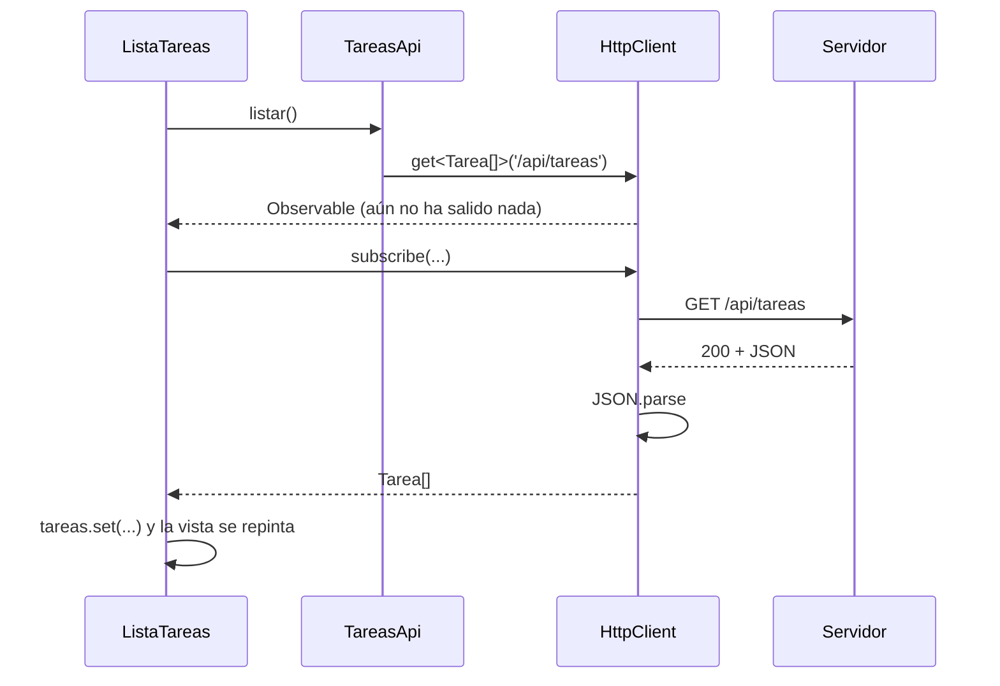

Ya sabes qué es una API. Ahora necesitas que tu aplicación Angular le hable. Podrías usar `fetch` del navegador a mano, pero Angular trae una herramienta mejor integrada: **`HttpClient`**. Convierte el JSON en objetos tipados, deja que añadas comportamiento común a todas las peticiones (interceptores, lección 4) y se prueba fácilmente con dobles (módulo 18).

> [!analogia]
> `HttpClient` es el mensajero de tu empresa. Tú le das el encargo («trae las tareas de `/api/tareas`») y él se ocupa del viaje: preparar el sobre, ir, esperar, volver y abrirte el paquete ya ordenado.

## Configurarlo en `app.config.ts`

```typescript
// src/app/app.config.ts
import { ApplicationConfig, provideBrowserGlobalErrorListeners } from '@angular/core';
import { provideHttpClient } from '@angular/common/http';
import { provideRouter } from '@angular/router';
import { routes } from './app.routes';

export const appConfig: ApplicationConfig = {
  providers: [provideBrowserGlobalErrorListeners(), provideRouter(routes), provideHttpClient()],
};
```

- `@angular/common/http`: la parte HTTP de la librería `@angular/common` (ya instalada por `ng new`).
- `provideHttpClient()`: configura `HttpClient` para toda la aplicación. Acepta **funciones de configuración** (*features*) como `withInterceptors([...])`, que verás en la lección 4.

> [!idea]
> **Novedades de Angular 22** (comprobadas en `node_modules/@angular/common/types/http.d.ts`):
> - `HttpClient` ya está **provisto en la raíz por defecto**: puedes inyectarlo aunque no llames a `provideHttpClient()`. Aun así, lo normal es llamarlo en `app.config.ts`, porque es ahí donde se añaden los interceptores y demás opciones.
> - `HttpClient` usa por defecto la API **`fetch`** del navegador. `withFetch()` está marcado `@deprecated` (ya no hace falta). Si necesitas el progreso de subida de archivos, existe `withXhr()` para usar el antiguo `XMLHttpRequest`.
> En proyectos antiguos verás `provideHttpClient(withFetch())` o incluso `HttpClientModule` dentro de un `NgModule`: hacen lo mismo con la sintaxis de antes.

## Un servicio para la API

Las peticiones no se escriben en los componentes: se agrupan en un **servicio** (módulo 10). Créalo con `ng generate service tareas/tareas-api`:

```typescript
// src/app/tareas/tareas-api.ts
import { HttpClient } from '@angular/common/http';
import { inject, Service } from '@angular/core';
import { Observable } from 'rxjs';
import { Tarea } from './tarea';

@Service()
export class TareasApi {
  private readonly http = inject(HttpClient);
  private readonly url = '/api/tareas';

  listar(): Observable<Tarea[]> {
    return this.http.get<Tarea[]>(this.url);
  }

  obtener(id: number): Observable<Tarea> {
    return this.http.get<Tarea>(`${this.url}/${id}`);
  }

  crear(titulo: string): Observable<Tarea> {
    return this.http.post<Tarea>(this.url, { titulo, hecha: false });
  }

  actualizar(tarea: Tarea): Observable<Tarea> {
    return this.http.put<Tarea>(`${this.url}/${tarea.id}`, tarea);
  }

  borrar(id: number): Observable<void> {
    return this.http.delete<void>(`${this.url}/${id}`);
  }

  buscar(texto: string): Observable<Tarea[]> {
    return this.http.get<Tarea[]>(this.url, { params: { q: texto } });
  }
}
```

Línea a línea:

- `@Service()`: el decorador que genera la CLI de Angular 22 para los servicios. Hace que el servicio exista una sola vez en toda la app y se pueda inyectar en cualquier sitio. En código anterior verás `@Injectable({ providedIn: 'root' })`, que es equivalente.
- `inject(HttpClient)`: pide el mensajero al sistema de inyección.
- `Observable` viene de **RxJS**, una librería que Angular usa para valores que llegan con el tiempo (módulo 14). Cada método devuelve un `Observable`: **la promesa de una respuesta futura**, todavía no la respuesta.
- `get<Tarea[]>(url)`: el `<Tarea[]>` le dice a TypeScript qué forma tendrá el JSON. Ojo: es una promesa tuya, Angular **no comprueba** que el servidor cumpla.
- `post(url, cuerpo)` y `put(url, cuerpo)`: el segundo argumento es el cuerpo. `HttpClient` lo convierte a JSON y pone la cabecera `Content-Type: application/json` por ti.
- `{ params: { q: texto } }`: añade `?q=texto` a la URL, codificando bien los espacios y los acentos.

## Usarlo en un componente

```typescript
// src/app/tareas/lista-tareas.ts (fragmento)
private readonly api = inject(TareasApi);
protected readonly tareas = signal<Tarea[]>([]);

ngOnInit() {
  this.api.listar().subscribe((tareas) => this.tareas.set(tareas));
}
```

`subscribe(...)` es la orden de «ve y tráelo»; la función que le pasas se ejecuta cuando llega la respuesta, ya convertida en un array de `Tarea`. La guardas en un signal y la plantilla se repinta sola.

```pantalla
@url localhost:4200/tareas
<h2>Mis tareas</h2>
<ul>
  <li>Comprar pan</li>
  <li>Estudiar Angular</li>
</ul>
```

## El viaje completo



> [!prueba]
> En tu proyecto, cambia la URL por `https://jsonplaceholder.typicode.com/todos?_limit=3` y la plantilla para mostrar `tarea.title`. Guarda y abre la pestaña Red: verás la petición `GET` y su JSON.

> [!cuidado]
> `get<Tarea[]>` no convierte ni valida nada: si el servidor devuelve `{ "title": ... }` en lugar de `{ "titulo": ... }`, TypeScript no se queja y en pantalla verás huecos vacíos. Revisa el JSON real en la pestaña Red cuando algo no aparezca.

> [!resumen]
> - `provideHttpClient()` en `app.config.ts` configura `HttpClient`; en Angular 22 ya usa `fetch` por defecto.
> - Las peticiones van en un servicio: `get`, `post`, `put`, `patch` y `delete` devuelven `Observable` tipados.
> - El tipo `<Tarea[]>` es una promesa tuya, no una comprobación.
> - Nada viaja hasta que alguien hace `subscribe` (lo verás a fondo en la siguiente lección).
