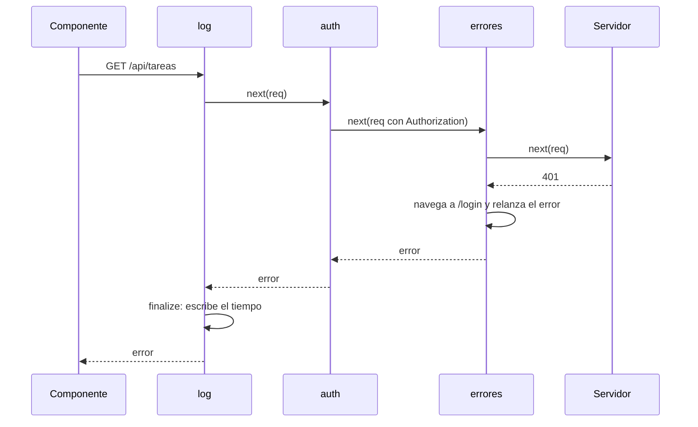

Tu API pide que **todas** las peticiones lleven la cabecera `Authorization: Bearer <token>` para saber quién eres. Podrías añadirla a mano en cada `get`, `post` y `delete`… y olvidarla en uno. También quieres que, si cualquier petición responde `401`, la app te mande a la pantalla de login, y medir cuánto tarda cada llamada. Todo eso es lo mismo para todas las peticiones. Para eso existen los **interceptores**.

> [!analogia]
> Un interceptor es como el control de seguridad de un aeropuerto. Todos los pasajeros (peticiones) pasan por él al salir y otra vez al volver. Puede ponerles una pegatina (una cabecera), apuntar a qué hora pasaron (un log) o pararlos si algo va mal (un error). Puede haber varios controles seguidos, y el orden importa.

## Un interceptor es una función

```bash
ng generate interceptor auth
CREATE src/app/auth-interceptor.spec.ts (475 bytes)
CREATE src/app/auth-interceptor.ts (149 bytes)
```

La CLI de Angular 22 genera un interceptor **funcional**:

```typescript
// src/app/auth-interceptor.ts (tal como lo crea la CLI)
import { HttpInterceptorFn } from '@angular/common/http';

export const authInterceptor: HttpInterceptorFn = (req, next) => {
  return next(req);
};
```

- `HttpInterceptorFn`: el tipo de un interceptor. Recibe la petición `req` y la función `next`.
- `next(req)`: «deja pasar la petición al siguiente control». Devuelve un observable con lo que vuelva del servidor.
- Un interceptor que solo hace `return next(req)` no cambia nada: es un control vacío.

## Tres interceptores útiles

```typescript
// src/app/interceptores.ts
import { HttpErrorResponse, HttpInterceptorFn } from '@angular/common/http';
import { inject } from '@angular/core';
import { Router } from '@angular/router';
import { catchError, tap, throwError } from 'rxjs';
import { Sesion } from './sesion';

export const authInterceptor: HttpInterceptorFn = (req, next) => {
  const token = inject(Sesion).token();
  if (!token) {
    return next(req);
  }
  const conToken = req.clone({ setHeaders: { Authorization: `Bearer ${token}` } });
  return next(conToken);
};

export const logInterceptor: HttpInterceptorFn = (req, next) => {
  const inicio = performance.now();
  return next(req).pipe(
    tap({
      finalize: () => console.log(`${req.method} ${req.url} (${Math.round(performance.now() - inicio)} ms)`),
    }),
  );
};

export const erroresInterceptor: HttpInterceptorFn = (req, next) => {
  const router = inject(Router);
  return next(req).pipe(
    catchError((error: HttpErrorResponse) => {
      if (error.status === 401) {
        router.navigate(['/login']);
      }
      return throwError(() => error);
    }),
  );
};
```

- `inject(Sesion)`: los interceptores funcionales pueden usar `inject()`, porque Angular los ejecuta dentro del sistema de inyección. `Sesion` es un servicio tuyo que guarda el token en un signal.
- `req.clone({ setHeaders: ... })`: las peticiones son **inmutables** (no se pueden cambiar). Para añadir una cabecera se crea una copia con el cambio.
- `tap({ finalize })`: un operador de RxJS que «mira sin tocar». `finalize` se ejecuta cuando la petición termina, vaya bien o mal.
- `catchError` + `throwError(() => error)`: reacciona al `401` y **vuelve a lanzar** el error, para que el componente también se entere y pueda mostrar su mensaje.

## Registrarlos

```typescript
// src/app/app.config.ts
import { ApplicationConfig, provideBrowserGlobalErrorListeners } from '@angular/core';
import { provideHttpClient, withInterceptors } from '@angular/common/http';
import { provideRouter } from '@angular/router';
import { routes } from './app.routes';
import { authInterceptor, erroresInterceptor, logInterceptor } from './interceptores';

export const appConfig: ApplicationConfig = {
  providers: [
    provideBrowserGlobalErrorListeners(),
    provideRouter(routes),
    provideHttpClient(withInterceptors([logInterceptor, authInterceptor, erroresInterceptor])),
  ],
};
```

`withInterceptors([...])` es una *feature* de `provideHttpClient`. El orden del array es el orden de paso **a la ida**; a la vuelta, la respuesta los recorre **al revés**.

## El viaje de ida y vuelta



> [!idea]
> `next(req)` no devuelve solo la respuesta: devuelve un **flujo de eventos HTTP**. El primero es «petición enviada» (`HttpEventType.Sent`) y el último la respuesta (`HttpEventType.Response`). Si en un `tap` quieres actuar solo con la respuesta, pregunta `if (evento.type === HttpEventType.Response)`.

> [!prueba]
> En tu proyecto, registra solo `logInterceptor` y recarga una página que pida datos. En la consola verás algo como `GET /api/tareas (38 ms)`. Después añade `console.log('auth: ida')` al principio de `authInterceptor`, regístralo detrás de `logInterceptor` y mira en qué orden salen los mensajes.

> [!cuidado]
> En proyectos antiguos verás interceptores como **clases** que implementan `HttpInterceptor` y se registran con `HTTP_INTERCEPTORS` y `withInterceptorsFromDi()`. Siguen funcionando, pero en código nuevo usa funciones con `withInterceptors`. Y no olvides devolver siempre `next(...)`: un interceptor que no lo llama deja la petición colgada y nunca llega al servidor.

> [!resumen]
> - Un interceptor es una función `(req, next) => ...` por la que pasan todas las peticiones.
> - Para cambiar una petición se clona: `req.clone({ setHeaders: ... })`.
> - Se registran con `provideHttpClient(withInterceptors([...]))`; a la ida van en orden y a la vuelta al revés.
> - Casos típicos: añadir el token, tratar errores comunes y medir tiempos.
