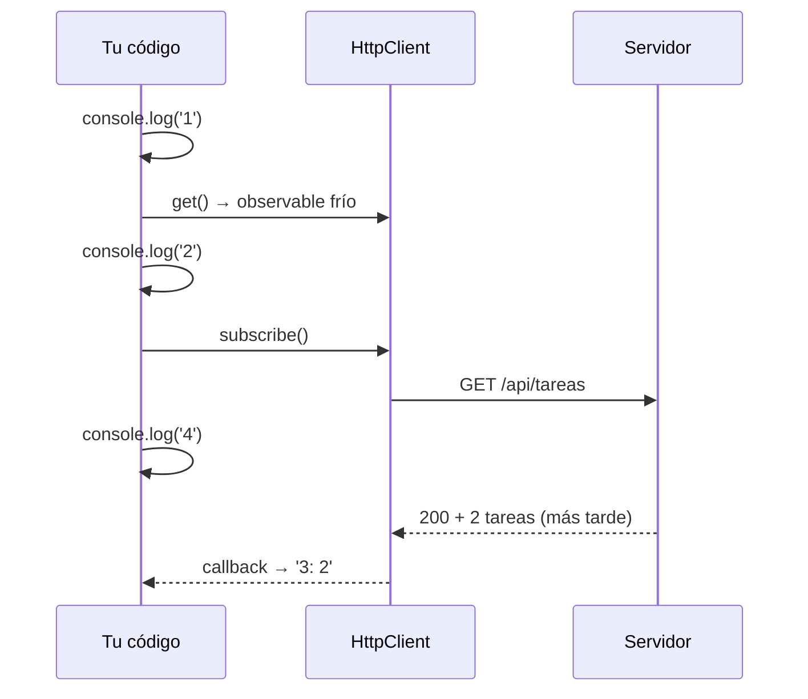

Escribes `this.api.listar()` en el constructor, recargas, abres la pestaña Red… y no hay ninguna petición. No es un error de Angular: los observables de `HttpClient` son **fríos**. Además, la red falla: el wifi se cae, el servidor devuelve un `500`. Una buena pantalla muestra «Cargando…», luego los datos o un mensaje claro con un botón de reintentar. En esta lección verás las dos cosas.

> [!analogia]
> Un observable frío es como una receta escrita en una tarjeta. Tener la tarjeta en la mano no cocina nada. Solo cuando alguien dice «¡a cocinar!» (`subscribe`) se enciende el fuego. Y si dos personas cocinan con la misma tarjeta, se hacen **dos** platos.

## Nada pasa hasta `subscribe`

```typescript
console.log('1');
const tareas$ = this.http.get<Tarea[]>('/api/tareas');
console.log('2');
tareas$.subscribe((t) => console.log('3: ' + t.length));
console.log('4');
```

Si el servidor devuelve dos tareas, la consola muestra:

```text
1
2
4
3: 2
```

- `get(...)` solo **prepara** la petición. No sale nada hacia la red.
- `subscribe(...)` la **lanza**. Pero la respuesta tarda: JavaScript no se queda esperando, sigue con la línea siguiente y escribe `4`.
- Cuando llega la respuesta, se ejecuta la función de `subscribe` y aparece `3: 2`.

El `$` al final de `tareas$` es una costumbre: indica que la variable guarda un observable.



> [!cuidado]
> Cada `subscribe` lanza **otra** petición. Si te suscribes dos veces al mismo `tareas$`, el servidor recibe dos `GET`. Y al revés: si un método solo devuelve `this.http.post(...)` y nadie se suscribe, **la tarea nunca se crea**. Es el error más típico con `HttpClient`.

Las peticiones de `HttpClient` emiten una respuesta y **terminan** (se completan). Por eso no hace falta cancelar la suscripción a mano en la mayoría de casos; si el componente se destruye antes, puedes usar `takeUntilDestroyed()` (módulo 14).

## Los tres estados de una pantalla

```typescript
// src/app/tareas/lista-tareas.ts
import { HttpErrorResponse } from '@angular/common/http';
import { Component, inject, OnInit, signal } from '@angular/core';
import { Tarea } from './tarea';
import { TareasApi } from './tareas-api';

@Component({
  selector: 'app-lista-tareas',
  templateUrl: './lista-tareas.html',
})
export class ListaTareas implements OnInit {
  private readonly api = inject(TareasApi);

  protected readonly tareas = signal<Tarea[]>([]);
  protected readonly cargando = signal(false);
  protected readonly error = signal<string | null>(null);

  ngOnInit() {
    this.cargar();
  }

  protected cargar() {
    this.cargando.set(true);
    this.error.set(null);
    this.api.listar().subscribe({
      next: (tareas) => {
        this.tareas.set(tareas);
        this.cargando.set(false);
      },
      error: (e: HttpErrorResponse) => {
        this.error.set(`No se pudieron cargar las tareas (${e.status})`);
        this.cargando.set(false);
      },
    });
  }
}
```

```html
<!-- src/app/tareas/lista-tareas.html -->
@if (cargando()) {
  <p>Cargando…</p>
} @else if (error()) {
  <p class="error">{{ error() }}</p>
  <button (click)="cargar()">Reintentar</button>
} @else {
  <ul>
    @for (tarea of tareas(); track tarea.id) {
      <li>{{ tarea.titulo }}</li>
    } @empty {
      <li>No hay tareas</li>
    }
  </ul>
}
```

- `subscribe({ next, error })`: en lugar de una función, un objeto con una función para cada caso. `next` recibe los datos; `error` recibe el fallo.
- `HttpErrorResponse`: la clase de error de `@angular/common/http`. Trae `status` (404, 500… o `0` si no hubo conexión), `message` y `error` (el cuerpo que envió el servidor).
- Tres signals (`tareas`, `cargando`, `error`) describen la pantalla, y la plantilla elige qué pintar con `@if`.

Así se ve si el servidor falla:

```pantalla
@url localhost:4200/tareas
<p style="color: crimson">No se pudieron cargar las tareas (500)</p>
<button>Reintentar</button>
```

## `catchError`: un plan B dentro de la tubería

RxJS también permite tratar el error **antes** de que llegue a `subscribe`, con el operador `catchError` (módulo 14):

```typescript
import { catchError, finalize, of } from 'rxjs';

this.api
  .listar()
  .pipe(
    catchError((error) => {
      console.error('Falló la petición', error);
      return of([]);
    }),
    finalize(() => this.cargando.set(false)),
  )
  .subscribe((tareas) => this.tareas.set(tareas));
```

- `pipe(...)`: encadena operadores que transforman lo que pasa por el observable.
- `catchError`: si hay error, ejecuta la función y **sustituye** el error por otro observable. `of([])` emite una lista vacía, así que `subscribe` recibe `[]` como si todo hubiera ido bien.
- `finalize`: se ejecuta al terminar, tanto si fue bien como si falló. Ideal para apagar el «Cargando…».

> [!prueba]
> En tu proyecto, cambia la URL de `listar()` por una que no exista (`/api/tareaz`) y recarga: verás el mensaje de error con el código `404`. Pulsa «Reintentar» y mira en la pestaña Red cómo sale otra petición.

> [!resumen]
> - Los observables de `HttpClient` son fríos: la petición sale con `subscribe`, y cada `subscribe` lanza una nueva.
> - La respuesta llega más tarde; el código que va después de `subscribe` se ejecuta antes.
> - Modela la pantalla con signals de datos, carga y error, y trata el fallo en `error` o con `catchError`.
