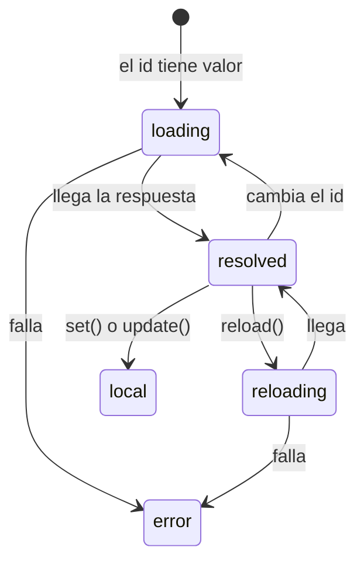

En la lección 3 escribiste tres signals (`tareas`, `cargando`, `error`), un método `cargar()` y un `subscribe` con dos ramas. Funciona, pero es mucho código repetido para algo muy común: «cuando cambie este id, pide estos datos y dime en qué estado está la petición». Angular tiene una pieza hecha para eso: los **resources**.

> [!idea]
> **Estado en Angular 22** (comprobado en los `.d.ts`): `resource()` y `ResourceRef` (`@angular/core`), `rxResource()` (`@angular/core/rxjs-interop`) y `httpResource()` (`@angular/common/http`) llevan la etiqueta **`@publicApi 22.0`**: son estables. Antes eran experimentales, así que en artículos antiguos verás nombres distintos (por ejemplo `request` y `loader` en lugar de `params` y `stream` en `rxResource`). Lo que sigue siendo `@experimental` en Angular 22 son piezas cercanas como `debounced()` y `resourceFromSnapshots()`: no las uses todavía.

> [!analogia]
> Un resource es como un pedido con seguimiento. Tú dices qué quieres («el detalle de la tarea 7») y él se encarga de pedirlo, y en todo momento puedes mirar su estado: «en camino», «entregado», «incidencia». Si cambias el pedido (ahora la tarea 8), cancela el anterior y lanza el nuevo.

## `httpResource`: una petición GET reactiva

```typescript
// src/app/tareas/detalle-tarea.ts
import { httpResource } from '@angular/common/http';
import { Component, input } from '@angular/core';
import { Tarea } from './tarea';

@Component({
  selector: 'app-detalle-tarea',
  templateUrl: './detalle-tarea.html',
})
export class DetalleTarea {
  readonly id = input.required<number>();

  protected readonly tarea = httpResource<Tarea>(() => `/api/tareas/${this.id()}`);
}
```

```html
<!-- src/app/tareas/detalle-tarea.html -->
@if (tarea.isLoading()) {
  <p>Cargando…</p>
} @else if (tarea.error()) {
  <p>No se pudo cargar la tarea</p>
} @else if (tarea.hasValue()) {
  <h2>{{ tarea.value().titulo }}</h2>
}
```

- `httpResource<Tarea>(() => url)`: recibe una **función** que devuelve la URL. Como la función lee el signal `this.id()`, Angular sabe que depende de él: cada vez que cambie el id, hace la petición nueva y cancela la anterior si aún no había terminado. Si la función devuelve `undefined`, no pide nada.
- Usa `HttpClient` por dentro, así que **pasa por tus interceptores**.
- `tarea.value()`, `tarea.isLoading()`, `tarea.error()`, `tarea.status()`: todo son signals, la plantilla se repinta sola.
- `tarea.hasValue()`: `true` cuando hay un valor que mostrar. Dentro de ese `@if`, TypeScript sabe que `value()` no es `undefined`.

## Los estados de un resource

`status()` vale uno de estos textos:

| Estado | Qué significa |
| --- | --- |
| `'idle'` | No hay petición (la función devolvió `undefined`) |
| `'loading'` | Pidiendo por primera vez (o tras cambiar los parámetros) |
| `'resolved'` | Llegó el valor |
| `'error'` | Falló; el error está en `error()` |
| `'reloading'` | Recargando con `reload()`; mientras, conserva el valor anterior |
| `'local'` | Cambiaste el valor a mano con `set()` o `update()` |



Así se ve el componente mientras carga y cuando termina:

```pantalla
@url localhost:4200/tareas/7
<p>Cargando…</p>
```

```pantalla
@url localhost:4200/tareas/7
<h2>Estudiar Angular</h2>
```

## `resource` y `rxResource`

`httpResource` es un atajo para peticiones GET. Para cualquier otra fuente asíncrona existen dos hermanos:

```typescript
import { Component, inject, resource, signal } from '@angular/core';
import { rxResource } from '@angular/core/rxjs-interop';

// Dentro de la clase del componente:
protected readonly texto = signal('');

// rxResource: la fuente es un Observable (por ejemplo, tu servicio TareasApi)
protected readonly resultados = rxResource({
  params: () => ({ q: this.texto() }),
  stream: ({ params }) => this.api.buscar(params.q),
  defaultValue: [] as Tarea[],
});

// resource: la fuente es una Promise (por ejemplo, fetch)
protected readonly ciudad = signal('Madrid');
protected readonly clima = resource({
  params: () => ({ ciudad: this.ciudad() }),
  loader: async ({ params, abortSignal }) => {
    const respuesta = await fetch(`/api/clima?ciudad=${params.ciudad}`, { signal: abortSignal });
    return (await respuesta.json()) as { temperatura: number };
  },
});
```

- `params`: una función reactiva que calcula los parámetros. Cuando cambia lo que lee, el resource vuelve a cargar.
- `stream` (en `rxResource`) devuelve un `Observable`; `loader` (en `resource`) devuelve una `Promise`.
- `abortSignal`: una señal del navegador para **cancelar** el `fetch` cuando llegan parámetros nuevos.
- `defaultValue`: el valor mientras no hay datos; así `value()` nunca es `undefined`.
- `reload()`: vuelve a pedir con los mismos parámetros (el botón «Reintentar»).

## ¿Cuándo usar cada cosa?

| Necesitas… | Usa |
| --- | --- |
| Leer datos que dependen de signals (un id, un filtro) | `httpResource` |
| Leer usando un servicio que devuelve `Observable` | `rxResource` |
| Leer de una fuente con `Promise` | `resource` |
| **Crear, cambiar o borrar** (`POST`, `PUT`, `DELETE`) | `HttpClient` + `subscribe` |

> [!cuidado]
> Los resources son para **leer**. Su documentación avisa: cancelan la petición en curso cuando cambian los parámetros o se destruye el componente, y eso podría cortar a medias una operación que modifica datos. Para guardar, usa `HttpClient` directamente (lección 2).

> [!prueba]
> En tu proyecto, añade un botón `<button (click)="tarea.reload()">Recargar</button>` y muestra `<p>{{ tarea.status() }}</p>`. Con la pestaña Red abierta en modo «3G lento», pulsa el botón: verás `reloading` mientras el título anterior sigue en pantalla, y después `resolved`.

> [!resumen]
> - `httpResource`, `rxResource` y `resource` son estables en Angular 22 (`@publicApi 22.0`).
> - Hacen la petición cuando cambian los signals que leen y exponen `value`, `status`, `isLoading` y `error` como signals.
> - `httpResource` para GET con `HttpClient`; `rxResource` con Observables; `resource` con Promises.
> - Son para leer datos; para crear, cambiar o borrar, usa `HttpClient`.
