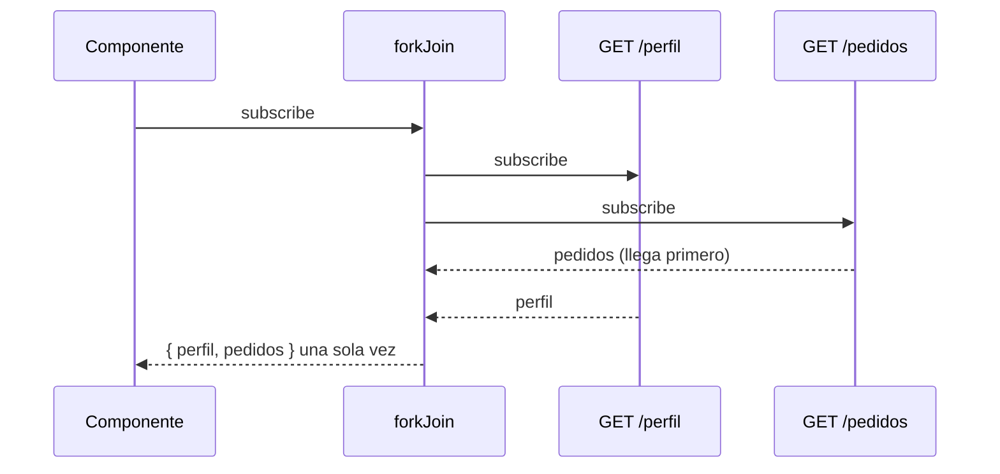

Tienes un Observable con las teclas que pulsa la persona en un buscador. No quieres buscar con cada tecla, ni buscar textos de una letra, ni repetir la misma búsqueda dos veces. Podrías meter todo eso en el `subscribe` con `if` y temporizadores… o encadenar **operadores**: piezas pequeñas que transforman la película antes de que llegue a ti.

> [!analogia]
> `pipe` es una cadena de montaje. Los valores entran por un lado y pasan por estaciones: una descarta los defectuosos (`filter`), otra los pinta (`map`), otra espera a que se acumulen (`debounceTime`). Al final de la cinta está tu `subscribe`, que solo ve lo que sobrevivió.

## `pipe`, `map`, `filter` y `tap`

```typescript
import { filter, map, of, tap } from 'rxjs';

of(3, 8, 1, 10)
  .pipe(
    tap((n) => console.log('entra', n)),
    filter((n) => n > 2),
    map((n) => n * 2),
  )
  .subscribe((n) => console.log('sale', n));
```

```text
entra 3
sale 6
entra 8
sale 16
entra 1
entra 10
sale 20
```

- `pipe(op1, op2, ...)`: devuelve un **Observable nuevo** con los operadores aplicados en orden. No cambia el original.
- `tap(fn)`: mira cada valor sin cambiarlo. Para logs y depuración.
- `filter(fn)`: deja pasar solo los valores para los que la función devuelve `true`.
- `map(fn)`: transforma cada valor en otro.
- Cada valor recorre **toda** la cadena antes de que entre el siguiente: por eso «entra 3» va seguido de «sale 6».

```text
fuente:        --3--8--1--10--|
filter(n>2):   --3--8-----10--|
map(n*2):      --6--16----20--|
```

## Operadores de tiempo: `debounceTime` y `distinctUntilChanged`

```text
teclas:                 -a-ad-ada---------adá--adá-------->
debounceTime(300):      ---------ada(300ms)-------adá(300ms)-->
distinctUntilChanged(): ---------ada----------------adá-------->
```

- `debounceTime(300)`: espera a que pasen **300 ms sin valores nuevos** y entonces emite el último. Mientras la persona teclea seguido, no sale nada.
- `distinctUntilChanged()`: descarta un valor si es **igual al anterior**. Si la persona escribe «ada», borra y vuelve a escribir la «a», no se repite la búsqueda.

## Errores: `catchError`

```typescript
import { catchError, map, of } from 'rxjs';

of(1, 2, 3)
  .pipe(
    map((n) => {
      if (n === 2) throw new Error('¡dos!');
      return n;
    }),
    catchError(() => of(0)),
  )
  .subscribe({ next: (n) => console.log(n), complete: () => console.log('fin') });
```

```text
1
0
fin
```

`catchError` atrapa el error y **sustituye el resto de la película** por el Observable que devuelvas. El 3 no llega nunca: el Observable original ya terminó con el error.

## Combinar varios Observables

```typescript
import { BehaviorSubject, combineLatest, forkJoin } from 'rxjs';

const usuario$ = new BehaviorSubject('Ada');
const tema$ = new BehaviorSubject('claro');
combineLatest([usuario$, tema$]).subscribe(([u, t]) => console.log(`${u} usa el tema ${t}`));
tema$.next('oscuro');
// Ada usa el tema claro
// Ada usa el tema oscuro

forkJoin({ perfil: api.perfil(), pedidos: api.pedidos() }).subscribe(({ perfil, pedidos }) =>
  console.log(`${perfil.nombre} tiene ${pedidos.length} pedidos`),
);
```

| Operador | Emite… | Úsalo para |
| --- | --- | --- |
| `combineLatest` | Cada vez que **cualquiera** cambia, con el último valor de todos (cuando todos tienen al menos uno) | Juntar estados que cambian: filtros + datos |
| `forkJoin` | **Una sola vez**, cuando **todos terminan**, con el último valor de cada uno | Lanzar varias peticiones HTTP a la vez y esperar a todas |



> [!prueba]
> En tu proyecto, copia el ejemplo de `of(3, 8, 1, 10)` en el constructor de `App` y mira la consola. Después cambia el orden: pon `map` antes que `filter`. ¿Qué números salen ahora? (Pista: el filtro recibe ya los dobles.)

> [!cuidado]
> `forkJoin` espera a que **todos terminen**. Con peticiones HTTP perfecto, porque terminan solas; pero si le das un Observable que nunca termina (un `interval`, un `BehaviorSubject`), `forkJoin` no emite jamás. Para eso es `combineLatest`.

> [!resumen]
> - `pipe` encadena operadores y devuelve un Observable nuevo; cada valor recorre toda la cadena.
> - `map` transforma, `filter` descarta, `tap` observa sin tocar.
> - `debounceTime` espera a que haya calma y `distinctUntilChanged` evita repetidos.
> - `catchError` sustituye un error por un plan B; `combineLatest` junta estados y `forkJoin` espera a varias peticiones.
