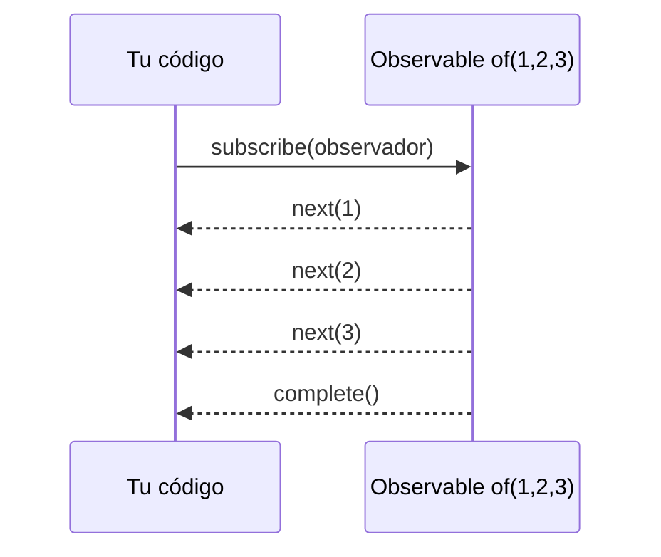

Un valor normal es una foto: `const edad = 30` vale 30 y ya está. Pero muchas cosas de una aplicación son **películas**: las teclas que pulsa la persona, los clics, los mensajes de un chat, la respuesta de un servidor que llegará dentro de un rato. Son valores que aparecen **a lo largo del tiempo**. RxJS es la librería que Angular usa para trabajar con esas películas, y su pieza central es el **Observable**.

> [!analogia]
> Un Observable es como un canal de YouTube. El canal publica vídeos cuando quiere (valores). Tú te **suscribes** para recibirlos; mientras estás suscrito, cada vídeo nuevo te llega. Puedes **darte de baja** cuando quieras. Y un día el canal puede cerrar (terminar) o tener un problema y dejar de emitir (error).

## De dónde sale RxJS

RxJS (*Reactive Extensions for JavaScript*) no es parte de Angular: es una librería aparte que `ng new` instala en `dependencies` (`"rxjs": "~7.8.0"`). Angular la usa por dentro en `HttpClient`, en el router y en los formularios reactivos. Todo se importa desde `'rxjs'`:

```typescript
import { Observable, of, interval, filter, map } from 'rxjs';
```

## Las tres señales de un Observable

Un Observable puede enviar tres tipos de aviso a quien está suscrito:

| Aviso | Significa | Cuántas veces |
| --- | --- | --- |
| `next(valor)` | Aquí tienes un valor nuevo | De 0 a infinitas |
| `error(e)` | Algo falló; se acabó | Como mucho una, y es la última |
| `complete()` | Terminé bien; no habrá más | Como mucho una, y es la última |

Para ver el tiempo se usan **diagramas de canicas** (*marble diagrams*). El tiempo avanza hacia la derecha, cada letra o número es un valor, `|` es `complete` y `X` es `error`:

```text
of(1, 2, 3)        (123|)            tres valores seguidos y termina
interval(1000)     ---0---1---2--->  un número cada segundo, para siempre
http.get(...)      ------R|          una respuesta (R) y termina
petición fallida   ------X           un error y se acaba
```

## Suscribirse

```typescript
import { of } from 'rxjs';

const numeros$ = of(1, 2, 3);

numeros$.subscribe({
  next: (n) => console.log('Valor', n),
  error: (e) => console.log('Error', e),
  complete: () => console.log('Fin'),
});
```

```text
Valor 1
Valor 2
Valor 3
Fin
```

- `of(1, 2, 3)`: crea un Observable que emite esos valores y termina.
- `subscribe({...})`: le pasas un **observador**, un objeto con una función por cada tipo de aviso. Si solo te interesan los valores, basta con una función: `numeros$.subscribe((n) => console.log(n))`.
- Igual que viste en el módulo 13, el Observable es **frío**: hasta `subscribe` no pasa nada, y cada suscripción empieza su propia película desde el principio.



## Darse de baja

Algunos Observables no terminan nunca, como `interval(1000)`, que emite un número cada segundo. Si te suscribes en un componente y el componente desaparece, la suscripción **sigue viva** gastando memoria y ejecutando código. Hay que darse de baja:

```typescript
import { interval } from 'rxjs';

const suscripcion = interval(1000).subscribe((n) => console.log(n));

// más tarde, cuando ya no lo necesitas:
suscripcion.unsubscribe();
```

`subscribe` devuelve un objeto `Subscription`; su método `unsubscribe()` corta la película. En Angular casi nunca lo harás a mano: en la lección 5 verás `takeUntilDestroyed()`, el pipe `async` y `toSignal`, que se dan de baja solos.

> [!idea]
> Observable frente a Promise (módulo 2): una Promise da **un** valor, empieza en cuanto la creas y no se puede cancelar. Un Observable puede dar **muchos** valores, no empieza hasta `subscribe` y se cancela con `unsubscribe`.

> [!prueba]
> En tu proyecto, dentro del constructor de `App`, escribe `interval(1000).subscribe((n) => console.log('tic', n));` (importa `interval` de `'rxjs'`). Abre la consola: un «tic» cada segundo. Ahora guarda la suscripción en una variable y llama a `unsubscribe()` dentro de un `setTimeout` de 5 segundos: los tics se paran.

> [!cuidado]
> Un error **termina** el Observable: después de `error` no llega ni un `next` más, aunque la fuente tuviera más valores. Si quieres que la película siga tras un fallo, tienes que tratarlo con operadores como `catchError` (lección 3).

> [!resumen]
> - Un Observable es una secuencia de valores en el tiempo; avisa con `next`, `error` y `complete`.
> - Los diagramas de canicas dibujan el tiempo: valores, `|` para terminar y `X` para error.
> - `subscribe` arranca la película y `unsubscribe` la corta; los que no terminan solos hay que cortarlos.
> - RxJS es una librería aparte (`rxjs`), que Angular usa en HTTP, router y formularios reactivos.
