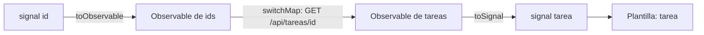

Angular moderno tiene dos herramientas reactivas: los **signals** (módulo 7) y los **Observables** de RxJS. No compiten: cada una brilla en una cosa, y Angular trae puentes para pasar de una a otra. En esta lección verás esos puentes, cómo evitar suscripciones olvidadas y cuándo usar cada herramienta.

> [!analogia]
> Un signal es un **marcador** de un partido: siempre tiene un valor, lo miras cuando quieras y te enteras de los cambios. Un Observable es la **retransmisión** del partido: una sucesión de momentos en el tiempo, que puedes recortar, acelerar o combinar con otras. Los puentes convierten la retransmisión en marcador y al revés.

## El pipe `async`

```typescript
// src/app/reloj/reloj.ts
import { AsyncPipe } from '@angular/common';
import { Component } from '@angular/core';
import { interval } from 'rxjs';

@Component({
  selector: 'app-reloj',
  imports: [AsyncPipe],
  template: `<p>Segundos: {{ segundos$ | async }}</p>`,
})
export class Reloj {
  protected readonly segundos$ = interval(1000);
}
```

`| async` se suscribe al Observable cuando se pinta la plantilla, muestra el último valor y **se da de baja solo** al destruir el componente. Antes del primer valor muestra `null` (nada). Lo verás mucho en código anterior a los signals.

## `toSignal`: de Observable a signal

```typescript
import { toSignal } from '@angular/core/rxjs-interop';
import { interval } from 'rxjs';

protected readonly segundos = toSignal(interval(1000), { initialValue: 0 });
// en la plantilla: {{ segundos() }}
```

- `@angular/core/rxjs-interop`: la parte de Angular que conecta signals y RxJS.
- `toSignal(obs$)`: se suscribe al Observable y guarda el último valor en un signal de solo lectura. Se da de baja solo cuando se destruye el componente (o el servicio) donde se creó.
- `initialValue`: el valor mientras no ha llegado nada. Sin él, el signal empieza en `undefined` y su tipo incluye `undefined`.
- Debe llamarse en un **contexto de inyección**: al declarar una propiedad o en el constructor, igual que `inject()`.

## `toObservable`: de signal a Observable

```typescript
import { signal } from '@angular/core';
import { toObservable, toSignal } from '@angular/core/rxjs-interop';
import { switchMap } from 'rxjs';

protected readonly id = signal(1);
protected readonly tarea = toSignal(
  toObservable(this.id).pipe(switchMap((id) => this.api.obtener(id))),
);
```

`toObservable(signal)` emite cada vez que el signal cambia. Así puedes usar operadores de tiempo (`debounceTime`, `switchMap`) sobre un signal y volver a un signal al final.



## `takeUntilDestroyed`: darse de baja sin pensar

Cuando sí necesitas un `subscribe` (por ejemplo, para un efecto como escribir en consola o guardar), corta la suscripción al destruir el componente:

```typescript
import { Component, DestroyRef, inject } from '@angular/core';
import { takeUntilDestroyed } from '@angular/core/rxjs-interop';
import { interval, map } from 'rxjs';

export class Reloj {
  private readonly destroyRef = inject(DestroyRef);

  constructor() {
    interval(5000)
      .pipe(takeUntilDestroyed())
      .subscribe(() => console.log('sigo vivo'));
  }

  protected iniciarMasTarde() {
    interval(1000)
      .pipe(
        map((n) => n * 2),
        takeUntilDestroyed(this.destroyRef),
      )
      .subscribe((n) => console.log(n));
  }
}
```

- `takeUntilDestroyed()` sin argumentos funciona en el constructor o al declarar propiedades (contexto de inyección).
- Fuera de ese contexto (en un método que se llama más tarde) hay que pasarle el `DestroyRef` del componente (módulo 5).
- Ponlo **al final** del `pipe`, justo antes de `subscribe`, para que corte todo lo anterior.

> [!cuidado]
> En proyectos antiguos verás un `Subject` llamado `destroy$`, un `ngOnDestroy() { this.destroy$.next(); }` y `takeUntil(this.destroy$)` en cada `pipe`. Es el mismo patrón hecho a mano. Si encuentras un `subscribe` a un Observable infinito **sin nada** que lo corte, has encontrado una fuga de memoria: cada vez que se cree el componente habrá una suscripción más.

## ¿Signals o RxJS?

| Situación | Mejor |
| --- | --- |
| Estado que la plantilla muestra (contador, usuario, lista) | `signal` y `computed` |
| Valores derivados de otros | `computed` |
| Leer datos de una API según un signal | `httpResource` / `rxResource` (módulo 13) |
| Eventos en el tiempo: teclas, debounce, cancelar, reintentar | RxJS |
| Combinar varias fuentes asíncronas con reglas de tiempo | RxJS |
| APIs de Angular que ya devuelven Observables (`HttpClient`, router, `valueChanges`) | RxJS, y `toSignal` para la plantilla |

> [!idea]
> Regla práctica: **el estado en signals, el tiempo en RxJS**. Usa RxJS dentro del servicio o en la tubería, y entrega a la plantilla un signal.

> [!prueba]
> En tu proyecto, crea el componente `Reloj` con `toSignal(interval(1000), { initialValue: 0 })` y muéstralo con una ruta. Navega a otra ruta y vuelve: el contador empieza de nuevo en 0, porque la suscripción anterior se cortó al destruir el componente.

> [!resumen]
> - `| async` y `toSignal` se suscriben y se dan de baja solos; `toSignal` necesita contexto de inyección.
> - `toObservable` convierte un signal en Observable para aplicarle operadores.
> - `takeUntilDestroyed()` corta un `subscribe` al destruir el componente (con `DestroyRef` fuera del constructor).
> - Estado en signals; eventos y tiempo en RxJS.
