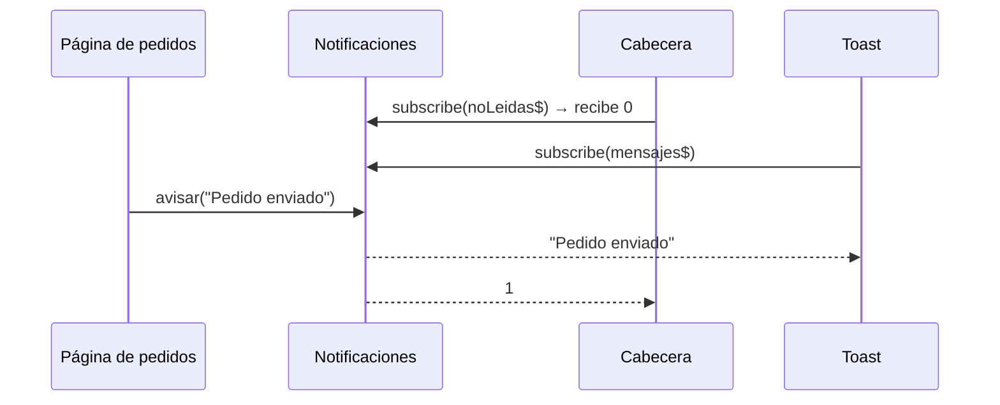

Los Observables de la lección anterior los «emitía» alguien de fuera: el temporizador, el servidor. Pero a veces **tú** quieres emitir valores cuando pase algo: «ha llegado una notificación», «el usuario ha cerrado sesión». Y quieres que varios componentes lo escuchen a la vez. Para eso existen los **Subjects**: Observables a los que también puedes empujar valores.

> [!analogia]
> Un `Subject` es una emisora de radio en directo: quien está sintonizado oye lo que se dice desde ese momento, y lo que se dijo antes se perdió. Un `BehaviorSubject` es una pantalla de aeropuerto: siempre muestra el **último** estado («Embarcando»), así que quien llega tarde ve al instante cómo están las cosas, y después cada cambio.

## `Subject`: emitir a mano

```typescript
import { Subject } from 'rxjs';

const avisos = new Subject<string>();

avisos.next('a');                                  // nadie escucha: se pierde
avisos.subscribe((v) => console.log('Ana: ' + v));
avisos.next('b');                                  // Ana lo recibe
avisos.subscribe((v) => console.log('Luis: ' + v));
avisos.next('c');                                  // los dos lo reciben
```

```text
Ana: b
Ana: c
Luis: c
```

- `new Subject<string>()`: un Subject que emite textos.
- `next(valor)`: emite a **todos** los suscritos en ese momento.
- A diferencia de un Observable frío, un Subject es **caliente**: todos comparten la misma emisión y no hay «empezar desde el principio».

```text
next:   --a-----b--------c---->
Ana:          ^-b--------c---->   (se suscribe tras «a»)
Luis:                ^---c---->   (se suscribe tras «b»)
```

## `BehaviorSubject`: siempre tiene un valor

```typescript
import { BehaviorSubject } from 'rxjs';

const precio = new BehaviorSubject(10);   // valor inicial obligatorio

precio.next(20);
precio.subscribe((p) => console.log('Ana ve ' + p));   // recibe 20 al instante
precio.next(30);
console.log('Ahora vale ' + precio.value);
```

```text
Ana ve 20
Ana ve 30
Ahora vale 30
```

- El constructor necesita un **valor inicial**.
- Quien se suscribe recibe **enseguida el último valor**, y después los nuevos.
- `.value` lee el valor actual sin suscribirse.

También existe `ReplaySubject(n)`, que guarda los **últimos n** valores y se los da a quien llega tarde.

## Un servicio de notificaciones

El uso típico en Angular: un servicio con un Subject **privado** y un Observable **público**. Solo el servicio puede emitir; el resto solo escucha.

```typescript
// src/app/notificaciones.ts
import { Service } from '@angular/core';
import { BehaviorSubject, Observable, Subject } from 'rxjs';

@Service()
export class Notificaciones {
  private readonly mensajes = new Subject<string>();
  private readonly noLeidas = new BehaviorSubject(0);

  readonly mensajes$: Observable<string> = this.mensajes.asObservable();
  readonly noLeidas$: Observable<number> = this.noLeidas.asObservable();

  avisar(texto: string) {
    this.mensajes.next(texto);
    this.noLeidas.next(this.noLeidas.value + 1);
  }

  marcarLeidas() {
    this.noLeidas.next(0);
  }
}
```

- `asObservable()`: devuelve una versión de solo lectura. Quien la recibe puede suscribirse pero no tiene `next`.
- `mensajes` es un `Subject` porque un aviso es un **evento**: si no estabas, no te interesa.
- `noLeidas` es un `BehaviorSubject` porque es un **estado**: el contador de la cabecera debe mostrar el número actual aunque se cree más tarde.



> [!idea]
> Un `BehaviorSubject` se parece mucho a un `signal`: los dos tienen siempre un valor actual y avisan de los cambios. En código nuevo de Angular, para **estado** se prefieren los signals (módulo 15); los Subjects siguen siendo útiles para **eventos** y para combinarlos con operadores de RxJS.

> [!prueba]
> En tu proyecto, crea el servicio `Notificaciones`, inyéctalo en `App` y suscríbete a `noLeidas$` en el constructor con un `console.log`. Llama a `avisar('hola')` dos veces y a `marcarLeidas()`. En la consola verás 0, 1, 2 y 0.

> [!cuidado]
> No expongas el Subject directamente como `public`. Si cualquier componente puede llamar a `next`, el estado puede cambiar desde cualquier rincón y será muy difícil saber quién lo cambió. Expón `asObservable()` y métodos con nombre (`avisar`, `marcarLeidas`).

> [!resumen]
> - Un `Subject` es un Observable al que tú empujas valores con `next`; solo llegan a quien ya está suscrito.
> - Un `BehaviorSubject` tiene valor inicial, da el último valor a quien llega y se lee con `.value`.
> - Patrón: Subject privado, `asObservable()` público y métodos para emitir.
