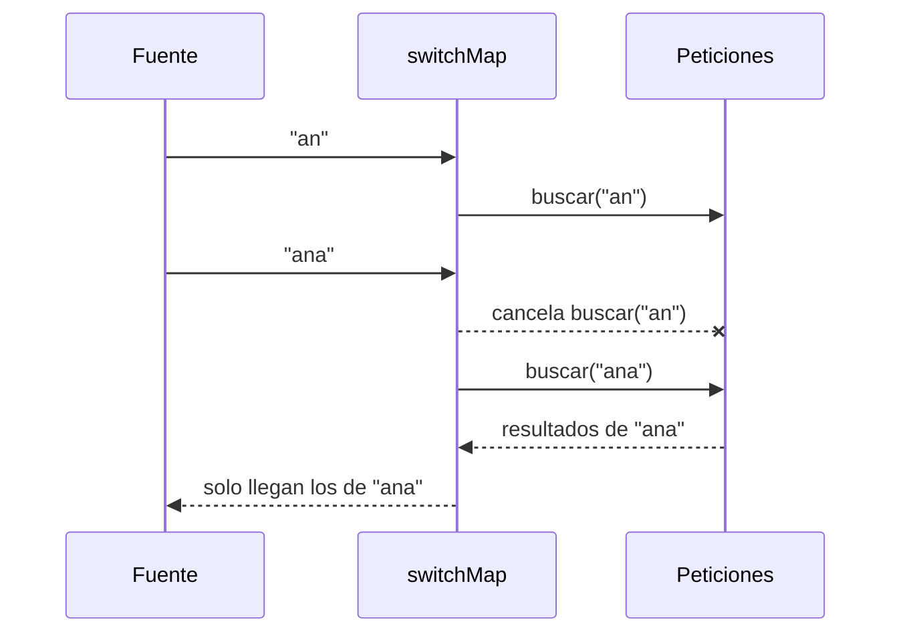

En el buscador, cada texto (después de `debounceTime`) tiene que convertirse en una **petición HTTP**. Con `map` tendrías un problema: `map((texto) => api.buscar(texto))` devuelve un Observable **de Observables**, y tu `subscribe` recibiría peticiones sin lanzar en lugar de resultados. Necesitas un operador que se suscriba por ti a cada Observable interno y te pase sus valores. Hay varios, y la diferencia entre ellos es **qué hacen si llega un valor nuevo mientras el anterior aún está en marcha**.

> [!analogia]
> Imagina que pides comida por teléfono y, antes de que llegue, cambias de idea y vuelves a llamar.
> - `switchMap`: el restaurante **cancela** el primer pedido y solo te trae el último.
> - `mergeMap`: prepara **los dos a la vez** y te los trae según estén listos, en cualquier orden.
> - `concatMap`: los prepara **en fila**: hasta que no entrega el primero, no empieza el segundo.
> - `exhaustMap`: mientras hay un pedido en marcha, **ignora** las llamadas nuevas.

## Un mismo ejemplo, tres operadores

Llegan tres pedidos seguidos, 3, 1 y 2. Atender el pedido `n` tarda `n × 100` ms:

```typescript
import { concatMap, map, mergeMap, of, switchMap, timer } from 'rxjs';

const pedidos$ = of(3, 1, 2);
const tarda = (n: number) => timer(n * 100).pipe(map(() => n));

pedidos$.pipe(mergeMap(tarda)).subscribe((n) => console.log('merge ' + n));
pedidos$.pipe(concatMap(tarda)).subscribe((n) => console.log('concat ' + n));
pedidos$.pipe(switchMap(tarda)).subscribe((n) => console.log('switch ' + n));
```

- `timer(ms)`: emite una vez pasados esos milisegundos y termina. Aquí simula una petición que tarda.
- `tarda(n)` devuelve un Observable **interno**; cada operador decide cómo suscribirse a ellos.

Mira cuándo sale cada valor en cada uno (una columna cada 100 ms):

```text
t (ms):      0   100 200 300 400 500 600
llegan:      312
mergeMap:        1   2   3|                 todos a la vez: sale antes el más rápido
concatMap:               3   1       2|     en fila: 3 (300), luego 1 (+100), luego 2 (+200)
switchMap:           2|                     el 3 y el 1 se cancelan al llegar el siguiente
```

Ejecutados por separado, cada uno imprime:

```text
merge 1
merge 2
merge 3

concat 3
concat 1
concat 2

switch 2
```



## Cuál elegir

| Operador | Si llega un valor nuevo mientras el anterior sigue… | Caso típico |
| --- | --- | --- |
| `switchMap` | Cancela el anterior | Buscador, cargar el detalle del elemento seleccionado |
| `mergeMap` | Los ejecuta a la vez | Subir varias fotos en paralelo |
| `concatMap` | Espera a que termine el anterior | Guardar cambios en orden |
| `exhaustMap` | Ignora el nuevo | Botón «Pagar» pulsado dos veces |

## El buscador completo

```typescript
// src/app/buscador/buscador.ts
import { Component, inject } from '@angular/core';
import { toSignal } from '@angular/core/rxjs-interop';
import { FormControl, ReactiveFormsModule } from '@angular/forms';
import { debounceTime, distinctUntilChanged, filter, map, switchMap } from 'rxjs';
import { TareasApi } from '../tareas/tareas-api';

@Component({
  selector: 'app-buscador',
  imports: [ReactiveFormsModule],
  template: `
    <input [formControl]="busqueda" placeholder="Buscar tareas" />
    <ul>
      @for (tarea of resultados(); track tarea.id) {
        <li>{{ tarea.titulo }}</li>
      }
    </ul>
  `,
})
export class Buscador {
  private readonly api = inject(TareasApi);
  protected readonly busqueda = new FormControl('', { nonNullable: true });

  protected readonly resultados = toSignal(
    this.busqueda.valueChanges.pipe(
      map((texto) => texto.trim()),
      filter((texto) => texto.length >= 2),
      debounceTime(300),
      distinctUntilChanged(),
      switchMap((texto) => this.api.buscar(texto)),
    ),
    { initialValue: [] },
  );
}
```

- `[formControl]="busqueda"`: un `FormControl` suelto, sin grupo (módulo 12). Su `valueChanges` es un Observable con cada valor que se escribe.
- La cadena: limpia espacios, descarta textos cortos, espera la calma, evita repetir y lanza la búsqueda cancelando la anterior.
- `toSignal(...)`: convierte el resultado en un signal para la plantilla, y se da de baja solo al destruir el componente (lección 5).

```pantalla
@url localhost:4200/buscar
<input value="estu" placeholder="Buscar tareas">
<ul>
  <li>Estudiar Angular</li>
  <li>Estudiar RxJS</li>
</ul>
```

> [!prueba]
> En tu proyecto, cambia `switchMap` por `mergeMap` y pon la pestaña Red en «3G lento». Escribe deprisa «an», espera un instante, y «ana»: con `mergeMap` verás las dos peticiones terminar y, si la primera llega tarde, ¡pisará los resultados buenos! Vuelve a `switchMap`: la primera aparece como *cancelada*.

> [!cuidado]
> No anides `subscribe` dentro de `subscribe` (`texto$.subscribe(t => api.buscar(t).subscribe(...))`). No se cancelan las peticiones viejas, las respuestas pueden llegar desordenadas y las suscripciones internas no se limpian. Ese es exactamente el trabajo de `switchMap` y sus hermanos.

> [!resumen]
> - Para convertir cada valor en otro Observable (una petición), usa un operador de aplanamiento, no `map`.
> - `switchMap` cancela el anterior, `mergeMap` los ejecuta a la vez, `concatMap` en fila y `exhaustMap` ignora los nuevos.
> - Para buscadores y selecciones, `switchMap`; para guardar en orden, `concatMap`.
