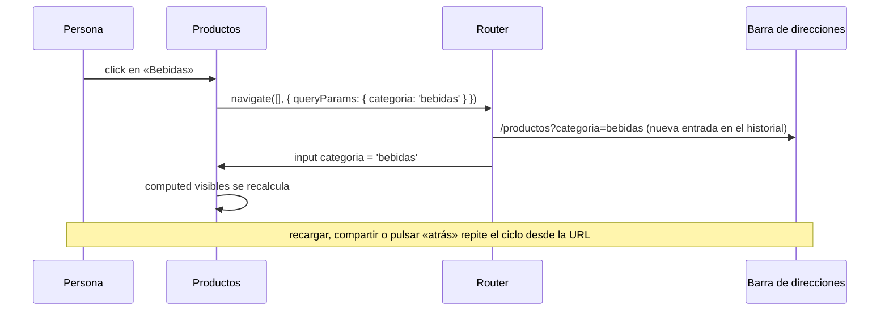

Filtras el catálogo por «bebidas», envías el enlace a una amiga y ella ve… todos los productos. Recargas la página y el filtro también desaparece. El botón «atrás» del navegador te saca del catálogo en lugar de quitar el filtro. Todo eso pasa porque el filtro vivía en un signal del componente. Si el estado debe **sobrevivir a una recarga, compartirse por enlace o respetar el botón atrás**, su sitio es la **URL**.

> [!analogia]
> La URL es como la dirección completa de un paquete: «Calle Mayor 5, 3.º B». Con ella, cualquiera llega exactamente al mismo sitio. Un filtro guardado solo en memoria es como decir «la casa de siempre»: solo lo entiende quien ya estaba allí.

## Dos sitios en la URL

```text
/productos/42?categoria=bebidas&orden=precio
          ^^^ ^^^^^^^^^^^^^^^^^^^^^^^^^^^^^^
          |   query params: opcionales, filtros, orden, página, búsqueda
          parámetro de ruta: identifica el recurso (el producto 42)
```

- Los **parámetros de ruta** (`/productos/:id`) dicen *qué* estás viendo (módulo 11).
- Los **query params** (`?clave=valor&...`) dicen *cómo* lo ves: filtros, orden, página.

## La URL como fuente de verdad

La idea es que el componente **no guarde** el filtro: lo lee de la URL y, para cambiarlo, cambia la URL.

```typescript
// src/app/app.config.ts (fragmento)
provideRouter(routes, withComponentInputBinding()),
```

```typescript
// src/app/productos/productos.ts
import { Component, computed, inject, input } from '@angular/core';
import { Router } from '@angular/router';

interface Producto {
  nombre: string;
  categoria: string;
}

const PRODUCTOS: Producto[] = [
  { nombre: 'Café', categoria: 'bebidas' },
  { nombre: 'Té', categoria: 'bebidas' },
  { nombre: 'Galletas', categoria: 'comida' },
];

@Component({
  selector: 'app-productos',
  template: `
    <button (click)="filtrar('bebidas')">Bebidas</button>
    <button (click)="filtrar('comida')">Comida</button>
    <button (click)="filtrar(null)">Todo</button>
    @for (p of visibles(); track p.nombre) {
      <p>{{ p.nombre }}</p>
    }
  `,
})
export class Productos {
  private readonly router = inject(Router);

  // Llega de ?categoria=... gracias a withComponentInputBinding()
  readonly categoria = input<string>();

  protected readonly visibles = computed(() => {
    const categoria = this.categoria();
    return categoria ? PRODUCTOS.filter((p) => p.categoria === categoria) : PRODUCTOS;
  });

  protected filtrar(categoria: string | null) {
    this.router.navigate([], {
      queryParams: { categoria },
      queryParamsHandling: 'merge',
    });
  }
}
```

Pieza a pieza:

- `withComponentInputBinding()`: una *feature* de `provideRouter` (módulo 11). Hace que los parámetros de ruta **y los query params** lleguen al componente de la ruta como `input()` con el mismo nombre.
- `categoria = input<string>()`: el filtro. No es un `signal` que el componente cambie: es de solo lectura y su valor lo pone el router a partir de la URL.
- `visibles = computed(...)`: estado derivado (lección 3). Cuando cambia la URL, cambia el input y se recalcula la lista.
- `router.navigate([], { queryParams })`: navega a **la misma ruta** (el array vacío) cambiando solo los query params. Con `categoria: null`, el parámetro desaparece de la URL.
- `queryParamsHandling: 'merge'`: conserva los otros query params que hubiera (por ejemplo `orden=precio`).

## El ciclo completo



```pantalla
@url localhost:4200/productos?categoria=bebidas
<button>Bebidas</button> <button>Comida</button> <button>Todo</button>
<p>Café</p>
<p>Té</p>
```

Si en lugar de botones usas enlaces, ni siquiera necesitas el método:

```html
<a routerLink="." [queryParams]="{ categoria: 'comida' }">Comida</a>
```

## ¿Qué va en la URL y qué no?

| En la URL | Fuera de la URL |
| --- | --- |
| Filtros, búsqueda, orden, página | Menú abierto, foco, hover |
| Pestaña seleccionada si se quiere enlazar | Datos del formulario a medio escribir |
| Id del elemento que se ve | Tokens, contraseñas o datos personales |

> [!prueba]
> En tu proyecto, añade la ruta `{ path: 'productos', component: Productos }` y `withComponentInputBinding()`. Pulsa «Bebidas», copia la URL y ábrela en otra pestaña: el filtro sigue. Pulsa «Comida» y después el botón «atrás» del navegador: vuelves a «Bebidas».

> [!cuidado]
> Los query params siempre llegan como **texto**. `?pagina=2` da `'2'`, no `2`. Si necesitas un número, convierte con la opción `transform` de `input()` (módulo 8), por ejemplo `input(1, { transform: numberAttribute })`. Y no dupliques: si el filtro está en la URL, no lo copies además en un signal del componente que haya que mantener sincronizado.

> [!resumen]
> - Lo que deba sobrevivir a una recarga, compartirse o respetar «atrás» va en la URL.
> - Con `withComponentInputBinding()`, los query params llegan como `input()`.
> - Para cambiar el estado, cambia la URL: `router.navigate([], { queryParams, queryParamsHandling: 'merge' })`.
> - La URL es la fuente de verdad; el resto se deriva con `computed`.
