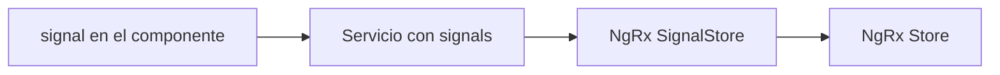
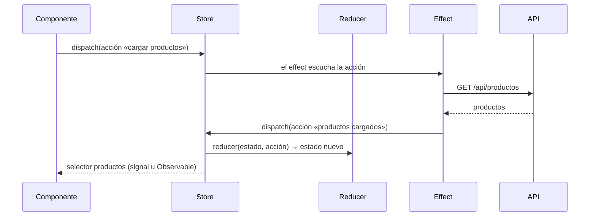

El store de la lección 2 son unas 30 líneas de Angular puro y sirve para muchísimas aplicaciones. Pero en equipos grandes aparecen nuevas necesidades: que todos los stores se escriban igual, poder ver en una herramienta cada cambio que ocurre, deshacer, o reutilizar piezas como «lista con carga y error». Para eso existen **librerías de estado**. La más usada en Angular es **NgRx**. Esta lección es un panorama: qué son, cómo se ven y cuándo merecen la pena. No hace falta instalarlas para seguir el curso.

> [!analogia]
> Tu store hecho a mano es como cocinar en casa: rápido, flexible y suficiente para la familia. Una librería de estado es la cocina de un restaurante: recetas estandarizadas, cada plato apuntado en una comanda y todos los cocineros trabajando igual. Tiene sentido cuando sois muchos; en casa sería burocracia.

## La escalera del estado



Sube un escalón solo cuando el anterior se te quede corto. La mayoría de aplicaciones viven felices en los dos primeros.

## NgRx SignalStore (`@ngrx/signals`)

Es la propuesta moderna de NgRx, construida sobre signals. Formaliza el patrón que ya conoces (estado + derivados + métodos) con funciones que se combinan. Así se vería el carrito (código **orientativo**: requiere instalar la librería con `npm install @ngrx/signals`, y su API puede variar entre versiones; consulta su documentación):

```typescript
// carrito-store.ts con NgRx SignalStore (orientativo)
import { computed } from '@angular/core';
import { patchState, signalStore, withComputed, withMethods, withState } from '@ngrx/signals';

export const CarritoStore = signalStore(
  { providedIn: 'root' },
  withState({ lineas: [] as Linea[] }),
  withComputed(({ lineas }) => ({
    unidades: computed(() => lineas().reduce((s, l) => s + l.cantidad, 0)),
  })),
  withMethods((store) => ({
    vaciar() {
      patchState(store, { lineas: [] });
    },
  })),
);
```

- `withState`: el estado inicial; cada propiedad se convierte en un signal de solo lectura.
- `withComputed`: los selectores derivados.
- `withMethods`: los métodos; `patchState` reemplaza parte del estado de forma inmutable.
- Ventajas: todos los stores tienen la misma forma y se pueden crear *features* reutilizables (por ejemplo, «entidades con carga y error»).

## NgRx Store (`@ngrx/store`)

Es el NgRx clásico, basado en el patrón **Redux**. Hay un único almacén global y el estado solo cambia mediante **acciones**:



- **Acciones**: mensajes que describen lo que pasó («producto añadido»).
- **Reducers**: funciones puras `(estado, acción) => estadoNuevo`. Toda la inmutabilidad de la lección 3, como regla.
- **Selectores**: leen y derivan partes del estado.
- **Effects**: hacen el trabajo asíncrono (HTTP) con RxJS y emiten nuevas acciones.
- Ventajas: cada cambio queda registrado y se puede inspeccionar paso a paso con las Redux DevTools del navegador. Inconveniente: mucho más código para cada funcionalidad.

## ¿Cuándo usar cada cosa?

| Situación | Recomendación |
| --- | --- |
| Estado de un componente | `signal` local |
| Unos pocos datos compartidos (usuario, carrito, tema) | Servicio con signals |
| Muchos stores parecidos en un equipo grande, quieres convenciones | NgRx SignalStore |
| App enorme, muchos equipos, necesitas trazar cada cambio | NgRx Store |
| Datos del servidor | `httpResource`/`rxResource` o servicio HTTP (en cualquier escalón) |

> [!idea]
> Una librería no arregla un estado mal diseñado. Las reglas son las mismas en todos los escalones: una sola fuente de verdad, cambios inmutables, estado derivado con `computed` y cada dato en su sitio (local, compartido, servidor o URL).

> [!prueba]
> Abre `package.json` de tu proyecto: no hay ninguna librería de estado, y aun así ya sabes construir un store completo. Si tienes curiosidad, crea un proyecto aparte de pruebas y ejecuta `npm install @ngrx/signals` para ver cómo aparece en las `dependencies` de `package.json`. No lo hagas en el proyecto del curso.

> [!cuidado]
> En proyectos con NgRx Store antiguos verás `store.select(...)` devolviendo Observables, `| async` en todas las plantillas y clases con `@Effect()`. Son versiones anteriores de la misma idea. Y no añadas NgRx a una aplicación pequeña «por si acaso»: cada funcionalidad necesitará acciones, reducers y selectores, y tardarás más en hacer lo mismo.

> [!resumen]
> - Para la mayoría de apps basta un servicio con signals; las librerías son para equipos y apps grandes.
> - NgRx SignalStore (`@ngrx/signals`) formaliza el patrón estado + computed + métodos sobre signals.
> - NgRx Store (`@ngrx/store`) sigue Redux: acciones, reducers, selectores y effects, con trazabilidad total.
> - Las reglas de fondo no cambian: una fuente de verdad, inmutabilidad y estado derivado.
