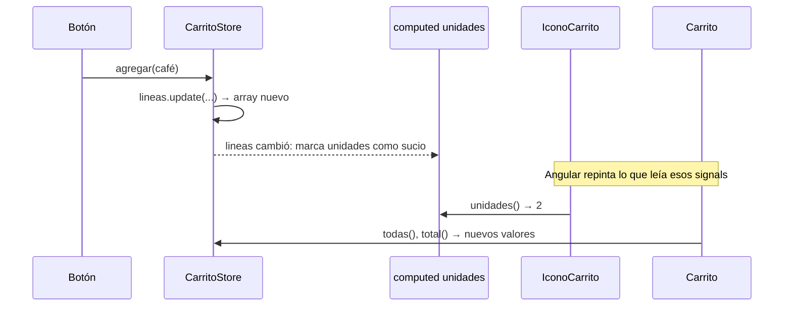

La cabecera muestra «🛒 3» y la página del carrito, la lista y el total. Los dos leen el mismo estado y la página además lo cambia. Necesitas un sitio único, con reglas claras de quién puede leer y quién puede escribir. En Angular moderno ese sitio es un **servicio con signals**, al que se suele llamar *store* (almacén).

> [!analogia]
> Un store es como el mostrador de una tienda. El almacén de detrás (el estado privado) solo lo toca el dependiente. Los clientes ven el escaparate (los selectores de solo lectura) y, si quieren algo, lo piden en el mostrador (los métodos). Nadie entra al almacén a mover cajas por su cuenta.

## Las tres partes de un store

```typescript
// src/app/carrito/carrito-store.ts
import { computed, Service, signal } from '@angular/core';

export interface Linea {
  id: number;
  nombre: string;
  precio: number;
  cantidad: number;
}

@Service()
export class CarritoStore {
  // 1. Estado privado: solo este servicio puede cambiarlo
  private readonly lineas = signal<Linea[]>([]);

  // 2. Selectores: lecturas públicas, de solo lectura
  readonly todas = this.lineas.asReadonly();
  readonly unidades = computed(() => this.lineas().reduce((suma, l) => suma + l.cantidad, 0));
  readonly total = computed(() =>
    this.lineas().reduce((suma, l) => suma + l.precio * l.cantidad, 0),
  );
  readonly vacio = computed(() => this.lineas().length === 0);

  // 3. Métodos: la única forma de cambiar el estado
  agregar(producto: Omit<Linea, 'cantidad'>) {
    this.lineas.update((lineas) => {
      const existe = lineas.find((l) => l.id === producto.id);
      if (existe) {
        return lineas.map((l) => (l.id === producto.id ? { ...l, cantidad: l.cantidad + 1 } : l));
      }
      return [...lineas, { ...producto, cantidad: 1 }];
    });
  }

  quitar(id: number) {
    this.lineas.update((lineas) => lineas.filter((l) => l.id !== id));
  }

  vaciar() {
    this.lineas.set([]);
  }
}
```

Parte por parte:

- `@Service()`: el decorador de servicios de Angular 22 (módulo 10). Hay **una sola instancia** para toda la app, así que todos los componentes que lo inyectan ven el mismo carrito.
- `private readonly lineas = signal<Linea[]>([])`: el estado. `private` impide que otros lo lean o lo cambien directamente; `readonly` impide reemplazar el signal por otro.
- `asReadonly()`: devuelve una versión del signal **sin** `set` ni `update`. Quien la recibe puede leerla (`todas()`), pero no cambiarla.
- `computed(...)`: valores **derivados** (módulo 7). `unidades` y `total` se recalculan solos cuando cambia `lineas`, y solo si alguien los lee.
- `agregar`, `quitar`, `vaciar`: los métodos con nombre del negocio. Toda la lógica de cambio está aquí: si mañana hay un límite de 10 unidades, se cambia en un solo sitio.
- `Omit<Linea, 'cantidad'>`: un tipo de TypeScript que significa «una `Linea` sin el campo `cantidad`».
- `update` siempre devuelve un array **nuevo** (`map`, `filter`, `[...lineas, nueva]`). La lección 3 explica por qué es obligatorio.

## Dos componentes, un estado

```typescript
// src/app/cabecera/icono-carrito.ts
import { Component, inject } from '@angular/core';
import { CarritoStore } from '../carrito/carrito-store';

@Component({
  selector: 'app-icono-carrito',
  template: `<span>🛒 {{ store.unidades() }}</span>`,
})
export class IconoCarrito {
  protected readonly store = inject(CarritoStore);
}
```

```typescript
// src/app/carrito/carrito.ts
import { CurrencyPipe } from '@angular/common';
import { Component, inject } from '@angular/core';
import { CarritoStore } from './carrito-store';

@Component({
  selector: 'app-carrito',
  imports: [CurrencyPipe],
  template: `
    @if (store.vacio()) {
      <p>Tu carrito está vacío</p>
    } @else {
      @for (linea of store.todas(); track linea.id) {
        <p>{{ linea.nombre }} × {{ linea.cantidad }} <button (click)="store.quitar(linea.id)">Quitar</button></p>
      }
      <p>Total: {{ store.total() | currency: 'EUR' }}</p>
    }
    <button (click)="store.agregar({ id: 1, nombre: 'Café', precio: 3 })">Añadir café</button>
  `,
})
export class Carrito {
  protected readonly store = inject(CarritoStore);
}
```

Tras pulsar dos veces «Añadir café»:

```pantalla
@url localhost:4200/carrito
<header>Mi tienda <span style="float:right">🛒 2</span></header>
<p>Café × 2 <button>Quitar</button></p>
<p>Total: €6.00</p>
<button>Añadir café</button>
```

## Qué pasa al pulsar «Añadir café»



> [!prueba]
> En tu proyecto, pon `<app-icono-carrito />` en `app.html` y `<app-carrito />` debajo. Pulsa «Añadir café» varias veces: el icono se actualiza aunque el botón esté en otro componente. Ahora intenta escribir `this.store.todas.set([])` en `Carrito`: TypeScript te dice que `set` no existe. Ese es el muro del `asReadonly()`.

> [!cuidado]
> Si declaras `readonly lineas = signal(...)` **público**, cualquier componente podrá hacer `store.lineas.set([])` y el estado cambiará desde sitios que no esperas. El patrón es siempre: signal privado, selectores públicos de solo lectura y métodos para cambiar. Y no metas en el store estado que solo usa un componente: eso es estado local.

> [!resumen]
> - Un store es un servicio con: estado privado (`signal`), selectores públicos (`asReadonly()`, `computed`) y métodos.
> - Al ser un servicio de instancia única, todos los componentes comparten el mismo estado.
> - Solo los métodos cambian el estado, y siempre con valores nuevos.
