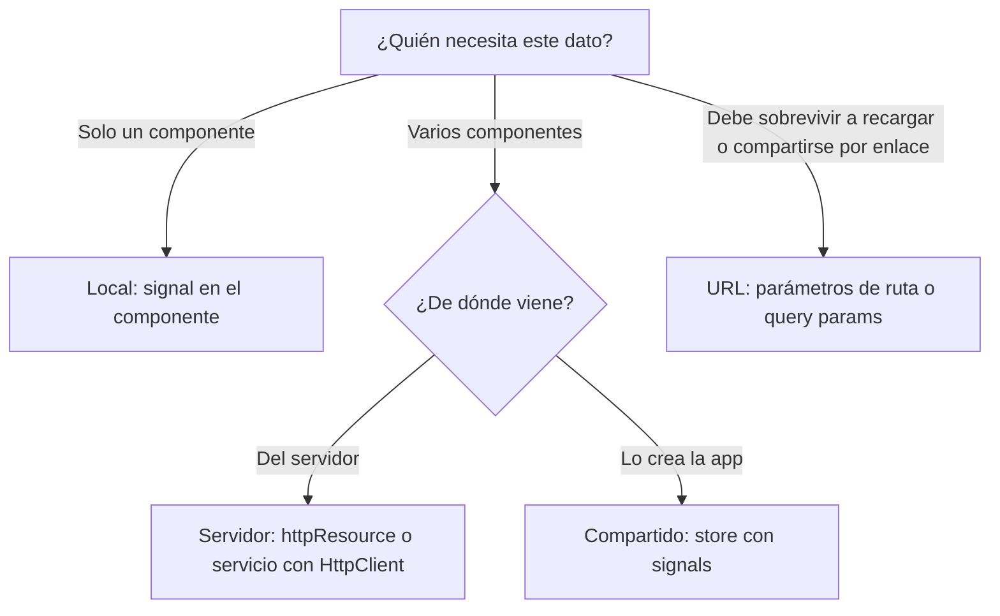
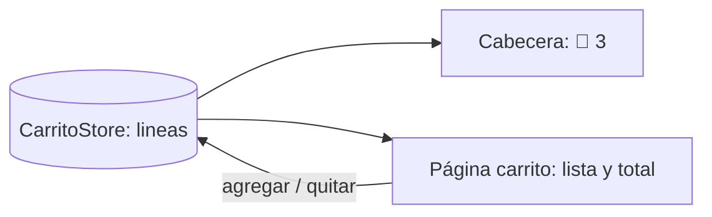

Abre cualquier tienda online y fíjate en todo lo que «recuerda» la página: si el menú está abierto, qué hay en el carrito, qué usuario ha iniciado sesión, la lista de productos que vino del servidor, la categoría que filtraste (y que sigue ahí si copias el enlace a un amigo). Todo eso es **estado**: datos que cambian mientras usas la aplicación y que la pantalla debe reflejar. El problema no es guardarlo, sino decidir **dónde** vive cada cosa.

> [!analogia]
> Piensa en una casa. Las llaves del coche las llevas tú en el bolsillo (estado local). La lista de la compra está en la nevera, donde toda la familia la ve y la apunta (estado compartido). El extracto del banco no lo escribes tú: te llega del banco y solo tienes una copia (estado del servidor). Y la dirección de tu casa la puedes dar a cualquiera para que llegue al mismo sitio (estado de la URL).

## Los cuatro tipos de estado

| Tipo | Ejemplo | Dónde vive en Angular | Quién lo cambia |
| --- | --- | --- | --- |
| **Local** | Menú abierto, texto de una caja, pestaña activa | Un `signal` dentro del componente | Solo ese componente |
| **Compartido** | Carrito, usuario conectado, tema oscuro | Un servicio con signals (un *store*) | Los métodos del servicio |
| **Del servidor** | Productos, pedidos, perfil | El servidor; tú tienes una copia en caché | El servidor (tú pides y envías cambios) |
| **De la URL** | Página actual, filtro, búsqueda, id del producto | La dirección del navegador | El router y los enlaces |



## Estado local: lo más sencillo posible

```typescript
// src/app/menu/menu.ts
import { Component, signal } from '@angular/core';

@Component({
  selector: 'app-menu',
  template: `
    <button (click)="abierto.update((a) => !a)">Menú</button>
    @if (abierto()) {
      <nav>Inicio · Productos · Contacto</nav>
    }
  `,
})
export class Menu {
  protected readonly abierto = signal(false);
}
```

A nadie más le importa si este menú está abierto. Si lo subieras a un servicio global, cualquier parte de la app podría cerrarlo sin querer y sería más difícil de entender. **Empieza siempre local** y sube el estado solo cuando otro componente lo necesite.

## Estado compartido: el carrito

El icono del carrito en la cabecera y la página del carrito muestran los mismos datos. Si cada uno guardara su copia, se desincronizarían. La solución es un **único** servicio que guarda el estado y que los dos inyectan (lo construyes en la lección 2):



## Estado del servidor: una copia que caduca

Los productos no son tuyos: son del servidor. Lo que tienes es una **copia** que puede quedarse vieja. Por eso este estado tiene necesidades propias: estado de carga, errores, recargar. Para eso viste `httpResource` y `rxResource` (módulo 13). Mezclarlo a mano con el estado de la app es una fuente típica de errores.

## Estado de la URL: el que se comparte por enlace

Si filtras «bebidas» y la URL no cambia, al recargar o al enviar el enlace el filtro se pierde. Si el filtro vive en la URL (`/productos?categoria=bebidas`), sobrevive a todo eso y el botón «atrás» del navegador funciona. Lo verás en la lección 4.

```pantalla
@url localhost:4200/productos?categoria=bebidas
<header>Mi tienda <span style="float:right">🛒 3</span></header>
<h2>Bebidas</h2>
<p>Café</p>
<p>Té</p>
```

En esta pantalla conviven los cuatro: el menú (local), el 🛒 3 (compartido), los productos (servidor) y «bebidas» (URL).

> [!prueba]
> Abre una tienda online que uses, filtra por una categoría y fíjate en la barra de direcciones. ¿Cambia la URL? Recarga la página: ¿se mantiene el filtro? Haz lo mismo con el carrito: ¿dónde crees que vive ese estado?

> [!cuidado]
> El error más común es **duplicar** estado: guardar la lista de productos en un signal y, aparte, el número de productos en otro signal. Tarde o temprano uno se actualiza y el otro no. Guarda el dato una vez y **calcula** lo demás con `computed` (lección 3).

> [!resumen]
> - Hay cuatro tipos de estado: local, compartido, del servidor y de la URL.
> - Empieza local; súbelo a un servicio solo cuando varios componentes lo necesiten.
> - El estado del servidor es una copia: trátalo con resources o servicios HTTP.
> - Lo que deba sobrevivir a una recarga o compartirse por enlace, en la URL.
