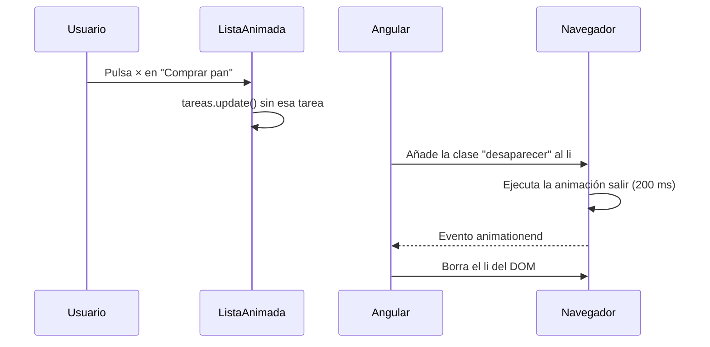

Pulsas «Quitar» en una lista de tareas y la tarea desaparece **de golpe**. Las de debajo saltan hacia arriba y tu ojo no sabe qué ha pasado. Una animación corta (que la tarea se desvanezca en 200 milisegundos) hace que el cambio se entienda. Las animaciones no son adorno: cuentan **qué ha cambiado**.

> [!analogia]
> Sin animación, la pantalla es un truco de magia: algo estaba y ya no está. Con animación es un camarero que retira un plato: lo ves irse y sabes adónde ha ido.

## El problema: Angular quita el elemento al instante

Ya sabes animar con CSS: defines una animación con `@keyframes` y la aplicas con la propiedad `animation`. Para **entrar** basta con eso, porque el elemento se crea y la animación arranca. Pero para **salir** hay un problema: cuando un `@if` pasa a `false` o quitas un elemento de un `@for`, Angular borra el elemento del DOM **inmediatamente**. Ya no existe, así que no hay nada que animar.

Angular 22 lo resuelve con dos atributos especiales que entiende el compilador: **`animate.enter`** y **`animate.leave`**. Vienen en el propio `@angular/core`: no hay que instalar ni importar nada.

## `animate.enter` y `animate.leave` con clases CSS

```typescript
// src/app/lista-animada/lista-animada.ts
import { Component, signal } from '@angular/core';

@Component({
  selector: 'app-lista-animada',
  template: `
    <button type="button" (click)="anadir()">Añadir</button>
    <ul>
      @for (tarea of tareas(); track tarea.id) {
        <li animate.enter="aparecer" animate.leave="desaparecer">
          {{ tarea.texto }}
          <button type="button" (click)="quitar(tarea.id)" [attr.aria-label]="'Quitar ' + tarea.texto">×</button>
        </li>
      }
    </ul>
  `,
  styles: `
    .aparecer {
      animation: entrar 300ms ease-out;
    }
    .desaparecer {
      animation: salir 200ms ease-in forwards;
    }
    @keyframes entrar {
      from { opacity: 0; transform: translateY(-8px); }
      to   { opacity: 1; transform: translateY(0); }
    }
    @keyframes salir {
      from { opacity: 1; }
      to   { opacity: 0; transform: translateX(24px); }
    }
    @media (prefers-reduced-motion: reduce) {
      .aparecer, .desaparecer { animation: none; }
    }
  `,
})
export class ListaAnimada {
  private siguienteId = 3;
  protected readonly tareas = signal([
    { id: 1, texto: 'Comprar pan' },
    { id: 2, texto: 'Estudiar Angular' },
  ]);

  protected anadir() {
    const id = this.siguienteId++;
    this.tareas.update((lista) => [...lista, { id, texto: `Tarea ${id}` }]);
  }

  protected quitar(id: number) {
    this.tareas.update((lista) => lista.filter((t) => t.id !== id));
  }
}
```

Lo importante:

- `animate.enter="aparecer"`: cuando el `<li>` **entra** en el DOM, Angular le pone la clase `aparecer`. La clase arranca la animación `entrar`. Cuando la animación termina, Angular quita la clase.
- `animate.leave="desaparecer"`: cuando el `<li>` **va a salir**, Angular le pone la clase `desaparecer` y **espera** a que acabe la animación `salir` antes de borrarlo.
- `forwards` en la animación de salida: que el elemento se quede en el último fotograma (invisible) hasta que Angular lo quite, sin un parpadeo.
- `@media (prefers-reduced-motion: reduce)`: hay personas a las que el movimiento les marea. Si lo han indicado en su sistema operativo, no animamos. Angular ve que no hay animación y quita el elemento enseguida.
- `track tarea.id`: con un buen `track`, Angular sabe qué `<li>` concreto sale (lo verás a fondo en el módulo 17).



```pantalla
@url localhost:4200/
<button>Añadir</button>
<ul>
  <li style="opacity:0.4;transform:translateX(12px)">Comprar pan <button>×</button></li>
  <li>Estudiar Angular <button>×</button></li>
</ul>
```

Así se ve a mitad de la salida: «Comprar pan» se está desvaneciendo hacia la derecha.

## Clases que cambian y funciones

Los dos atributos también aceptan un *binding* entre corchetes, para decidir la clase con una expresión: `[animate.enter]="claseEntrada()"`. Y si quieres controlar la animación con JavaScript (por ejemplo, con la API `element.animate()` del navegador), usa la forma de **evento**, entre paréntesis:

```typescript
// src/app/panel-ayuda/panel-ayuda.ts
import { AnimationCallbackEvent, Component, signal } from '@angular/core';

@Component({
  selector: 'app-panel-ayuda',
  template: `
    <button type="button" (click)="abierto.set(!abierto())">Ayuda</button>
    @if (abierto()) {
      <div [animate.enter]="claseEntrada()" (animate.leave)="alSalir($event)">Aquí va la ayuda.</div>
    }
  `,
  styles: `
    .deslizar { animation: bajar 250ms ease-out; }
    @keyframes bajar { from { opacity: 0; transform: translateY(-4px); } }
  `,
})
export class PanelAyuda {
  protected readonly abierto = signal(false);
  protected readonly claseEntrada = signal('deslizar');

  protected alSalir(evento: AnimationCallbackEvent) {
    const animacion = evento.target.animate([{ opacity: 1 }, { opacity: 0 }], { duration: 200 });
    animacion.onfinish = () => evento.animationComplete();
  }
}
```

- `AnimationCallbackEvent` (de `@angular/core`): el tipo del evento. Trae `target` (el elemento) y `animationComplete`.
- `evento.animationComplete()`: **tienes que llamarla** cuando tu animación acabe. Es la señal para que Angular borre el elemento. Si se te olvida, Angular lo borra igualmente pasado un tiempo máximo, para que no se quede colgado.

## `@angular/animations`: lo que verás en proyectos antiguos

Antes, Angular tenía un paquete aparte, `@angular/animations`, con funciones como `trigger()`, `state()`, `transition()` y `animate()`, el campo `animations: [...]` en `@Component` y atributos como `[@abrirCerrar]` en la plantilla. Necesitaba `provideAnimationsAsync()` en `appConfig`.

> [!cuidado]
> `@angular/animations` está **obsoleto** desde Angular 20.2: el propio paquete npm lo indica y el campo `animations` de `@Component` dice que se quiere eliminar en la versión 23. Un proyecto nuevo de Angular 22 ni siquiera lo instala. Si lo encuentras en código antiguo, migra a `animate.enter`/`animate.leave` con CSS.

> [!idea]
> Las animaciones de hoy son **CSS normal**. Angular solo se encarga de poner la clase en el momento justo y de esperar antes de borrar.

> [!prueba]
> En tu proyecto, copia `ListaAnimada`, úsala en `app.html` y cambia `200ms` por `2s` en `.desaparecer`. Guarda, pulsa × y observa cómo Angular espera los dos segundos antes de quitar la tarea.

> [!resumen]
> - `animate.enter="clase"` añade la clase cuando el elemento entra; `animate.leave="clase"` la añade al salir y espera a que acabe la animación antes de borrarlo.
> - Con `(animate.leave)="fn($event)"` animas con JavaScript y avisas con `$event.animationComplete()`.
> - `@angular/animations` está obsoleto; respeta `prefers-reduced-motion` para quien no quiere movimiento.
