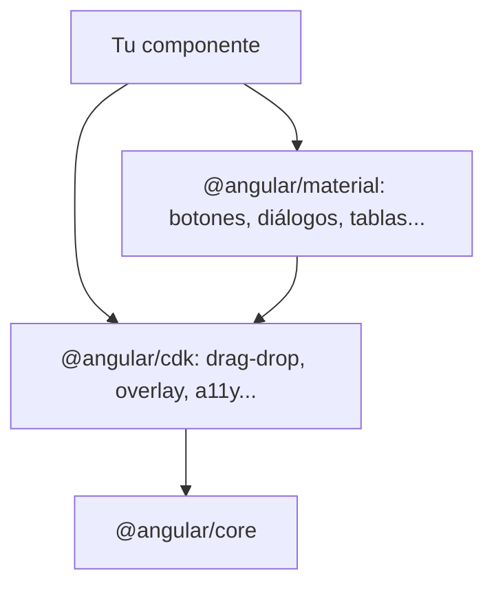

Tu app necesita un menú desplegable, una ventana de diálogo y una lista que se pueda reordenar arrastrando. Programarlo desde cero es mucho más que dibujar cajas: el menú tiene que cerrarse al pulsar fuera, el diálogo debe atrapar el foco del teclado, la lista tiene que funcionar con el ratón y con el dedo… El equipo de Angular ya lo ha resuelto en dos librerías oficiales: **Angular CDK** y **Angular Material**.

> [!analogia]
> Piensa en una cocina. El **CDK** son los electrodomésticos sin carcasa: el motor del horno, el termostato, las bisagras de las puertas. Funcionan perfectamente, pero tú eliges el aspecto. **Material** es la cocina de exposición ya montada: los mismos motores con muebles, colores y tiradores de un estilo concreto (Material Design, el de Google).

## Qué es cada una

| Librería | Paquete npm | Qué te da | Aspecto |
| --- | --- | --- | --- |
| Angular CDK (*Component Dev Kit*) | `@angular/cdk` | Comportamientos: arrastrar y soltar, capas flotantes (*overlay*), accesibilidad, listas virtuales, copiar al portapapeles… | Ninguno: tú pones el CSS |
| Angular Material | `@angular/material` | Componentes completos: botones, formularios, diálogos, tablas, menús, fechas… | Material Design 3 |

Material está construido **encima** del CDK: depende de él. Ninguna de las dos viene en un proyecto nuevo; se añaden cuando las necesitas.

## Instalar Material con `ng add`

`npm install` solo descarga un paquete. `ng add` lo descarga **y además ejecuta su instalador**, que configura tu proyecto. Material trae uno:

```bash
ng add @angular/material
```

La CLI te pide confirmación para instalar el paquete y después Material hace una única pregunta: qué pareja de colores quieres para el tema (`azure-blue`, `rose-red`, `magenta-violet` o `cyan-orange`). Con tu respuesta, el instalador de la versión 22:

```arbol
mi-app/
  package.json            # Añade @angular/material y @angular/cdk a dependencies
  angular.json            # Añade src/material-theme.scss a la lista "styles"
  src/
    index.html            # Añade los enlaces a las fuentes Roboto y Material Symbols
    material-theme.scss   # Nuevo: el tema (colores, tipografía y densidad) en Sass
    styles.css            # No cambia
```

El archivo de tema usa **Sass** (un CSS con superpoderes; la extensión es `.scss`). Si tu proyecto ya usaba `styles.scss`, el tema se escribe al principio de ese archivo en lugar de crear uno nuevo. Este es su corazón:

```scss
// src/material-theme.scss (extracto)
@use '@angular/material' as mat;

html {
  @include mat.theme((
    color: (
      primary: mat.$azure-palette,
      tertiary: mat.$blue-palette,
    ),
    typography: Roboto,
    density: 0,
  ));
}
```

- `@use '@angular/material' as mat`: carga las herramientas de Sass de Material con el apodo `mat`.
- `@include mat.theme(...)`: genera **variables CSS** (`--mat-sys-primary`, `--mat-sys-surface`…) con los colores, la tipografía y la densidad. Los componentes de Material las leen con `var()`, igual que hiciste en la lección anterior. Tú también puedes usarlas en tus estilos.

## Usar un componente de Material

Cada componente se importa desde su propio subpaquete, como cualquier componente independiente:

```typescript
// src/app/guardar/guardar.ts
import { Component, signal } from '@angular/core';
import { MatButton } from '@angular/material/button';

@Component({
  selector: 'app-guardar',
  imports: [MatButton],
  template: `
    <button matButton="filled" (click)="guardado.set(true)">Guardar</button>
    @if (guardado()) {
      <p>Cambios guardados</p>
    }
  `,
})
export class Guardar {
  protected readonly guardado = signal(false);
}
```

- `import { MatButton } from '@angular/material/button'`: solo cargas el botón, no toda la librería. Lo que no importas no entra en el *bundle* (el paquete de JavaScript que descarga el navegador; lo verás en el módulo 17).
- `imports: [MatButton]`: hace que la plantilla entienda el atributo `matButton`.
- `matButton="filled"`: la apariencia. En la versión 22 puede ser `text`, `filled`, `elevated`, `outlined` o `tonal`.

```pantalla
@url localhost:4200/
<button style="background:#005cbb;color:white;border:none;border-radius:20px;padding:10px 24px;font-family:Roboto,sans-serif">Guardar</button>
<p style="font-family:Roboto,sans-serif">Cambios guardados</p>
```

## Usar el CDK

El CDK se instala con `npm install @angular/cdk` (no tiene instalador que configurar). Un ejemplo: hacer que un elemento se pueda arrastrar.

```typescript
// src/app/nota-movil/nota-movil.ts
import { Component } from '@angular/core';
import { CdkDrag } from '@angular/cdk/drag-drop';

@Component({
  selector: 'app-nota-movil',
  imports: [CdkDrag],
  template: `<div cdkDrag class="nota">Arrástrame</div>`,
  styles: `.nota { width: 120px; padding: 12px; background: khaki; cursor: move; }`,
})
export class NotaMovil {}
```

Con una sola directiva, `cdkDrag`, el `div` se mueve con el ratón y con el dedo. El aspecto (`khaki`) es tuyo.



> [!cuidado]
> No mezcles varias librerías de componentes (Material, otra de terceros, Bootstrap…) en la misma app: tendrás estilos que se pisan y un *bundle* más grande. Elige una, o usa solo el CDK y tu propio diseño.

> [!idea]
> En Angular 22 existe además `@angular/aria`, un paquete oficial con piezas accesibles **sin estilos** (pestañas, menús, listas, *combobox*…). Es otra opción si quieres tu propio diseño con buena accesibilidad. Consulta su estado en angular.dev antes de usarlo en producción.

> [!prueba]
> En un proyecto de prueba, ejecuta `ng add @angular/material`, elige un tema y abre `git diff` (o mira los archivos) para comprobar cada cambio del árbol de arriba. Después usa `<button matButton="outlined">` en `app.html`.

> [!resumen]
> - El CDK da comportamientos sin aspecto; Material da componentes completos con Material Design, construidos sobre el CDK.
> - `ng add @angular/material` instala los paquetes y configura el tema, las fuentes y `angular.json`.
> - Cada pieza se importa desde su subpaquete (`@angular/material/button`, `@angular/cdk/drag-drop`) y se añade a `imports` del componente.
