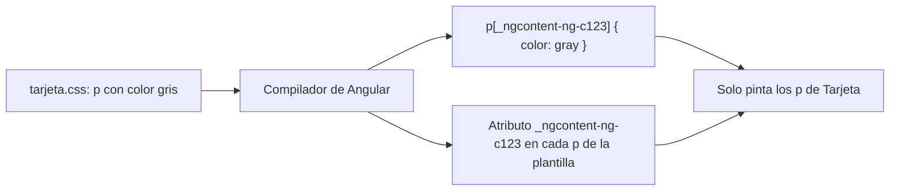

Imagina una app con dos componentes: una tarjeta de producto y un pie de página. Los dos tienen un `<p>`. En la tarjeta quieres el texto en gris pequeño; en el pie, en blanco. Si escribes `p { color: gray; }` en un CSS normal, **todos** los párrafos de la página se vuelven grises, también los del pie. En una web grande, con cientos de componentes, ese choque de estilos es el pan de cada día.

Angular lo resuelve con la **encapsulación de estilos**: los estilos que escribes en un componente solo afectan a ese componente.

> [!analogia]
> Piensa en un edificio de pisos. El **portal** (los estilos globales) es de todos: si lo pintas de azul, todos los vecinos lo ven azul. Pero lo que pintas **dentro de tu piso** (los estilos del componente) no sale por la puerta: tu vecino puede tener las paredes de otro color aunque las dos habitaciones se llamen «salón».

## Dos sitios para escribir CSS

```arbol
mi-app/
  src/
    styles.css            # Estilos globales: afectan a toda la página
    app/
      app.css             # Estilos del componente App: solo afectan a su plantilla
      tarjeta/
        tarjeta.css       # Estilos de Tarjeta: solo afectan a la plantilla de Tarjeta
  angular.json            # En "styles" dice qué hojas globales se cargan (src/styles.css)
```

- **`src/styles.css`** es la hoja **global**. Aparece en `angular.json`, dentro de `"styles": ["src/styles.css"]`, y Angular la mete en la página tal cual. Es el sitio para la tipografía base, los colores del `body`, un *reset* o las variables de tema.
- **`styleUrl`** (o `styles`) en `@Component` son los estilos **del componente**. Solo se aplican a los elementos de **su** plantilla.

```typescript
// src/app/tarjeta/tarjeta.ts
import { Component } from '@angular/core';

@Component({
  selector: 'app-tarjeta',
  templateUrl: './tarjeta.html',
  styleUrl: './tarjeta.css',
})
export class Tarjeta {}
```

- `import { Component } from '@angular/core'`: el decorador `@Component` viene de `@angular/core`, el corazón de Angular.
- `styleUrl: './tarjeta.css'`: la hoja de estilos de este componente. Si prefieres escribir el CSS dentro del propio archivo `.ts`, usa `styles` con un texto entre comillas invertidas.

```css
/* src/app/tarjeta/tarjeta.css */
p {
  color: gray;
  font-size: 14px;
}
```

Aunque el selector es un simple `p`, este gris **no** llega al pie de página.

## Cómo lo consigue: la encapsulación emulada

Cuando el compilador de Angular procesa tu componente, hace dos cosas:

1. Añade a cada elemento de la plantilla un atributo inventado, por ejemplo `_ngcontent-ng-c123`. Al elemento anfitrión (la etiqueta `<app-tarjeta>`) le pone `_nghost-ng-c123`.
2. Reescribe tu CSS para que el selector exija ese atributo.

Así queda en el navegador (el número cambia en cada proyecto):

```html
<app-tarjeta _nghost-ng-c123>
  <p _ngcontent-ng-c123>Libro de Angular</p>
</app-tarjeta>
<footer>
  <p>© 2026 Mi tienda</p>
</footer>
```

```css
/* Lo que Angular mete en la página a partir de tarjeta.css */
p[_ngcontent-ng-c123] {
  color: gray;
  font-size: 14px;
}
```

El `<p>` del pie no tiene el atributo, así que la regla no le afecta.

```pantalla
@url localhost:4200/
<div style="border:1px solid #ddd;padding:12px;border-radius:8px;max-width:260px">
  <p style="color:gray;font-size:14px;margin:0">Libro de Angular</p>
</div>
<footer style="background:#1f2937;padding:8px;margin-top:12px">
  <p style="color:white;margin:0">© 2026 Mi tienda</p>
</footer>
```



> [!idea]
> Los estilos de un componente **no salen** del componente, y los estilos globales **sí entran** en todos. Lo que pongas en `styles.css` afecta a toda la app.

## Los tres modos de encapsulación

El campo `encapsulation` de `@Component` elige el modo. Sus valores están en el enumerado `ViewEncapsulation`, que también viene de `@angular/core`:

| Modo | Qué hace | Cuándo usarlo |
| --- | --- | --- |
| `ViewEncapsulation.Emulated` | El truco de los atributos. **Es el modo por defecto.** | Casi siempre |
| `ViewEncapsulation.None` | Sin encapsulación: tus estilos se vuelven globales | Estilos que quieres compartir a propósito |
| `ViewEncapsulation.ShadowDom` | Usa el Shadow DOM del navegador, un aislamiento real | Componentes que se incrustan en webs ajenas |

```typescript
// src/app/aviso-legal/aviso-legal.ts
import { Component, ViewEncapsulation } from '@angular/core';

@Component({
  selector: 'app-aviso-legal',
  template: `<p class="nota">Estilos sin encapsular</p>`,
  styles: `.nota { font-style: italic; }`,
  encapsulation: ViewEncapsulation.None,
})
export class AvisoLegal {}
```

Con `None`, la regla `.nota` se copia tal cual a la página: cualquier elemento con la clase `nota`, esté donde esté, saldrá en cursiva.

> [!cuidado]
> `ViewEncapsulation.None` es como pintar el portal desde tu piso: afecta a todos los vecinos, pero además la regla solo se añade a la página cuando ese componente se muestra. El aspecto de la app depende entonces de por dónde haya navegado el usuario, y eso produce errores difíciles de encontrar. Si quieres un estilo global, ponlo en `styles.css`.

> [!cuidado]
> En Angular 22 existe un cuarto valor, `ViewEncapsulation.ExperimentalIsolatedShadowDom`. Es **experimental**: puede cambiar o desaparecer. No lo uses en una app real todavía.

> [!prueba]
> En tu proyecto, escribe `p { color: crimson; }` en `src/app/app.css` y guarda: el navegador se recarga solo. Abre las herramientas del navegador (F12), inspecciona un párrafo y busca el atributo `_ngcontent-…`. Ahora mueve la regla a `src/styles.css`: verás que ya no lleva atributo y afecta a todo.

> [!resumen]
> - `src/styles.css` es global; `styleUrl`/`styles` en `@Component` solo afecta a la plantilla de ese componente.
> - La encapsulación por defecto (`Emulated`) añade atributos como `_ngcontent-…` y reescribe tus selectores para que no se escapen.
> - `None` convierte los estilos en globales; `ShadowDom` usa el aislamiento nativo del navegador.
