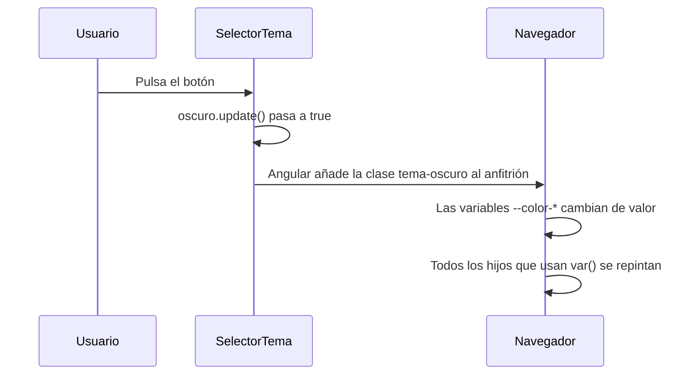

Tu app ya tiene componentes bien aislados. Ahora el cliente pide dos cosas: que cada aviso tenga un borde de color **alrededor de todo el componente**, y un botón de **modo oscuro** que cambie los colores de toda la app de golpe. Para lo primero necesitas dar estilo a la etiqueta del propio componente; para lo segundo, colores que se puedan cambiar en un solo sitio.

> [!analogia]
> El elemento anfitrión es la **fachada** de tu piso: la puerta que se ve desde el rellano (`<app-aviso>`). `:host` te deja pintar esa fachada desde dentro. Las **variables CSS** son como el termostato central: cambias un número en un sitio y todas las habitaciones se ajustan.

## `:host`: dar estilo a la etiqueta del componente

Cuando usas `<app-aviso>` en una plantilla, esa etiqueta es el **elemento anfitrión** (*host*). No está en la plantilla del componente, así que un selector normal no la alcanza. Para eso existe `:host`.

```typescript
// src/app/aviso/aviso.ts
import { Component, input } from '@angular/core';

@Component({
  selector: 'app-aviso',
  template: `<p class="texto">{{ mensaje() }}</p>`,
  styles: `
    :host {
      display: block;
      padding: 12px 16px;
      border-left: 4px solid var(--color-acento, #6d28d9);
      background: var(--fondo-suave, #f5f3ff);
    }
    :host(.importante) {
      border-left-color: crimson;
    }
    :host-context(.tema-oscuro) {
      background: #2e1065;
      color: white;
    }
    .texto {
      margin: 0;
    }
  `,
})
export class Aviso {
  readonly mensaje = input.required<string>();
}
```

Línea a línea:

- `import { Component, input } from '@angular/core'`: `input` crea una entrada de datos del componente (lo viste en el módulo 8).
- `:host { display: block; … }`: estiliza `<app-aviso>`. Las etiquetas inventadas como `app-aviso` son *inline* por defecto (se comportan como texto), por eso casi siempre conviene `display: block`.
- `:host(.importante)`: solo cuando la etiqueta anfitriona tiene la clase `importante`, como en `<app-aviso class="importante">`.
- `:host-context(.tema-oscuro)`: cuando **algún antepasado** (el `body`, un `div` de fuera…) tiene la clase `tema-oscuro`.
- `var(--color-acento, #6d28d9)`: usa la variable CSS `--color-acento`; si nadie la ha definido, usa el valor de reserva `#6d28d9`.

Esto es lo que Angular 22 genera de verdad a partir de esos selectores (copiado de una ejecución real; el nombre del atributo cambia en cada proyecto):

```css
[_nghost-a-c4103967551] { display: block; /* … */ }
.importante[_nghost-a-c4103967551] { border-left-color: crimson; }
.tema-oscuro[_nghost-a-c4103967551], .tema-oscuro [_nghost-a-c4103967551] { background: #2e1065; color: white; }
```

`:host` se convierte en el atributo `_nghost-…` que Angular pone en la etiqueta anfitriona, y `:host-context` busca la clase en la propia etiqueta o en cualquier antepasado.

## Variables CSS: un tema que se cambia en un sitio

Una **variable CSS** (*custom property*) es un nombre que empieza por `--` y guarda un valor. Se lee con `var(--nombre)`. Lo mejor: **se heredan** hacia abajo por el árbol de elementos y **atraviesan la encapsulación**. Si un antepasado define `--color-acento`, todos sus descendientes pueden usarla, sean del componente que sean.

Este componente envuelve a otros y cambia el tema con un botón:

```typescript
// src/app/selector-tema/selector-tema.ts
import { Component, signal } from '@angular/core';

@Component({
  selector: 'app-selector-tema',
  template: `
    <button type="button" (click)="alternar()" [attr.aria-pressed]="oscuro()">
      Modo oscuro: {{ oscuro() ? 'sí' : 'no' }}
    </button>
    <ng-content />
  `,
  host: {
    '[class.tema-oscuro]': 'oscuro()',
  },
  styles: `
    :host {
      --color-fondo: #ffffff;
      --color-texto: #1f2937;
      --color-acento: #6d28d9;
      display: block;
      padding: 16px;
      background: var(--color-fondo);
      color: var(--color-texto);
    }
    :host(.tema-oscuro) {
      --color-fondo: #111827;
      --color-texto: #f9fafb;
      --color-acento: #a78bfa;
    }
    button {
      background: var(--color-acento);
      color: var(--color-fondo);
      border: none;
      padding: 8px 12px;
      border-radius: 6px;
    }
  `,
})
export class SelectorTema {
  protected readonly oscuro = signal(false);

  protected alternar() {
    this.oscuro.update((valor) => !valor);
  }
}
```

- `signal(false)`: el estado del tema (módulo 7). Empieza en claro.
- `host: { '[class.tema-oscuro]': 'oscuro()' }`: un *binding* sobre la etiqueta anfitriona. Cuando `oscuro()` es `true`, `<app-selector-tema>` recibe la clase `tema-oscuro`.
- `:host { --color-fondo: … }`: **define** las variables en la etiqueta anfitriona. `:host(.tema-oscuro)` les da otros valores cuando está la clase.
- `<ng-content />`: aquí se pinta lo que pongas dentro de `<app-selector-tema>` (módulo 8). Esos hijos heredan las variables.
- `[attr.aria-pressed]`: le dice a un lector de pantalla si el botón está pulsado. Lo verás en la lección de accesibilidad.

```html
<!-- src/app/app.html -->
<app-selector-tema>
  <app-aviso mensaje="Hola" />
  <app-aviso class="importante" mensaje="Ojo" />
</app-selector-tema>
```



Antes y después de pulsar:

```pantalla
@url localhost:4200/
<div style="background:#ffffff;color:#1f2937;padding:16px">
  <button style="background:#6d28d9;color:#fff;border:none;padding:8px 12px;border-radius:6px">Modo oscuro: no</button>
  <p style="border-left:4px solid #6d28d9;background:#f5f3ff;padding:12px 16px">Hola</p>
  <p style="border-left:4px solid crimson;background:#f5f3ff;padding:12px 16px">Ojo</p>
</div>
```

```pantalla
@url localhost:4200/
<div style="background:#111827;color:#f9fafb;padding:16px">
  <button style="background:#a78bfa;color:#111827;border:none;padding:8px 12px;border-radius:6px">Modo oscuro: sí</button>
  <p style="border-left:4px solid #a78bfa;background:#2e1065;color:white;padding:12px 16px">Hola</p>
  <p style="border-left:4px solid crimson;background:#2e1065;color:white;padding:12px 16px">Ojo</p>
</div>
```

> [!idea]
> Define los colores **una vez** como variables CSS (en `styles.css` sobre `:root`, o en el anfitrión de un componente) y úsalos con `var()` en todas partes. Cambiar de tema es cambiar unos pocos valores.

> [!cuidado]
> En código antiguo verás `::ng-deep` para «atravesar» la encapsulación y dar estilo a los hijos desde el padre. Angular lo marca como **obsoleto** y rompe el aislamiento. Usa variables CSS: el hijo decide qué propiedades se pueden personalizar.

> [!prueba]
> En tu proyecto, añade a `src/styles.css` un bloque `:root { --color-acento: teal; }` y usa `color: var(--color-acento)` en el CSS de cualquier componente. Guarda: el color llega aunque el componente esté encapsulado.

> [!resumen]
> - `:host` estiliza la etiqueta del componente; `:host(.clase)` lo hace solo si la etiqueta tiene esa clase.
> - `:host-context(.clase)` aplica estilos cuando un antepasado tiene la clase.
> - Las variables CSS (`--nombre` y `var(--nombre)`) se heredan y atraviesan la encapsulación: son la herramienta para los temas.
