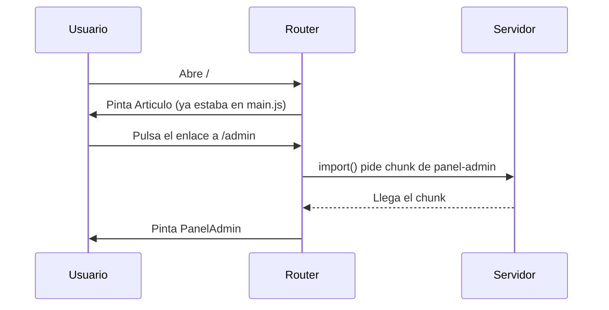

Antes de que el usuario vea **nada** de tu app, el navegador tiene que descargar, leer y ejecutar su JavaScript. En un móvil con mala cobertura, cada 100 kB son tiempo de pantalla en blanco. Si tu app tiene una zona de administración que solo usan tres personas, ¿por qué la descargan todos los visitantes? Esta lección va del **tamaño del bundle** y de cómo recortarlo con **rutas diferidas**.

> [!analogia]
> Mudarte a un piso nuevo: no subes todas las cajas el primer día. Subes la cama, la cafetera y la ropa (el bundle inicial) y el resto lo traes cuando lo necesitas (los chunks diferidos). Los **budgets** son la báscula del ascensor: te avisan si cargas demasiado.

## Qué es el bundle

`ng build` junta tu código y el de las librerías que usas en unos pocos archivos JavaScript optimizados: el **bundle**. Durante la construcción hace tres cosas que reducen el tamaño:

- **Minificar**: quita espacios y comentarios y acorta nombres.
- **Eliminar código sin usar** (*tree shaking*, «sacudir el árbol»): lo que nadie importa no entra. Por eso cada pieza de Angular se importa por separado.
- **Dividir en trozos** (*chunks*): el código de rutas diferidas y bloques `@defer` va en archivos aparte.

Esta es la salida real de `ng build` de un proyecto de prueba:

```text
Initial chunk files | Names         |  Raw size | Estimated transfer size
chunk-O5TCHI2I.js   | -             | 143.07 kB |                42.84 kB
main-PNCT5AQF.js    | main          | 100.13 kB |                25.80 kB
styles-5INURTSO.css | styles        |   0 bytes |                 0 bytes

                    | Initial total | 243.21 kB |                68.63 kB

Lazy chunk files    | Names         |  Raw size | Estimated transfer size
chunk-JJHTCUKA.js   | comentarios   | 351 bytes |               351 bytes
chunk-XAHANEMB.js   | panel-admin   | 323 bytes |               323 bytes
```

- **Initial chunk files**: lo que se descarga **siempre** al abrir la app.
- **Lazy chunk files**: lo que se descarga **solo cuando hace falta**.
- **Raw size**: el tamaño del archivo. **Estimated transfer size**: lo que viaja de verdad por la red, comprimido.
- Las letras raras (`PNCT5AQF`) son el *hash* del contenido, para que el navegador no use una copia vieja (módulo 4).

## Rutas diferidas con `loadComponent`

En el módulo 11 viste las rutas. Una ruta con `component` mete ese componente en el bundle inicial. Con `loadComponent` se descarga al navegar a ella:

```typescript
// src/app/app.routes.ts
import { Routes } from '@angular/router';
import { Articulo } from './articulo/articulo';

export const routes: Routes = [
  { path: '', component: Articulo },
  {
    path: 'admin',
    loadComponent: () => import('./admin/panel-admin').then((m) => m.PanelAdmin),
  },
];
```

- `import { Articulo } from './articulo/articulo'`: un import normal, **arriba** del archivo. Entra en el bundle inicial, y está bien: es la portada.
- `import('./admin/panel-admin')`: con paréntesis es un **import dinámico**, una función de JavaScript que descarga el archivo cuando se llama y devuelve una promesa.
- `.then((m) => m.PanelAdmin)`: cuando la promesa se cumple, `m` es el módulo descargado y sacamos de él la clase del componente.
- `loadComponent: () => …`: una función flecha. El router solo la llama cuando alguien navega a `/admin`.

Para un grupo de rutas (todo `/admin/...`) se usa `loadChildren`, que devuelve un array de rutas; lo viste en el módulo 11.



> [!cuidado]
> Si además de `loadComponent` importas `PanelAdmin` arriba del todo (con un `import { PanelAdmin } from …` normal) en un archivo que va en el bundle inicial, el código ya viaja en el bundle inicial y la ruta diferida no ahorra nada. El import estático manda.

## Budgets: la báscula del bundle

En `angular.json`, la configuración `production` trae dos límites:

```json
"budgets": [
  { "type": "initial", "maximumWarning": "500kB", "maximumError": "1MB" },
  { "type": "anyComponentStyle", "maximumWarning": "4kB", "maximumError": "8kB" }
]
```

- `initial`: el total de **Initial chunk files**. Pasado `maximumWarning` avisa; pasado `maximumError` **la construcción falla**.
- `anyComponentStyle`: el CSS de **cada** componente.

Con un límite de aviso de 200 kB, el mismo proyecto da:

```text
▲ [WARNING] bundle initial exceeded maximum budget. Budget 200.00 kB was not met by 43.21 kB with a total of 243.21 kB.
```

Y con un límite de error de 220 kB:

```text
Application bundle generation failed.

✘ [ERROR] bundle initial exceeded maximum budget. Budget 220.00 kB was not met by 23.21 kB with a total of 243.21 kB.
```

> [!idea]
> Los budgets son una alarma, no un objetivo. Si saltan, no subas el número sin más: busca qué ha crecido. `ng build --stats-json` genera un `stats.json` que puedes analizar en esbuild.github.io/analyze para ver qué ocupa cada librería.

> [!prueba]
> En tu proyecto, crea un componente con `ng generate component informe`, añade una ruta con `loadComponent` hacia él y ejecuta `ng build`. Comprueba que aparece en «Lazy chunk files». Cambia la ruta a `component: Informe` y vuelve a construir: ahora está en el bundle inicial.

> [!resumen]
> - El bundle inicial es lo que todos descargan antes de ver nada: cuanto más pequeño, antes arranca la app.
> - `loadComponent: () => import(...)` (y `loadChildren`) mueven una ruta a un chunk que solo se descarga al visitarla.
> - Los budgets de `angular.json` avisan o rompen el build si el bundle crece demasiado.
