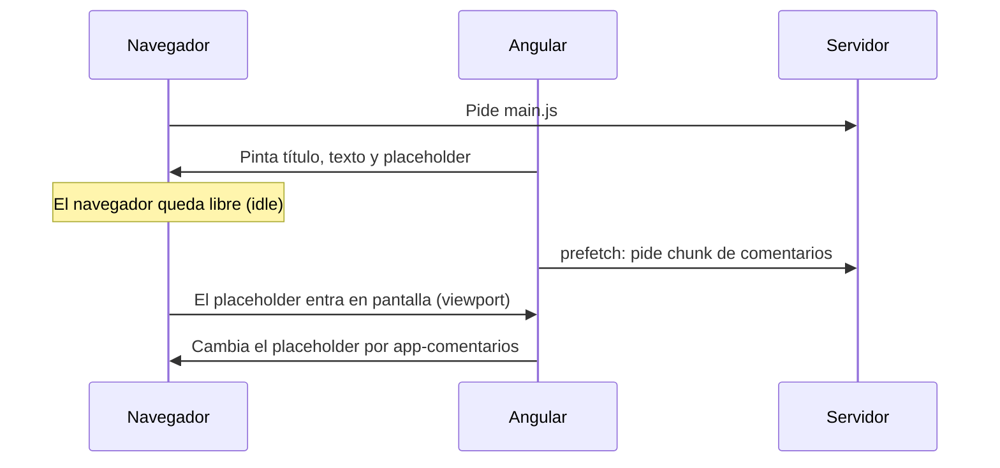

Abres un artículo de un periódico. Lo primero que quieres es el título y el texto. Los comentarios, al final de la página, solo los verá quien llegue hasta abajo. ¿Por qué obligar a todo el mundo a descargar el código de los comentarios antes de poder leer? Con **`@defer`** le dices a Angular: «este trozo de plantilla, y su código, cárgalo más tarde».

> [!analogia]
> En un restaurante, el postre no se cocina cuando te sientas. Te ponen la carta (el *placeholder*), y la cocina lo prepara cuando lo pides o cuando ve que vas acabando el segundo plato (el *trigger*). Si mientras tanto tarda, el camarero te dice «ya sale» (el *loading*).

## Un bloque `@defer` completo

```typescript
// src/app/articulo/articulo.ts
import { Component } from '@angular/core';
import { Comentarios } from './comentarios';

@Component({
  selector: 'app-articulo',
  imports: [Comentarios],
  template: `
    <h1>Mi artículo</h1>
    <p>Texto largo del artículo…</p>

    @defer (on viewport; prefetch on idle) {
      <app-comentarios />
    } @placeholder (minimum 500ms) {
      <p>Los comentarios se cargarán al llegar aquí.</p>
    } @loading (after 100ms; minimum 1s) {
      <p>Cargando comentarios…</p>
    } @error {
      <p>No se pudieron cargar los comentarios.</p>
    }
  `,
})
export class Articulo {}
```

Bloque a bloque:

- `@defer (on viewport; …) { … }`: el contenido diferido. `on viewport` es el **disparador** (*trigger*): se carga cuando el *placeholder* entra en la parte visible de la pantalla.
- `prefetch on idle`: **precarga** el código cuando el navegador está desocupado, aunque todavía no se muestre. Así, al llegar abajo, ya está descargado.
- `@placeholder (minimum 500ms)`: lo que se ve **antes** de que se dispare. `minimum` evita parpadeos: se muestra al menos ese tiempo.
- `@loading (after 100ms; minimum 1s)`: lo que se ve **mientras** se descarga. `after 100ms`: si la descarga tarda menos, ni se muestra.
- `@error`: lo que se ve si la descarga **falla** (por ejemplo, se cayó la conexión).

Solo el bloque principal es obligatorio; los otros tres son opcionales.

## Por qué ahorra: el código se separa

El compilador ve que `Comentarios` **solo** se usa dentro de un `@defer` y lo saca del archivo principal a un archivo aparte (un *chunk*). Esta es la salida real de `ng build` con este ejemplo:

```text
Initial chunk files | Names         |  Raw size | Estimated transfer size
chunk-O5TCHI2I.js   | -             | 143.07 kB |                42.84 kB
main-PNCT5AQF.js    | main          | 100.13 kB |                25.80 kB
styles-5INURTSO.css | styles        |   0 bytes |                 0 bytes

                    | Initial total | 243.21 kB |                68.63 kB

Lazy chunk files    | Names         |  Raw size | Estimated transfer size
chunk-JJHTCUKA.js   | comentarios   | 351 bytes |               351 bytes
chunk-XAHANEMB.js   | panel-admin   | 323 bytes |               323 bytes
```

`comentarios` aparece en **Lazy chunk files**: no se descarga al abrir la página. (El otro, `panel-admin`, es una ruta diferida; lo verás en la próxima lección.)



## Los disparadores

| Disparador | Se carga cuando… |
| --- | --- |
| `on idle` | El navegador está desocupado. **Es el de por defecto** si escribes solo `@defer {` |
| `on viewport` | El placeholder entra en la zona visible |
| `on interaction` | El usuario hace clic o pulsa una tecla sobre el placeholder |
| `on hover` | El ratón pasa por encima del placeholder |
| `on immediate` | Justo después de pintar la página |
| `on timer(2s)` | Pasado ese tiempo |
| `when condicion()` | Una expresión pasa a ser verdadera (una sola vez) |

Puedes combinarlos con `;` (`on viewport; on timer(5s)`: lo que ocurra antes) y usar los mismos con `prefetch`.

> [!cuidado]
> Para que `@defer` separe el código, el componente diferido debe ser independiente (*standalone*, lo normal en Angular 22) y **no usarse fuera** del `@defer` en la misma plantilla. Si también pones `<app-comentarios />` fuera del bloque, el compilador no puede separarlo y lo mete en el archivo principal.

> [!cuidado]
> `on viewport`, `on interaction` y `on hover` vigilan el **placeholder**. Sin `@placeholder` no hay nada que vigilar y la compilación falla con el error real `NG8019: Trigger with no target can only be placed on an @defer that has a @placeholder block`.

> [!idea]
> Difiere lo que está **lejos de la vista inicial** o es **pesado y opcional**: comentarios, gráficos, mapas, editores, pestañas que no se ven al principio. No difieras lo que el usuario ve nada más entrar.

> [!prueba]
> En tu proyecto, mete un componente dentro de `@defer (on interaction) { … } @placeholder { <button>Mostrar</button> }` y ejecuta `ng build`. Busca su nombre en «Lazy chunk files». Después, en `ng serve`, abre la pestaña Red (F12) y mira cuándo se descarga al pulsar.

> [!resumen]
> - `@defer` carga más tarde un trozo de plantilla y el código de sus componentes, que va a un *chunk* aparte.
> - `@placeholder` (antes), `@loading` (durante) y `@error` (si falla) son opcionales; `minimum` y `after` evitan parpadeos.
> - Los disparadores (`on idle` por defecto, `viewport`, `interaction`, `hover`, `immediate`, `timer`, `when`) deciden cuándo; `prefetch` descarga antes de mostrar.
