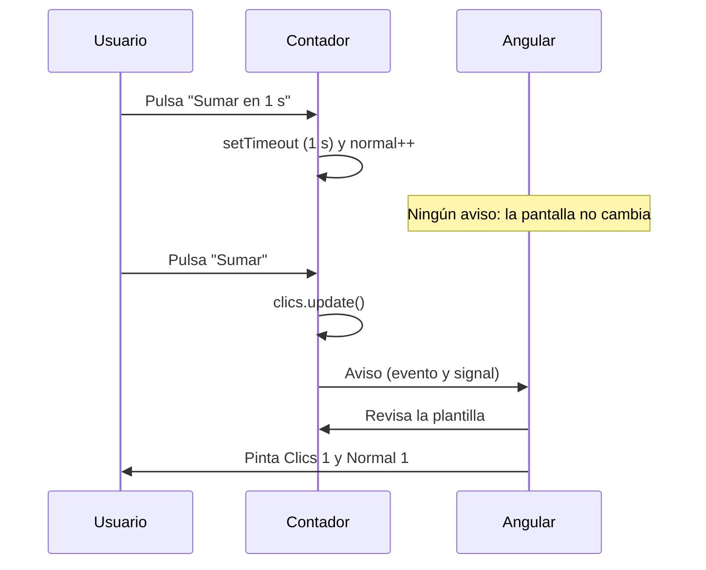

Pulsas «Sumar» y el número de la pantalla pasa de 3 a 4. Parece magia, pero alguien tiene que darse cuenta de que el dato cambió y **repintar** justo ese trozo de página. Ese trabajo se llama **detección de cambios** (*change detection*). Entender cómo lo hace Angular 22 explica por qué una app va fluida o a tirones, y por qué a veces «cambio un valor y la pantalla no se entera».

> [!analogia]
> Imagina un edificio con un conserje que revisa los buzones. Un conserje antiguo pasaba por **todos** los buzones cada vez que oía cualquier ruido en el portal. El conserje moderno solo sube a un buzón cuando alguien **toca su timbre**. En Angular 22, tocar el timbre es cambiar un signal que la plantilla lee.

## Qué es detectar cambios

Cada plantilla compilada sabe qué expresiones muestra: `{{ clics() }}`, `[disabled]="cargando()"`… Detectar cambios es volver a evaluar esas expresiones y, si el resultado es distinto del anterior, actualizar **solo** ese nodo del DOM. Angular nunca repinta la página entera.

La pregunta importante es **cuándo** lo hace.

## Antes: zone.js. Ahora: zoneless

En proyectos antiguos verás la librería `zone.js`. Vigilaba **todo** lo asíncrono del navegador (clics, temporizadores, peticiones) y, cuando algo terminaba, Angular revisaba toda la app «por si acaso». Funcionaba, pero hacía trabajo de más.

Una app nueva de Angular 22 es **zoneless**: no instala `zone.js` (míralo en el `package.json` que crea `ng new`). Angular solo programa una detección de cambios cuando recibe un **aviso**:

| Aviso | Ejemplo |
| --- | --- |
| Cambia un signal que lee una plantilla | `this.clics.update(n => n + 1)` |
| Un evento de la plantilla | `(click)="sumar()"` |
| Llega un valor a un `input()` | El padre cambia `[nombre]` |
| El pipe `async` recibe un valor | `{{ datos$ \| async }}` |
| Lo pides a mano | `inject(ChangeDetectorRef).markForCheck()` |

Un `setTimeout` que cambia una propiedad normal **no** es un aviso.

## OnPush: el modo por defecto en Angular 22

Cada componente tiene una **estrategia** de detección, en el campo `changeDetection` de `@Component`. El enumerado `ChangeDetectionStrategy` (de `@angular/core`) tiene dos valores en la versión 22:

- **`OnPush`**: Angular solo revisa el componente si está marcado como «sucio»: un signal que lee su plantilla cambió, ocurrió un evento en su plantilla, recibió un input nuevo o alguien llamó a `markForCheck()`. **Es el valor por defecto en Angular 22**: no hace falta escribirlo, y `ng generate component` ya no lo añade (su opción `--change-detection` vale `OnPush` por defecto).
- **`Eager`**: Angular lo revisa **siempre** que la detección pasa por él. Es el comportamiento clásico. Antes se llamaba `Default`; ese nombre sigue existiendo pero está obsoleto.

```typescript
// src/app/contador/contador.ts
import { ChangeDetectionStrategy, Component, signal } from '@angular/core';

@Component({
  selector: 'app-contador',
  template: `
    <p>Clics: {{ clics() }}</p>
    <p>Normal: {{ normal }}</p>
    <button type="button" (click)="sumar()">Sumar</button>
    <button type="button" (click)="sumarLuego()">Sumar en 1 s</button>
  `,
  changeDetection: ChangeDetectionStrategy.OnPush,
})
export class Contador {
  protected readonly clics = signal(0);
  protected normal = 0;

  protected sumar() {
    this.clics.update((n) => n + 1);
  }

  protected sumarLuego() {
    setTimeout(() => {
      this.normal++;
    }, 1000);
  }
}
```

- `changeDetection: ChangeDetectionStrategy.OnPush`: aquí lo escribimos para que lo veas, pero sería lo mismo sin esa línea.
- `clics` es un signal: al cambiar, avisa.
- `normal` es una propiedad corriente: cambiarla no avisa a nadie.

Esto es lo que pasa de verdad (lo hemos comprobado con una prueba automática en Angular 22):

1. Pulsas «Sumar en 1 s». Pasa un segundo y `normal` vale 1 por dentro, pero la pantalla sigue diciendo `Normal: 0`. Nadie tocó el timbre.
2. Pulsas «Sumar». El evento marca el componente, Angular lo revisa entero y ahora se ve `Clics: 1` y `Normal: 1`.

```pantalla
@url localhost:4200/
<p>Clics: 0</p>
<p>Normal: 0</p>
<button>Sumar</button> <button>Sumar en 1 s</button>
```



> [!idea]
> Guarda en **signals** todo lo que se ve en pantalla. Así cada cambio avisa solo, OnPush funciona sin sorpresas y Angular revisa solo los componentes que lo necesitan.

> [!cuidado]
> El error típico al migrar a zoneless: «cambio una variable dentro de un `setTimeout`, una promesa o un `subscribe` y la pantalla no se actualiza». No llames a `markForCheck()` por todas partes: convierte esa variable en un signal y usa `.set()`.

## Cómo verlo con tus ojos

**Angular DevTools** es una extensión gratuita para Chrome y Firefox. Añade una pestaña «Angular» a las herramientas del navegador (F12) con dos vistas:

- **Components**: el árbol de componentes, con sus inputs y signals en vivo.
- **Profiler**: pulsas grabar, usas la app y te muestra cada detección de cambios, qué componentes se revisaron y cuántos milisegundos tardó cada uno.

Lo usarás en la última lección del módulo para medir antes de optimizar.

> [!prueba]
> En tu proyecto, copia `Contador`, úsalo en `app.html` y repite los dos pasos de arriba. Después convierte `normal` en `signal(0)` y cambia `this.normal++` por `this.normal.update(n => n + 1)` (y `{{ normal }}` por `{{ normal() }}`). Ahora se actualiza solo al pasar el segundo.

> [!resumen]
> - La detección de cambios vuelve a evaluar las expresiones de las plantillas y actualiza solo lo que cambió.
> - Las apps nuevas son zoneless: Angular solo actúa cuando recibe un aviso (signal, evento, input, `async`, `markForCheck`).
> - En Angular 22 `OnPush` es la estrategia por defecto; `Eager` (antes `Default`) revisa siempre.
