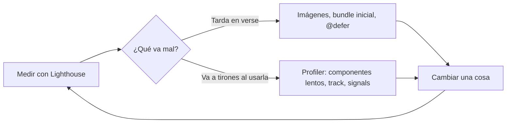

«La app va lenta.» ¿Lenta en qué? ¿Al abrirla, al escribir en un buscador, al cambiar de página? Optimizar a ciegas es perder el tiempo: puedes pasar un día ahorrando 2 kB de JavaScript cuando el problema real es una foto de 4 MB en la portada. Primero se **mide**; después se arregla lo que más pesa. Y muy a menudo, lo que más pesa son las **imágenes**.

> [!analogia]
> Un médico no receta antes de hacer pruebas. Las herramientas de medida son el análisis de sangre de tu app: te dicen dónde está el problema antes de tocar nada.

## Medir: tres herramientas

| Herramienta | Dónde | Qué te dice |
| --- | --- | --- |
| **Lighthouse** | Pestaña Lighthouse de Chrome (F12) | Una nota de rendimiento y métricas como el **LCP** (*Largest Contentful Paint*: cuánto tarda en verse el elemento más grande, a menudo la imagen principal) |
| **Angular DevTools → Profiler** | Extensión del navegador | Cada detección de cambios: qué componentes se revisaron y cuántos milisegundos tardó cada uno |
| **Salida de `ng build`** | Terminal | El tamaño del bundle inicial y de cada chunk diferido |

Un método sencillo:



Prueba siempre con el build de producción (`ng build` y sirve la carpeta `dist/`, o `ng serve --configuration production`): el modo desarrollo hace comprobaciones extra y es más lento a propósito.

## Imágenes: `NgOptimizedImage`

Una etiqueta `` normal tiene tres problemas típicos: la foto principal se descarga tarde, las fotos que están muy abajo se descargan aunque nadie llegue a verlas, y la página «salta» cuando la imagen termina de cargar porque el navegador no sabía cuánto espacio reservar. La directiva **`NgOptimizedImage`**, de `@angular/common`, los resuelve.

```typescript
// src/app/galeria/galeria.ts
import { NgOptimizedImage } from '@angular/common';
import { Component } from '@angular/core';

@Component({
  selector: 'app-galeria',
  imports: [NgOptimizedImage],
  template: `
    
    
  `,
})
export class Galeria {}
```

- `import { NgOptimizedImage } from '@angular/common'`: `@angular/common` es la librería de utilidades comunes de Angular (pipes, directivas, `HttpClient`…). Hay que añadir la directiva a `imports`.
- `ngSrc` en lugar de `src`: activa la directiva. Las imágenes van en la carpeta `public/`, como `portada.jpg`.
- `width` y `height` **obligatorios**: el navegador reserva el hueco y la página no salta. Si faltan, Angular lanza un error en desarrollo.
- `priority`: marca la imagen **importante** (la que suele ser el LCP). Úsalo en una o dos imágenes por página, las que se ven sin hacer scroll.
- `alt`: el texto alternativo para lectores de pantalla (lección de accesibilidad del módulo 16).

Esto es lo que Angular escribe de verdad en el DOM (lo hemos comprobado en Angular 22):

```html


```

- La imagen con `priority` recibe `loading="eager"` y `fetchpriority="high"`: se pide **ya** y antes que otras cosas.
- La otra recibe `loading="lazy"`: el navegador no la descarga hasta que el usuario se acerca a ella con el scroll.

```pantalla
@url localhost:4200/galeria
<div style="width:300px;height:150px;background:linear-gradient(#f97316,#7c3aed);color:white;display:flex;align-items:center;justify-content:center">portada.jpg (1200×600, prioritaria)</div>
<div style="width:120px;height:90px;margin-top:8px;background:#93c5fd;display:flex;align-items:center;justify-content:center;font-size:12px">detalle.jpg (diferida)</div>
```

En desarrollo, la directiva también avisa en la consola si una imagen es mucho más grande de lo que se muestra, o si la imagen LCP no tiene `priority`.

> [!cuidado]
> `NgOptimizedImage` no reduce el peso de una foto de 4 MB: no la recomprime. Para eso necesitas exportarla bien (formato moderno como WebP o AVIF, tamaño adecuado) o un servicio de imágenes (un CDN), que la directiva sabe usar mediante *loaders*.

> [!idea]
> El orden de ataque más rentable suele ser: imágenes (`NgOptimizedImage` y archivos ligeros), bundle inicial (rutas diferidas y `@defer`), y solo después la detección de cambios (signals, `track`, Profiler).

> [!prueba]
> En tu proyecto, pon una foto grande en `public/` y muéstrala con un `` normal. Pasa Lighthouse y apunta el LCP. Cámbiala a `ngSrc` con `width`, `height` y `priority` (no olvides `imports: [NgOptimizedImage]`) y vuelve a medir.

> [!resumen]
> - Mide antes de optimizar: Lighthouse para la carga, el Profiler de Angular DevTools para la interacción y `ng build` para el tamaño.
> - `NgOptimizedImage` (`ngSrc`, `width`, `height`, `priority`) carga primero la imagen importante, difiere el resto y evita saltos.
> - Prueba el rendimiento siempre en el build de producción.
