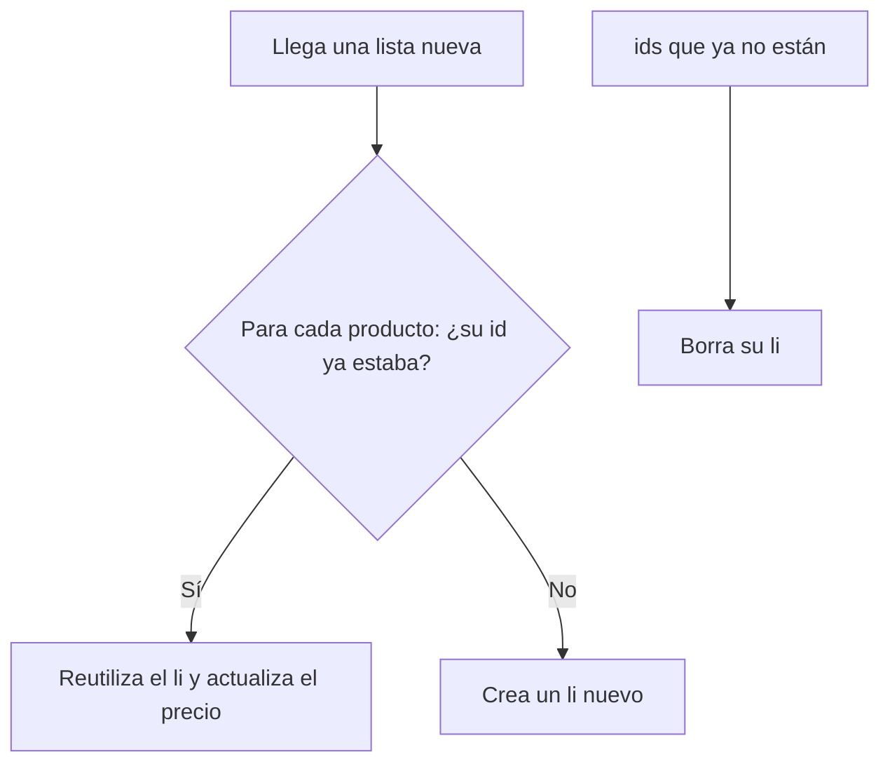

Tienes una lista de 500 productos y cada 10 segundos llega del servidor la lista actualizada: los mismos productos con algún precio distinto. ¿Debe Angular borrar los 500 elementos del DOM y crearlos de nuevo? Sería lento, y además el usuario perdería lo que estaba escribiendo en un campo de la lista. La expresión **`track`** de `@for` es la que evita ese desastre.

> [!analogia]
> Un profesor pasa lista. Si identifica a cada alumno **por su DNI**, da igual que cambien de silla: sabe quién es quién. Si los identifica **por el número de silla**, en cuanto alguien se cambia de sitio, le pone la nota al alumno equivocado. `track` es decirle a Angular cuál es el «DNI» de cada elemento.

## Qué hace `track`

Ya sabes (módulo 6) que `@for` exige `track`. Cuando la lista cambia, Angular compara la lista vieja con la nueva usando esa clave:

- Clave que **ya existía**: reutiliza su trozo de DOM y solo actualiza los datos que cambiaron.
- Clave **nueva**: crea un trozo de DOM.
- Clave que **desaparece**: borra su trozo de DOM.
- Clave que **cambia de posición**: mueve el trozo de DOM, sin recrearlo.

```html
<!-- src/app/catalogo/catalogo.html -->
<ul>
  @for (producto of productos(); track producto.id) {
    <li>{{ producto.nombre }}: {{ producto.precio }} €</li>
  } @empty {
    <li>No hay productos</li>
  }
</ul>
```

`track producto.id` dice: «dos objetos con el mismo `id` son el mismo producto, aunque sean objetos distintos en memoria».



## Las tres opciones y sus consecuencias

| `track` | Cuándo funciona bien | Problema |
| --- | --- | --- |
| `track producto.id` | Casi siempre: una clave única y estable | Ninguno |
| `track $index` | Listas que nunca se reordenan ni pierden elementos del medio | Al borrar o reordenar, el DOM de cada posición se queda con otro dato |
| `track producto` (el objeto) | Si los objetos nunca se sustituyen por copias | Si el servidor manda objetos nuevos, Angular cree que todo cambió y lo recrea todo |

Lo hemos comprobado con una lista de dos tareas, `A` y `B`, cada una con un `<input>`. Escribimos «nota de A» en el campo de `A` y borramos `A`:

- Con `track $index` queda **una fila «B» con el texto «nota de A»**. Angular borró la última posición y reutilizó la primera para `B`, con el campo tal como estaba.
- Con `track t.id` queda **una fila «B» con el campo vacío**, que es lo correcto: se borró el DOM de `A` con su texto.

```pantalla
@url localhost:4200/tareas
<p><strong>track $index</strong> (mal)</p>
<ul><li>B <input value="nota de A"></li></ul>
<p><strong>track t.id</strong> (bien)</p>
<ul><li>B <input value=""></li></ul>
```

## Los avisos de Angular

En modo desarrollo (`ng serve`), Angular te avisa en la consola del navegador:

- **NG0955**: la expresión de `track` dio **claves repetidas** («duplicated keys»). Dos productos con el mismo `id` confunden la comparación.
- **NG0956**: con `track` por el propio objeto, Angular tuvo que **recrear la colección entera** («caused re-creation of the entire collection»). Es la señal de que debes usar un `id`.

> [!cuidado]
> No uses `track $index` «porque es lo más corto». Funciona en una lista fija de opciones, pero en cuanto se puede borrar, filtrar u ordenar, te dará errores visuales difíciles de explicar.

> [!idea]
> El buen `track` es un dato **único** y **estable** de cada elemento: un `id` de la base de datos, un código, un correo. Si tus datos no tienen uno, créalo al recibirlos.

> [!prueba]
> En tu proyecto, haz una lista con `@for` y un `<input>` por fila, y un botón que borre el primer elemento. Prueba con `track $index` y con `track elemento.id`, escribiendo en el primer campo antes de borrar. Abre también la consola (F12) para ver si aparece algún aviso NG0955 o NG0956.

> [!resumen]
> - `track` le da a cada elemento una identidad para que Angular reutilice, mueva o borre su DOM en vez de recrearlo todo.
> - Usa una clave única y estable (`track item.id`); `$index` falla al borrar o reordenar y el objeto falla cuando llegan copias nuevas.
> - Los avisos NG0955 (claves repetidas) y NG0956 (colección recreada) te indican un mal `track`.
