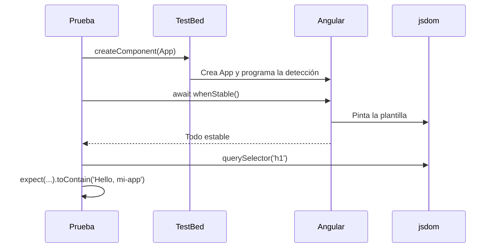

Cuando ejecutaste `ng new`, Angular te regaló una prueba que pasa: `src/app/app.spec.ts`. Es pequeña, pero contiene casi todo lo que usarás en cualquier prueba de componente. Vamos a leerla línea a línea, como si fuera una receta.

> [!analogia]
> Una prueba es un experimento de laboratorio con tres pasos: **preparar** el material (montar el componente), **actuar** (pulsar, cambiar un dato) y **comprobar** el resultado (lo que sale en pantalla). En inglés se llama *Arrange, Act, Assert*. El `TestBed` es la mesa del laboratorio donde montas el experimento.

## El archivo completo

```typescript
// src/app/app.spec.ts (tal como lo crea ng new)
import { TestBed } from '@angular/core/testing';
import { App } from './app';

describe('App', () => {
  beforeEach(async () => {
    await TestBed.configureTestingModule({
      imports: [App],
    }).compileComponents();
  });

  it('should create the app', () => {
    const fixture = TestBed.createComponent(App);
    const app = fixture.componentInstance;
    expect(app).toBeTruthy();
  });

  it('should render title', async () => {
    const fixture = TestBed.createComponent(App);
    await fixture.whenStable();
    const compiled = fixture.nativeElement as HTMLElement;
    expect(compiled.querySelector('h1')?.textContent).toContain('Hello, mi-app');
  });
});
```

## Los imports

- `import { TestBed } from '@angular/core/testing'`: `@angular/core/testing` es la parte de Angular dedicada a las pruebas. `TestBed` crea un mini entorno de Angular (con su inyector, su compilador y su detección de cambios) solo para la prueba.
- `import { App } from './app'`: el componente que vamos a probar.
- ¿Y `describe`, `it` y `expect`? No se importan: son **globales** de Vitest. Están disponibles porque `tsconfig.spec.json` incluye `"types": ["vitest/globals"]`. Lo mismo pasa con `beforeEach`, `afterEach` y `vi`.

## La estructura: `describe` e `it`

- `describe('App', () => { … })`: agrupa pruebas relacionadas bajo un nombre. Puedes anidar varios `describe`.
- `it('should create the app', () => { … })`: **una** prueba. El texto describe qué debe pasar («debería crear la app»). Puedes escribirlo en español: `it('suma uno al pulsar', …)`.
- La función que recibe `it` puede ser `async` cuando hay que esperar algo con `await`.

En la salida de Vitest los nombres se encadenan: `App > should create the app`.

## Preparar: `beforeEach` y `TestBed`

- `beforeEach(…)`: se ejecuta **antes de cada** `it`. Cada prueba empieza con un entorno limpio y no depende de lo que hizo la anterior.
- `TestBed.configureTestingModule({ imports: [App] })`: configura la mesa del laboratorio. En `imports` va el componente que pruebas; en `providers` irían los servicios o dobles (lo verás en la lección 4).
- `.compileComponents()`: compila las plantillas externas. Con el *builder* de Angular 22 ya llegan compiladas, así que en tus pruebas nuevas puedes omitirlo, pero no estorba.

## Actuar: `createComponent` y el *fixture*

- `TestBed.createComponent(App)`: crea el componente y lo pinta en el DOM de jsdom. Devuelve un **fixture** (un «accesorio de pruebas»): un mando a distancia del componente.
- `fixture.componentInstance`: el objeto de la clase `App`, para leer sus propiedades.
- `fixture.nativeElement`: el elemento HTML anfitrión (`<app-root>` con todo lo que hay dentro). `as HTMLElement` le dice a TypeScript qué tipo es, para poder usar `querySelector`.
- `fixture.componentRef`: lo usarás para darle inputs con `setInput` (lección siguiente).

## Esperar: `whenStable`

```typescript
await fixture.whenStable();
```

Recuerda el módulo 17: en una app zoneless, Angular **programa** la detección de cambios; no la hace en el mismo instante. `whenStable()` devuelve una promesa que se cumple cuando Angular ha terminado todo el trabajo pendiente (pintar, efectos, tareas). Con `await` la prueba espera a que la pantalla esté al día antes de mirar.



> [!cuidado]
> Si olvidas el `await fixture.whenStable()` después de cambiar algo, la prueba mira la pantalla **antes** de que Angular la actualice y falla con el valor antiguo. En código antiguo verás `fixture.detectChanges()`, que fuerza la detección en ese mismo momento; en Angular 22 lo recomendado es `await fixture.whenStable()`.

## Comprobar: `expect` y los *matchers*

`expect(valor)` empieza una comprobación; el método que sigue (el *matcher*) dice qué se espera:

| Matcher | Pasa si… |
| --- | --- |
| `toBe(x)` | Es exactamente `x` (el mismo valor o el mismo objeto) |
| `toEqual(x)` | Tiene el mismo contenido (para objetos y arrays) |
| `toContain(x)` | El texto o el array contiene `x` |
| `toBeTruthy()` | Es un valor «verdadero» (no `null`, `undefined`, `0`, `''` ni `false`) |
| `toHaveBeenCalledWith(x)` | Una función espía se llamó con `x` (lección 3) |

Delante de cualquiera puedes poner `.not`: `expect(lista).not.toContain('Pera')`.

- `expect(app).toBeTruthy()`: «el componente existe». Es la prueba mínima: si la plantilla tuviera un error, fallaría al crearlo.
- `expect(…textContent).toContain('Hello, mi-app')`: el `h1` contiene ese texto. El `?.` evita un error si no hubiera `h1` (el valor sería `undefined` y la prueba fallaría con un mensaje claro).

> [!prueba]
> En tu proyecto, cuando cambies `app.html` (lo harás en cuanto borres la página de ejemplo), esta prueba fallará. Arréglala: cambia `'Hello, mi-app'` por el texto de tu nuevo `h1` y ejecuta `ng test --watch=false` hasta verla en verde.

> [!resumen]
> - `describe` agrupa, `it` es una prueba, `beforeEach` prepara antes de cada una; `expect` + *matcher* comprueba.
> - `TestBed.createComponent()` devuelve un *fixture* con `componentInstance`, `nativeElement` y `componentRef`.
> - Tras crear o cambiar algo, `await fixture.whenStable()` antes de mirar el DOM.
