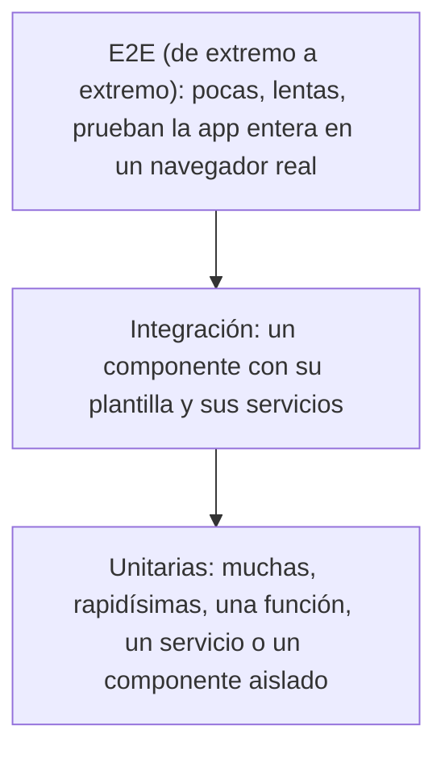

Cambias una línea en el carrito de la compra para arreglar el redondeo de los precios. Funciona. Tres semanas después, un cliente avisa de que el botón «Vaciar carrito» ya no hace nada: tu cambio lo rompió y nadie lo vio. Para comprobar a mano las 200 cosas que hace una app después de **cada** cambio harían falta horas. Las **pruebas automáticas** son pequeños programas que lo comprueban por ti en segundos, cada vez.

> [!analogia]
> Un piloto repasa una lista de comprobación antes de cada despegue, aunque el avión volara bien ayer. Las pruebas son esa lista: no confías en tu memoria, la máquina repasa cada punto y te dice cuál falla.

## La pirámide de pruebas

No todas las pruebas son iguales. Se suelen dibujar como una pirámide:



- **Unitarias** (la base): prueban una pieza aislada. Tardan milisegundos, así que puedes tener cientos.
- **De integración** (el medio): prueban varias piezas juntas, por ejemplo un componente pintando su plantilla con un servicio.
- **E2E** (*end to end*, la punta): abren la app de verdad en un navegador y hacen clic como un usuario. Son las más realistas, pero lentas y más frágiles; por eso hay pocas.

En Angular, la mayoría de las pruebas que escribirás con `TestBed` están entre la base y el medio: pintan un componente de verdad, pero sin navegador real.

## Vitest: el ejecutor de pruebas de Angular 22

Un proyecto nuevo trae todo listo. Recuerda lo que creó `ng new` (módulo 4):

```arbol
mi-app/
  package.json            # devDependencies incluye vitest y jsdom
  angular.json            # El objetivo "test" usa el builder @angular/build:unit-test
  tsconfig.spec.json      # Configuración de TypeScript solo para las pruebas (tipos vitest/globals)
  src/
    app/
      app.spec.ts         # La prueba del componente App que crea ng new
```

- **Vitest** es el *test runner*: busca los archivos de prueba, los ejecuta y te dice qué pasa y qué falla.
- **jsdom** es un navegador de mentira escrito en JavaScript: imita el DOM dentro de Node.js, sin abrir ninguna ventana. Por eso las pruebas son rápidas.
- **`@angular/build:unit-test`** es el *builder* que une las dos cosas: compila tu app y tus pruebas con el mismo compilador de Angular y se las pasa a Vitest.
- Los archivos de prueba terminan en **`.spec.ts`** («especificación»: describen cómo debe comportarse el código). `ng generate component` crea uno junto a cada componente.

## Ejecutar las pruebas

```bash
ng test
```

En una terminal normal, `ng test` se queda en **modo vigilancia** (*watch*): cada vez que guardas un archivo, vuelve a ejecutar las pruebas. Sales con `q` o Ctrl+C. Para ejecutarlas una sola vez (como hará un servidor de integración continua, módulo 21):

```bash
ng test --watch=false
```

Esta es la salida real en un proyecto recién creado, con la opción `--reporters=verbose` para ver el nombre de cada prueba:

```text
❯ Building...
✔ Building...
Application bundle generation complete. [1.726 seconds]

 RUN  v5.0.3 /home/ada/mi-app

 ✓ |mi-app| src/app/app.spec.ts > App > should create the app 119ms
 ✓ |mi-app| src/app/app.spec.ts > App > should render title 36ms

 Test Files  1 passed (1)
      Tests  2 passed (2)
   Start at  18:14:42
   Duration  1.76s
```

Primero Angular **construye** (como en `ng build`) y luego Vitest **ejecuta**. Cada `✓` es una prueba que pasa. Sin `--reporters=verbose` solo ves el resumen final.

Cuando una prueba falla, Vitest te enseña qué esperaba, qué recibió y en qué línea:

```text
 FAIL  |mi-app| src/app/saludo/saludo.spec.ts > Saludo > saluda con el nombre que recibe
AssertionError: expected 'Hola, Ada' to be 'Hola, Grace' // Object.is equality

Expected: "Hola, Grace"
Received: "Hola, Ada"

 ❯ src/app/saludo/saludo.spec.ts:19:29

 Test Files  1 failed (1)
      Tests  1 failed | 1 passed (2)
```

Opciones útiles de `ng test` (todas salen en `ng test --help`):

| Opción | Para qué |
| --- | --- |
| `--watch=false` | Ejecutar una vez y terminar |
| `--include=src/app/saludo` | Solo las pruebas de una carpeta o archivo |
| `--filter=Saludo` | Solo las pruebas cuyo nombre encaja con ese texto |
| `--coverage` | Informe de **cobertura**: qué líneas de tu código se ejecutaron durante las pruebas. La primera vez te pedirá instalar `@vitest/coverage-v8` |

## La punta de la pirámide: E2E con Playwright

Angular no trae ninguna herramienta E2E instalada: el propio `README.md` del proyecto lo dice. La más usada hoy es **Playwright**, que controla Chrome, Firefox y Safari de verdad. Se instala aparte (`npm init playwright@latest`) y sus pruebas se parecen a esto:

```typescript
// e2e/contador.spec.ts
import { expect, test } from '@playwright/test';

test('el contador suma al pulsar', async ({ page }) => {
  await page.goto('http://localhost:4200/');
  await page.getByRole('button', { name: 'Sumar' }).click();
  await expect(page.getByText('Clics: 1')).toBeVisible();
});
```

- `page.goto(...)`: abre la app (que debe estar en marcha con `ng serve`).
- `getByRole('button', { name: 'Sumar' })`: busca el botón como lo haría una persona (y como lo haría un lector de pantalla).
- `expect(...).toBeVisible()`: comprueba que el texto aparece de verdad en la pantalla.

> [!cuidado]
> No intentes probarlo todo con E2E «porque es lo más realista». Una batería de 500 pruebas E2E tarda muchos minutos y falla por motivos ajenos a tu código (la red, una animación lenta). Pocas E2E para los recorridos críticos (registrarse, pagar) y muchas unitarias para el resto.

> [!prueba]
> En tu proyecto, ejecuta `ng test`. Con las pruebas en marcha, abre `src/app/app.html` y cambia el texto del `<h1>`: guarda y mira cómo la prueba «should render title» se pone en rojo sola. Deshaz el cambio y vuelve a verde.

> [!resumen]
> - Las pruebas automáticas comprueban en segundos que lo que funcionaba sigue funcionando.
> - Pirámide: muchas unitarias, algunas de integración y pocas E2E.
> - Angular 22 usa Vitest con jsdom a través de `ng test`; los archivos de prueba acaban en `.spec.ts`. Para E2E, Playwright se instala aparte.
