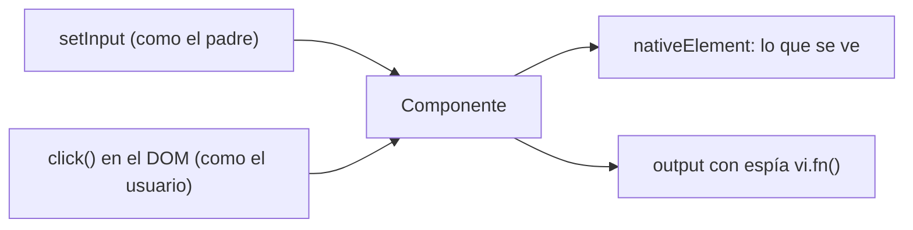

Un componente es como una caja con entradas y salidas: recibe datos por sus **inputs**, el usuario **interactúa** con él (clics, teclas) y él **avisa** a su padre con sus **outputs**. Probarlo bien es comprobar esas tres cosas mirando lo que ve el usuario, no los detalles internos de la clase.

> [!analogia]
> Para probar una máquina de café no la desmontas: metes una cápsula (input), pulsas el botón (interacción) y miras si sale café en la taza (lo que se ve) y si se enciende el piloto de «depósito vacío» (output). Lo de dentro puede cambiar mañana; lo que importa es lo que hace.

## Probar con inputs: `setInput`

```typescript
// src/app/saludo/saludo.ts
import { Component, input } from '@angular/core';

@Component({
  selector: 'app-saludo',
  template: `<h1>Hola, {{ nombre() }}</h1>`,
})
export class Saludo {
  readonly nombre = input('mundo');
}
```

```typescript
// src/app/saludo/saludo.spec.ts
import { TestBed } from '@angular/core/testing';
import { Saludo } from './saludo';

describe('Saludo', () => {
  it('saluda al mundo si no recibe nombre', async () => {
    const fixture = TestBed.createComponent(Saludo);
    await fixture.whenStable();

    const h1 = (fixture.nativeElement as HTMLElement).querySelector('h1');
    expect(h1?.textContent).toBe('Hola, mundo');
  });

  it('saluda con el nombre que recibe', async () => {
    const fixture = TestBed.createComponent(Saludo);
    fixture.componentRef.setInput('nombre', 'Ada');
    await fixture.whenStable();

    const h1 = (fixture.nativeElement as HTMLElement).querySelector('h1');
    expect(h1?.textContent).toBe('Hola, Ada');
  });
});
```

- No hay `configureTestingModule`: si el componente no necesita nada especial, `createComponent` basta.
- `fixture.componentRef.setInput('nombre', 'Ada')`: hace lo mismo que un padre que escribe `<app-saludo nombre="Ada" />`. Funciona con `input()`, `input.required()` y `model()`, y avisa a Angular para que repinte.
- El nombre del input va **entre comillas**: es el nombre público, el que usaría el padre en la plantilla.

## Probar clics y outputs

```typescript
// src/app/contador/contador.ts
import { Component, output, signal } from '@angular/core';

@Component({
  selector: 'app-contador',
  template: `
    <p>Clics: {{ clics() }}</p>
    <button type="button" (click)="sumar()">Sumar</button>
  `,
})
export class Contador {
  readonly cambio = output<number>();
  protected readonly clics = signal(0);

  protected sumar() {
    this.clics.update((n) => n + 1);
    this.cambio.emit(this.clics());
  }
}
```

```typescript
// src/app/contador/contador.spec.ts
import { ComponentFixture, TestBed } from '@angular/core/testing';
import { Contador } from './contador';

describe('Contador', () => {
  let fixture: ComponentFixture<Contador>;
  let pagina: HTMLElement;

  beforeEach(async () => {
    fixture = TestBed.createComponent(Contador);
    pagina = fixture.nativeElement;
    await fixture.whenStable();
  });

  it('empieza en cero', () => {
    expect(pagina.querySelector('p')?.textContent).toBe('Clics: 0');
  });

  it('suma uno al pulsar el botón', async () => {
    pagina.querySelector('button')?.click();
    await fixture.whenStable();

    expect(pagina.querySelector('p')?.textContent).toBe('Clics: 1');
  });

  it('avisa al padre con el nuevo valor', () => {
    const espia = vi.fn();
    fixture.componentInstance.cambio.subscribe(espia);

    pagina.querySelector('button')?.click();

    expect(espia).toHaveBeenCalledWith(1);
  });
});
```

Línea a línea lo nuevo:

- `ComponentFixture<Contador>`: el tipo del *fixture*, también de `@angular/core/testing`. Declaramos `fixture` y `pagina` fuera para compartirlos entre pruebas; `beforeEach` los vuelve a crear antes de cada una.
- `pagina.querySelector('button')?.click()`: un clic de verdad sobre el botón del DOM. Angular ejecuta `(click)="sumar()"` igual que en el navegador.
- `await fixture.whenStable()` **después** del clic: esperamos a que se repinte el párrafo.
- `vi.fn()`: `vi` es la caja de herramientas global de Vitest. `vi.fn()` crea una **función espía** (*spy*): no hace nada, pero apunta cada vez que la llaman y con qué argumentos.
- `cambio.subscribe(espia)`: nos suscribimos al output como lo haría el padre con `(cambio)="…"`.
- `toHaveBeenCalledWith(1)`: el espía se llamó con el valor 1. En la tercera prueba no hace falta `whenStable`: `emit` es inmediato.
- `clics` es `protected`: la prueba no lo lee directamente, mira el texto del párrafo. Así, si mañana cambias cómo se guarda el número, la prueba sigue valiendo.

Las tres pruebas pasan de verdad en Angular 22:

```text
 ✓ |mi-app| src/app/contador/contador.spec.ts > Contador > empieza en cero 154ms
 ✓ |mi-app| src/app/contador/contador.spec.ts > Contador > suma uno al pulsar el botón 30ms
 ✓ |mi-app| src/app/contador/contador.spec.ts > Contador > avisa al padre con el nuevo valor 15ms
```



> [!cuidado]
> No pruebes los detalles internos («la propiedad privada `x` vale 3»). Esas pruebas se rompen cada vez que reorganizas el código aunque todo siga funcionando. Prueba lo que se ve y lo que se emite.

## Harnesses del CDK (panorama)

Cuando usas componentes de Angular Material, su HTML interno es complejo y puede cambiar entre versiones. Por eso el CDK ofrece **harnesses** (arneses): objetos que manejan un componente con métodos de alto nivel. Este ejemplo pasa en un proyecto con Material 22 instalado:

```typescript
// src/app/guardar/guardar.spec.ts
import { TestbedHarnessEnvironment } from '@angular/cdk/testing/testbed';
import { TestBed } from '@angular/core/testing';
import { MatButtonHarness } from '@angular/material/button/testing';
import { Guardar } from './guardar';

describe('Guardar', () => {
  it('muestra el aviso al pulsar Guardar', async () => {
    const fixture = TestBed.createComponent(Guardar);
    const loader = TestbedHarnessEnvironment.loader(fixture);

    const boton = await loader.getHarness(MatButtonHarness.with({ text: 'Guardar' }));
    await boton.click();

    const texto = (fixture.nativeElement as HTMLElement).querySelector('p')?.textContent;
    expect(texto).toBe('Cambios guardados');
  });
});
```

- `TestbedHarnessEnvironment.loader(fixture)`: un buscador de harnesses dentro del componente.
- `MatButtonHarness.with({ text: 'Guardar' })`: «el botón de Material cuyo texto es Guardar».
- `await boton.click()`: pulsa y además espera a que Angular esté estable.

> [!prueba]
> En tu proyecto, genera un componente con `ng generate component saludo` (crea `saludo.spec.ts` solo), dale un `input()` y escribe una prueba con `setInput`. Ejecuta `ng test --include=src/app/saludo`.

> [!resumen]
> - Inputs: `fixture.componentRef.setInput('nombre', valor)` y después `await fixture.whenStable()`.
> - Interacción: busca en `nativeElement` y llama a `click()`; espera y comprueba el texto.
> - Outputs: suscribe un espía `vi.fn()` y comprueba con `toHaveBeenCalledWith`. Con Material, usa sus harnesses.
