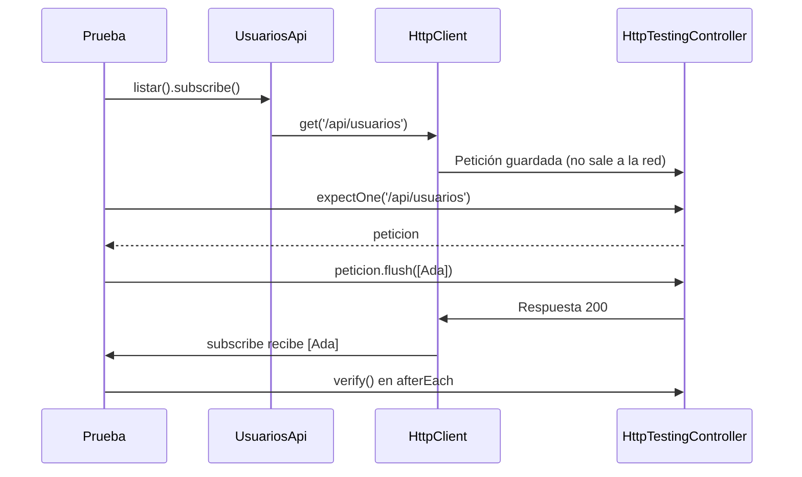

Tu servicio `UsuariosApi` pide la lista de usuarios a un servidor. ¿Cómo lo pruebas? Si la prueba llama al servidor de verdad, será lenta, fallará cuando no haya red, y no podrás probar fácilmente qué pasa si el servidor responde con un error 500. Angular trae un **servidor de mentira** para pruebas: `HttpTestingController`.

> [!analogia]
> Es como ensayar una obra con un apuntador. Tu servicio dice su frase («GET /api/usuarios») y, en vez de un público real, el apuntador (`HttpTestingController`) la escucha, comprueba que es la frase correcta y responde exactamente lo que tú le has escrito en el guion.

## El servicio

```typescript
// src/app/usuarios-api.ts
import { HttpClient } from '@angular/common/http';
import { Service, inject } from '@angular/core';
import { Observable } from 'rxjs';

export interface Usuario {
  id: number;
  nombre: string;
}

@Service()
export class UsuariosApi {
  private readonly http = inject(HttpClient);

  listar(): Observable<Usuario[]> {
    return this.http.get<Usuario[]>('/api/usuarios');
  }

  crear(nombre: string): Observable<Usuario> {
    return this.http.post<Usuario>('/api/usuarios', { nombre });
  }
}
```

Nada nuevo: `HttpClient` de `@angular/common/http` (módulo 13) y observables de `rxjs` (módulo 14).

## La prueba

```typescript
// src/app/usuarios-api.spec.ts
import { provideHttpClient } from '@angular/common/http';
import { HttpTestingController, provideHttpClientTesting } from '@angular/common/http/testing';
import { TestBed } from '@angular/core/testing';
import { Usuario, UsuariosApi } from './usuarios-api';

describe('UsuariosApi', () => {
  let api: UsuariosApi;
  let servidor: HttpTestingController;

  beforeEach(() => {
    TestBed.configureTestingModule({
      providers: [provideHttpClient(), provideHttpClientTesting()],
    });
    api = TestBed.inject(UsuariosApi);
    servidor = TestBed.inject(HttpTestingController);
  });

  afterEach(() => {
    servidor.verify();
  });

  it('pide la lista con GET y entrega lo que responde el servidor', () => {
    let recibidos: Usuario[] = [];
    api.listar().subscribe((usuarios) => (recibidos = usuarios));

    const peticion = servidor.expectOne('/api/usuarios');
    expect(peticion.request.method).toBe('GET');

    peticion.flush([{ id: 1, nombre: 'Ada' }]);

    expect(recibidos).toEqual([{ id: 1, nombre: 'Ada' }]);
  });

  it('crea un usuario con POST enviando el nombre', () => {
    api.crear('Grace').subscribe();

    const peticion = servidor.expectOne('/api/usuarios');
    expect(peticion.request.method).toBe('POST');
    expect(peticion.request.body).toEqual({ nombre: 'Grace' });

    peticion.flush({ id: 2, nombre: 'Grace' });
  });

  it('avisa del error si el servidor responde 500', () => {
    let estado = 0;
    api.listar().subscribe({ error: (err) => (estado = err.status) });

    servidor.expectOne('/api/usuarios').flush('Fallo', { status: 500, statusText: 'Server Error' });

    expect(estado).toBe(500);
  });
});
```

### Los imports

- `provideHttpClient` (de `@angular/common/http`): configura `HttpClient`, como en `app.config.ts`. En Angular 22 `HttpClient` ya está disponible en el inyector raíz aunque no lo llames (lo hemos comprobado), pero escribirlo deja claro que la prueba usa la misma configuración que la app; si tu app añade interceptores con `withInterceptors(...)`, ponlos aquí también.
- `provideHttpClientTesting` y `HttpTestingController` (de `@angular/common/http/testing`, la parte de pruebas de `HttpClient`): el primero **cambia el «cable» de red** de `HttpClient` por uno falso; el segundo es el mando para controlar ese cable.
- El orden importa: primero `provideHttpClient()`, después `provideHttpClientTesting()`, que sustituye parte de lo anterior.

### Lo que pasa en cada prueba

- `api.listar().subscribe(...)`: recuerda que un observable de `HttpClient` es **frío**: sin `subscribe` no se envía nada. Por eso hasta la prueba del POST se suscribe, aunque ignore la respuesta.
- `servidor.expectOne('/api/usuarios')`: comprueba que hay **exactamente una** petición pendiente a esa URL y te la devuelve. Si hay cero o dos, la prueba falla.
- `peticion.request`: la petición tal como salió: `method`, `body`, `headers`…
- `peticion.flush(datos)`: el «servidor» **responde** con esos datos. En ese momento se ejecuta tu `subscribe`, de forma síncrona.
- `flush('Fallo', { status: 500, statusText: 'Server Error' })`: responde con un error. Tu observable emite el error y `err.status` vale 500.
- `afterEach(() => servidor.verify())`: después de cada prueba comprueba que **no queda ninguna petición sin responder**. Atrapa peticiones que tu código hace sin que la prueba lo esperase.



La salida real de `ng test --reporters=verbose`:

```text
 ✓ |mi-app| src/app/usuarios-api.spec.ts > UsuariosApi > pide la lista con GET y entrega lo que responde el servidor 20ms
 ✓ |mi-app| src/app/usuarios-api.spec.ts > UsuariosApi > crea un usuario con POST enviando el nombre 8ms
 ✓ |mi-app| src/app/usuarios-api.spec.ts > UsuariosApi > avisa del error si el servidor responde 500 3ms
```

> [!cuidado]
> En código antiguo verás `imports: [HttpClientTestingModule]`. Sigue existiendo, pero está **obsoleto**: su propia documentación dice que añadas `provideHttpClientTesting()` a los `providers`. Y lo que no puedes olvidar es `provideHttpClientTesting()`: sin él, `HttpClient` intentaría usar la red de verdad.

> [!idea]
> Para probar un **componente** que usa `UsuariosApi`, no necesitas `HttpTestingController`: dale un doble del servicio con `useValue` (lección anterior) que devuelva `of([...])` de `rxjs`. `HttpTestingController` es para probar el servicio que habla HTTP.

> [!prueba]
> En tu proyecto, quita la línea `servidor.verify()` y añade en `listar()` una segunda llamada `this.http.get('/api/extra').subscribe()`. Las pruebas pasan sin `verify`. Vuelve a ponerlo: ahora fallan avisando de la petición que sobra.

> [!resumen]
> - `provideHttpClient()` + `provideHttpClientTesting()` cambian la red real por una falsa controlada por `HttpTestingController`.
> - `expectOne(url)` comprueba la petición, `flush(datos)` responde (o `flush(cuerpo, { status })` para errores).
> - `verify()` en `afterEach` asegura que no queda ninguna petición sin atender.
