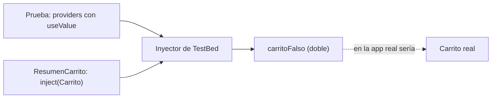

Los **servicios** guardan la lógica importante: los cálculos del carrito, las reglas de descuento, el estado compartido. Son lo más fácil de probar, porque no tienen plantilla: llamas a sus métodos y miras el resultado. Y cuando pruebas un **componente** que usa un servicio, a menudo no quieres el servicio real (que quizá llama a un servidor), sino un **doble** que tú controlas.

> [!analogia]
> En el cine, para una escena peligrosa no se tira el actor: se tira un **doble**. Se parece lo suficiente para la escena, y el director controla exactamente lo que hace. En una prueba, el doble de un servicio devuelve lo que tú decides y apunta lo que le piden.

## El servicio que vamos a probar

```typescript
// src/app/carrito.ts
import { Service, computed, signal } from '@angular/core';

export interface Producto {
  nombre: string;
  precio: number;
}

@Service()
export class Carrito {
  private readonly productos = signal<Producto[]>([]);

  readonly cantidad = computed(() => this.productos().length);
  readonly total = computed(() => this.productos().reduce((suma, p) => suma + p.precio, 0));

  anadir(producto: Producto) {
    this.productos.update((lista) => [...lista, producto]);
  }

  vaciar() {
    this.productos.set([]);
  }
}
```

- `@Service()` (de `@angular/core`): es lo que escribe `ng generate service carrito` en Angular 22. Marca la clase como servicio y la registra sola en el inyector raíz, igual que el clásico `@Injectable({ providedIn: 'root' })` que verás en mucho código (módulo 10). El archivo se llama `carrito.ts`, sin sufijo `.service`.
- Estado privado en un `signal` y lectura pública con `computed`: el patrón de *store* del módulo 15.

## Probar un servicio

```typescript
// src/app/carrito.spec.ts
import { TestBed } from '@angular/core/testing';
import { Carrito } from './carrito';

describe('Carrito', () => {
  let carrito: Carrito;

  beforeEach(() => {
    carrito = TestBed.inject(Carrito);
  });

  it('empieza vacío', () => {
    expect(carrito.cantidad()).toBe(0);
    expect(carrito.total()).toBe(0);
  });

  it('suma los precios de lo que añades', () => {
    carrito.anadir({ nombre: 'Libro', precio: 20 });
    carrito.anadir({ nombre: 'Taza', precio: 8 });

    expect(carrito.cantidad()).toBe(2);
    expect(carrito.total()).toBe(28);
  });

  it('vaciar deja el total a cero', () => {
    carrito.anadir({ nombre: 'Libro', precio: 20 });
    carrito.vaciar();

    expect(carrito.total()).toBe(0);
  });
});
```

- `TestBed.inject(Carrito)`: pide el servicio al inyector de la prueba, igual que `inject(Carrito)` en un componente. Si el servicio dependiera de otros, `TestBed` los crearía también.
- **Cada prueba recibe un carrito nuevo**: `TestBed` se reinicia entre pruebas, así que lo añadido en una no aparece en la siguiente.
- Los `computed` se leen llamándolos, `carrito.total()`, y siempre devuelven el valor al día. No hace falta `whenStable`: aquí no hay pantalla.

## Probar un componente con un doble

```typescript
// src/app/resumen-carrito/resumen-carrito.ts
import { Component, inject } from '@angular/core';
import { Carrito } from '../carrito';

@Component({
  selector: 'app-resumen-carrito',
  template: `
    <p>{{ carrito.cantidad() }} productos · {{ carrito.total() }} €</p>
    <button type="button" (click)="carrito.vaciar()">Vaciar</button>
  `,
})
export class ResumenCarrito {
  protected readonly carrito = inject(Carrito);
}
```

Queremos comprobar dos cosas del **componente**: que pinta lo que dice el carrito, y que al pulsar «Vaciar» se lo pide al carrito. La lógica del carrito ya está probada; aquí la sustituimos:

```typescript
// src/app/resumen-carrito/resumen-carrito.spec.ts
import { signal } from '@angular/core';
import { TestBed } from '@angular/core/testing';
import { Carrito } from '../carrito';
import { ResumenCarrito } from './resumen-carrito';

describe('ResumenCarrito', () => {
  const carritoFalso = {
    cantidad: signal(3),
    total: signal(45),
    vaciar: vi.fn(),
  };

  beforeEach(() => {
    TestBed.configureTestingModule({
      providers: [{ provide: Carrito, useValue: carritoFalso }],
    });
  });

  it('muestra lo que dice el carrito', async () => {
    const fixture = TestBed.createComponent(ResumenCarrito);
    await fixture.whenStable();

    const texto = (fixture.nativeElement as HTMLElement).querySelector('p')?.textContent;
    expect(texto).toBe('3 productos · 45 €');
  });

  it('pide al carrito que se vacíe', async () => {
    const fixture = TestBed.createComponent(ResumenCarrito);
    await fixture.whenStable();

    (fixture.nativeElement as HTMLElement).querySelector('button')?.click();

    expect(carritoFalso.vaciar).toHaveBeenCalledTimes(1);
  });
});
```

- `carritoFalso`: un objeto normal con **la misma forma** que usa la plantilla: `cantidad` y `total` (signals que leemos con `()`) y `vaciar` (un espía).
- `{ provide: Carrito, useValue: carritoFalso }`: la receta de inyección del módulo 10. «Cuando alguien pida `Carrito`, entrégale este objeto». El componente hace `inject(Carrito)` sin saber que recibe un doble.
- `toHaveBeenCalledTimes(1)`: el espía se llamó exactamente una vez.



Todo esto pasa de verdad con `ng test` en Angular 22:

```text
 ✓ |mi-app| src/app/resumen-carrito/resumen-carrito.spec.ts > ResumenCarrito > muestra lo que dice el carrito 96ms
 ✓ |mi-app| src/app/resumen-carrito/resumen-carrito.spec.ts > ResumenCarrito > pide al carrito que se vacíe 38ms
 ✓ |mi-app| src/app/carrito.spec.ts > Carrito > empieza vacío 8ms
 ✓ |mi-app| src/app/carrito.spec.ts > Carrito > suma los precios de lo que añades 8ms
 ✓ |mi-app| src/app/carrito.spec.ts > Carrito > vaciar deja el total a cero 2ms
```

> [!cuidado]
> `configureTestingModule` hay que llamarlo **antes** del primer `createComponent` o `inject` de la prueba. Si lo llamas después, `TestBed` ya está montado y lanza un error. Por eso va en `beforeEach`.

> [!idea]
> Prueba cada pieza en su nivel: la lógica, en el servicio; en el componente, solo que pinta y que delega. Con dobles, la prueba del componente no se rompe por un fallo del servicio, y es rápida aunque el servicio real hable con un servidor.

> [!prueba]
> En tu proyecto, ejecuta `ng generate service carrito` y mira los dos archivos que crea: `carrito.ts` con `@Service()` y `carrito.spec.ts` con una prueba que usa `TestBed.inject`. Añade el método `anadir` y una prueba para él.

> [!resumen]
> - Un servicio se prueba con `TestBed.inject(Servicio)`, llamando a sus métodos y comprobando el resultado.
> - Un doble sustituye una dependencia: `providers: [{ provide: Servicio, useValue: doble }]` en `configureTestingModule`.
> - Los espías `vi.fn()` en el doble comprueban que el componente delega (`toHaveBeenCalledTimes`, `toHaveBeenCalledWith`).
