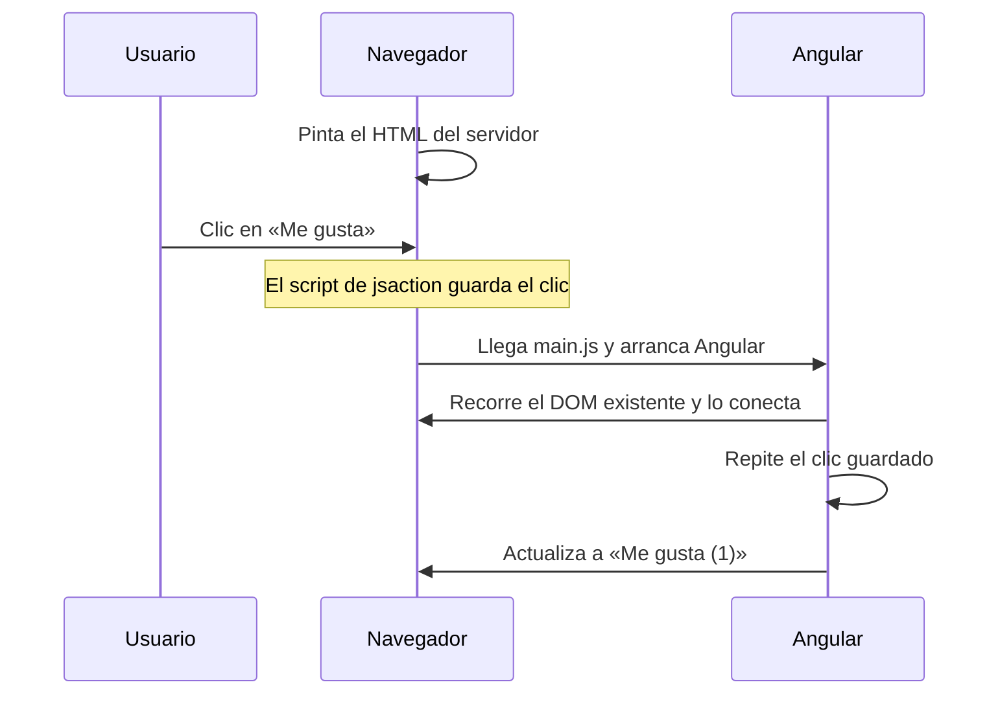

El servidor ha enviado el HTML de tu página y el navegador lo ha pintado. Se ve un botón «Me gusta (0)». Pero ese botón es **HTML sin vida**: nadie escucha sus clics, porque el JavaScript de Angular todavía no ha llegado. Cuando llega, Angular tiene dos opciones:

1. **Tirar** todo el HTML del servidor y volver a pintarlo desde cero. Funciona, pero la página parpadea y se pierde trabajo (y el foco o lo que el usuario estuviera seleccionando).
2. **Reutilizar** el HTML que ya está y solo conectar lo que falta: los escuchadores de eventos, los signals, los componentes.

La segunda opción se llama **hidratación**, y es lo que hace Angular.

> [!analogia]
> Una planta deshidratada que compras en una tienda: tiene la forma completa, pero está seca. No la tiras para plantar otra: le echas agua y la misma planta recupera la vida. El HTML del servidor es la planta seca; la hidratación es el agua que le da vida sin cambiarle la forma.

## Activarla: provideClientHydration

Un proyecto creado con `--ssr` ya la tiene en `app.config.ts`:

```typescript
// src/app/app.config.ts
import { ApplicationConfig, provideBrowserGlobalErrorListeners } from '@angular/core';
import { provideRouter } from '@angular/router';
import { routes } from './app.routes';
import { provideClientHydration } from '@angular/platform-browser';

export const appConfig: ApplicationConfig = {
  providers: [
    provideBrowserGlobalErrorListeners(),
    provideRouter(routes),
    provideClientHydration(),
  ],
};
```

`provideClientHydration` viene de `@angular/platform-browser`, la librería que conecta Angular con el navegador. Va en la configuración **del navegador** (no en la del servidor) porque es allí donde se hidrata. En Angular 22, esta sola línea activa cuatro cosas:

| Qué | Para qué |
| --- | --- |
| Hidratación del DOM | Reutilizar el HTML del servidor en vez de repintarlo |
| Caché de transferencia HTTP | Las peticiones de `HttpClient` hechas en el servidor viajan dentro del HTML; el navegador no las repite |
| Hidratación incremental | Hidratar partes de la página más tarde, con `@defer` (ver abajo) |
| Repetición de eventos | Los clics que el usuario hace **antes** de hidratar se guardan y se ejecutan después |

Con funciones `with…` puedes desactivar o ajustar alguna: `provideClientHydration(withNoHttpTransferCache())` desactiva la caché HTTP, por ejemplo.

## Qué viaja en el HTML

Si miras el código fuente de una página renderizada, verás marcas que no escribiste:

```html
<app-root ng-version="22.2.1" ngh="2" ng-server-context="ssr">
  <h1>Tienda</h1>
  <app-comentarios ngh="0">
    <button jsaction="click:;">Me gusta (0)</button>
  </app-comentarios>
</app-root>
<script id="ng-state" type="application/json">{"__nghData__":[...]}</script>
```

- `ngh="…"` apunta a datos del bloque `ng-state`: describen la estructura que generó el servidor, para que el navegador sepa qué nodo corresponde a qué parte de cada plantilla.
- `ng-server-context="ssr"` dice cómo se generó: `ssr` en cada petición, `ssg` en el build.
- `jsaction="click:;"` marca los elementos con eventos. Un pequeño script captura esos clics antes de que llegue Angular; al hidratar, los **repite**. Así, si el usuario pulsa «Me gusta» muy pronto, el clic no se pierde.



## Hidratación incremental con @defer

Ya conoces `@defer` (módulo 17): carga un trozo de plantilla más tarde. Con SSR tiene una versión especial, `hydrate`:

```html
<h2>Ficha del producto</h2>

@defer (hydrate on viewport) {
  <app-comentarios />
}
```

El servidor **sí** renderiza `<app-comentarios>` y el usuario lo ve desde el principio. Pero el navegador no descarga ni hidrata ese componente hasta que entra en pantalla (`on viewport`). Menos JavaScript al principio, sin huecos en la página. Hay más disparadores: `hydrate on interaction` (al tocarlo), `hydrate on idle` (cuando el navegador está libre), `hydrate on hover`, `hydrate on timer(2s)`, `hydrate when condicion` y `hydrate never` (nunca: queda como HTML estático).

> [!idea]
> Un `@defer` normal, sin `hydrate`, se comporta distinto en el servidor: renderiza el bloque `@placeholder`, no el contenido. Si el contenido importa para el SEO, usa `hydrate`; si es secundario (un chat, un mapa), un `@defer (on viewport)` normal está bien.

> [!cuidado]
> La hidratación exige que el navegador encuentre **exactamente** el DOM que generó el servidor. Si no coincide, Angular avisa con el error **NG0500** (*hydration mismatch*). Causas típicas: tocar el DOM a mano (`document.createElement`, librerías que mueven nodos), HTML inválido que el navegador «corrige» al leerlo (un `<div>` dentro de un `<p>`, una tabla sin `<tbody>`), o mostrar en el servidor algo distinto que en el navegador (la hora actual, un número aleatorio). Como último recurso, el atributo `ngSkipHydration` en un componente hace que Angular lo repinte en vez de hidratarlo.

En proyectos de versiones anteriores verás `provideClientHydration(withEventReplay())` o `withIncrementalHydration()`. En Angular 22 ya vienen incluidas: `withIncrementalHydration()` está marcada como obsoleta (*deprecated*) y se puede borrar.

> [!prueba]
> En tu proyecto con SSR, abre la página, pulsa `Ctrl+U` y busca `ngh=`. Después borra `provideClientHydration()` de `app.config.ts`, recarga y mira la consola del navegador (`F12`): Angular te avisa de que la página se renderizó en el servidor pero no se ha hidratado. Vuelve a ponerlo.

> [!resumen]
> - Hidratar es reutilizar el HTML del servidor y conectarle los eventos y el estado, en vez de repintarlo.
> - `provideClientHydration()` va en `app.config.ts` e incluye, en Angular 22, caché HTTP, hidratación incremental y repetición de eventos.
> - `@defer (hydrate on …)` renderiza en el servidor pero retrasa descargar e hidratar ese trozo.
> - El DOM del navegador debe coincidir con el del servidor; si no, aparece el error NG0500.
