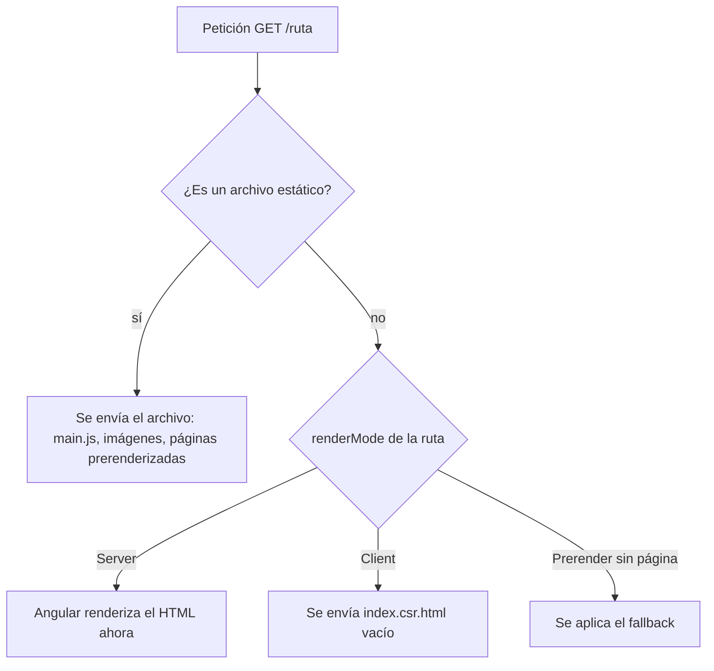

Una tienda online tiene páginas muy distintas:

- La **portada** y «Quiénes somos» son iguales para todo el mundo.
- La **ficha de cada producto** también es igual para todos, pero hay cientos.
- **Mi perfil** cambia con cada usuario: no se puede generar por adelantado.
- El **panel de administración** está detrás de un login: Google nunca lo verá.

Sería un desperdicio tratarlas igual. Angular te deja elegir **un modo de renderizado por ruta** en `app.routes.server.ts`.

> [!analogia]
> Una panadería. El pan de molde se hornea de madrugada y espera en la estantería (**prerender**: se hace una vez, en el build). Las tartas personalizadas se hornean cuando llega el encargo (**servidor**: en cada petición). Y los kits de galletas se venden crudos para que los hornees en casa (**cliente**: el navegador hace el trabajo).

## Los tres modos

`RenderMode` viene de `@angular/ssr` y tiene tres valores:

| Modo | Cuándo se genera el HTML | Úsalo para |
| --- | --- | --- |
| `RenderMode.Prerender` | Una vez, durante `ng build` (SSG) | Contenido igual para todos |
| `RenderMode.Server` | En cada petición (SSR) | Contenido que depende del usuario o cambia a cada momento |
| `RenderMode.Client` | En el navegador (CSR) | Zonas privadas o muy interactivas |

## La tienda, ruta a ruta

```typescript
// src/app/app.routes.server.ts
import { inject } from '@angular/core';
import { RenderMode, ServerRoute } from '@angular/ssr';
import { Catalogo } from './catalogo';

export const serverRoutes: ServerRoute[] = [
  { path: '', renderMode: RenderMode.Prerender },
  { path: 'quienes-somos', renderMode: RenderMode.Prerender },
  {
    path: 'productos/:id',
    renderMode: RenderMode.Prerender,
    async getPrerenderParams() {
      const ids = await inject(Catalogo).idsDestacados();
      return ids.map((id) => ({ id }));
    },
  },
  { path: 'perfil', renderMode: RenderMode.Server },
  { path: 'admin/**', renderMode: RenderMode.Client },
  { path: '**', renderMode: RenderMode.Server },
];
```

Línea a línea:

- **`ServerRoute[]`**: el tipo de la lista. Cada objeto tiene un `path` que coincide con una ruta de `app.routes.ts` y su `renderMode`. Las rutas del router siguen definiéndose en `app.routes.ts`; este archivo solo dice **cómo** se renderiza cada una.
- **`''` y `'quienes-somos'`**: prerender. El build genera `dist/…/browser/index.html` y `dist/…/browser/quienes-somos/index.html`.
- **`'productos/:id'`**: una ruta con parámetro. Para prerenderizarla, el build necesita saber **qué** valores de `:id` existen. Eso responde `getPrerenderParams`: una función asíncrona que devuelve una lista de objetos, uno por página. Si devuelve `[{ id: '1' }, { id: '2' }]`, se generan `/productos/1` y `/productos/2`. Se ejecuta en un contexto de inyección, así que puede usar `inject()` para pedir un servicio.
- **`'perfil'`**: servidor. Se renderiza en cada visita.
- **`'admin/**'`**: cliente. El servidor responde con la plantilla vacía (`index.csr.html`) y el navegador hace todo, como en una app normal.
- **`'**'`**: el comodín para todo lo demás. Va al **final**: Angular usa la primera regla que encaja.

> [!idea]
> ¿Y si alguien visita `/productos/77` y ese id no se prerenderizó? Por defecto el servidor lo renderiza en ese momento (SSR). Lo controla la opción `fallback`: `PrerenderFallback.Server` (por defecto), `PrerenderFallback.Client` (lo hace el navegador) o `PrerenderFallback.None` (el servidor no la atiende).

## Qué pasa con cada petición



Al compilar, la terminal te dice cuántas páginas prerenderizó:

```text
Prerendered 4 static routes.
Application bundle generation complete.
```

Y en `dist/tienda/prerendered-routes.json` tienes la lista exacta (`/`, `/productos/1`, `/productos/2` y `/quienes-somos`).

## Estado HTTP y cabeceras

Las rutas en modo `Server` o `Client` aceptan además `status` y `headers`. Sirve, por ejemplo, para que la página 404 responda de verdad con un código 404 y Google no la indexe:

```typescript
{ path: '**', renderMode: RenderMode.Server, status: 404 },
```

> [!cuidado]
> El prerender se ejecuta **en tu máquina o en la de CI, durante el build**. Si `getPrerenderParams` llama a una API, esa API debe estar accesible en ese momento. Y lo que se prerenderiza queda «congelado» hasta el siguiente build: si un precio cambia cada hora, esa página debe ir en modo `Server`, no `Prerender`.

> [!prueba]
> En tu proyecto con SSR, cambia la regla `'**'` de `Prerender` a `Server` y ejecuta `ng build`: el mensaje `Prerendered … static routes` desaparece. Vuelve a `Prerender` y compara la carpeta `dist/<app>/browser`.

> [!resumen]
> - `app.routes.server.ts` asigna a cada ruta `RenderMode.Prerender`, `Server` o `Client`.
> - Prerender genera el HTML en el build; Server en cada petición; Client en el navegador.
> - Para prerenderizar rutas con parámetros, `getPrerenderParams` devuelve los valores (`[{ id: '1' }, …]`).
> - Gana la primera regla que encaja: deja `'**'` al final.
