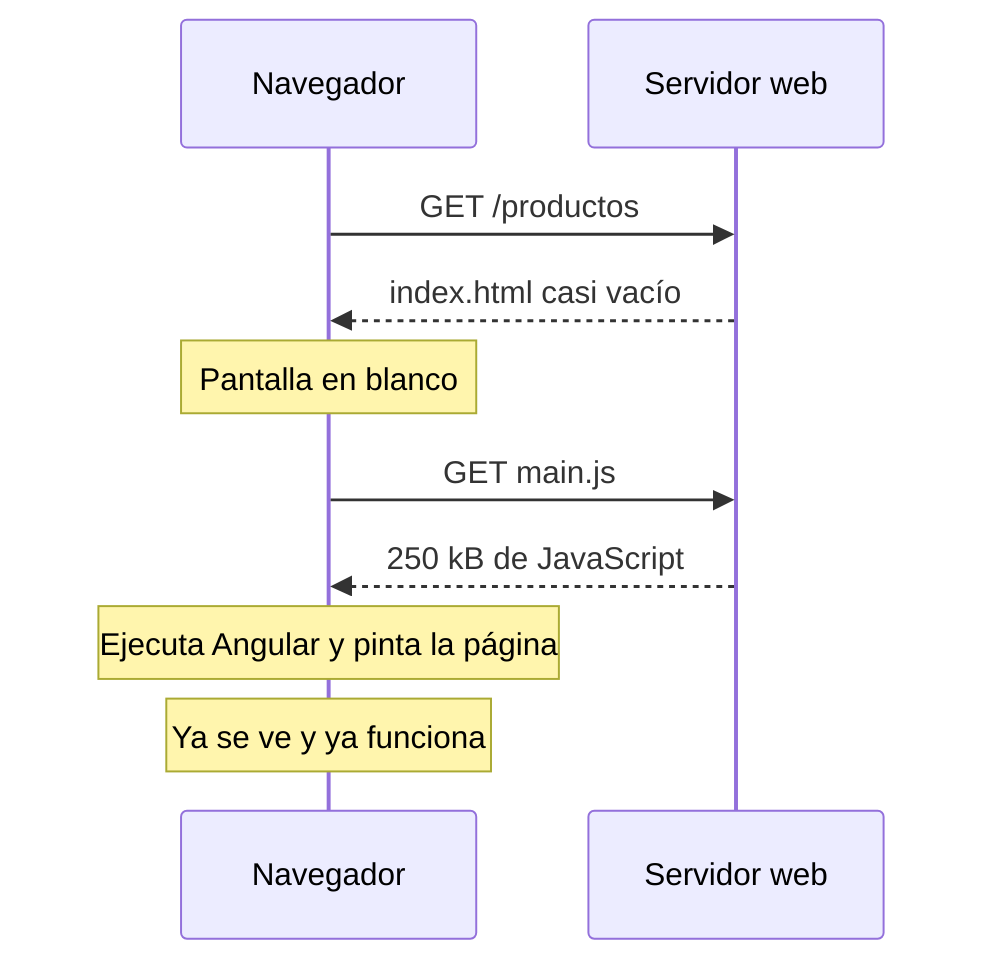
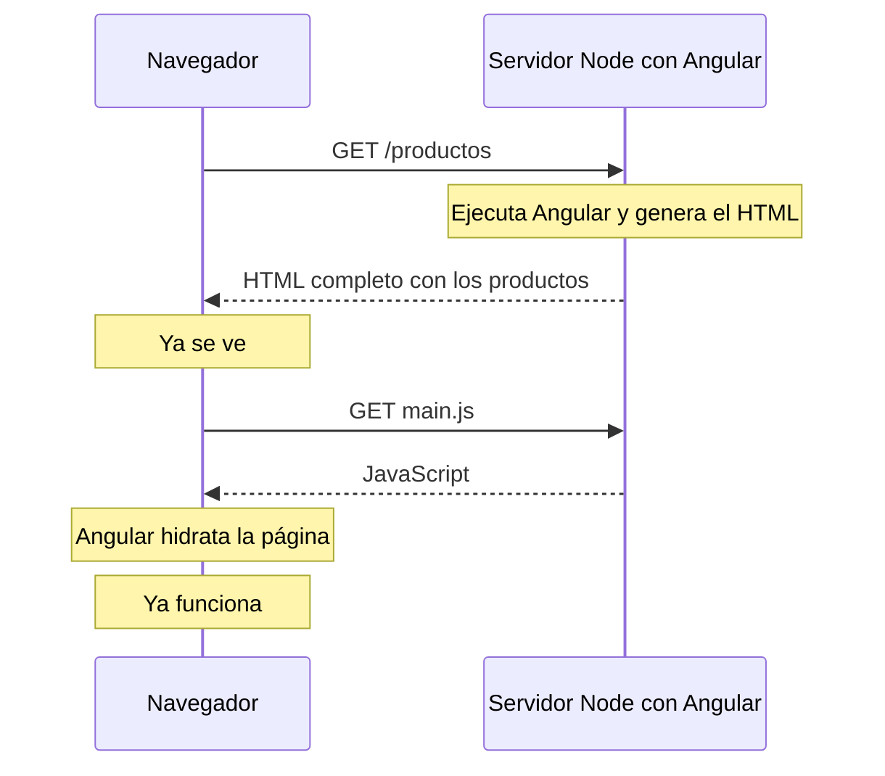

Abre la app que has construido hasta ahora y pide al navegador **Ver código fuente** (`Ctrl+U`). Dentro del `<body>` solo hay esto:

```html
<body>
  <app-root></app-root>
  <script src="main-O7QUVEYP.js" type="module"></script>
</body>
```

Ni un título, ni un párrafo. Todo lo que ves en pantalla lo pinta JavaScript **después** de descargarse y ejecutarse. Para ti no es un problema: tu portátil es rápido y tu wifi también. Pero piensa en otros dos visitantes:

- **Un móvil antiguo con 3G** en un tren. Tiene que descargar 250 kB de JavaScript, ejecutarlo y solo entonces ver algo. Durante varios segundos mira una pantalla en blanco.
- **El robot de Google** (o el que genera la vista previa cuando compartes un enlace en WhatsApp). Muchos de estos robots leen el HTML y no esperan a que se ejecute tu JavaScript. Para ellos, tu página está vacía.

**Renderizar en el servidor** (en inglés *Server-Side Rendering*, **SSR**) resuelve los dos problemas: el servidor ejecuta Angular, genera el HTML completo de la página y lo envía ya relleno. El navegador lo pinta al instante y, después, Angular «despierta» esa página para que los botones funcionen.

> [!analogia]
> Pedir una mesa montada por piezas o ya montada. Con la app normal (renderizado en el cliente) te llega una caja plana con instrucciones: tú (el navegador) tienes que montarla antes de poder usarla. Con SSR la mesa llega montada de fábrica: la puedes usar para apoyar cosas desde el primer segundo. Solo falta que alguien apriete los tornillos de los cajones (eso es la **hidratación**, la lección 3).

## Tres formas de generar el HTML

| Forma | Quién genera el HTML | Cuándo | Para qué |
| --- | --- | --- | --- |
| **CSR** (*Client-Side Rendering*) | El navegador, con JavaScript | Al abrir la página | Paneles privados, apps detrás de un login |
| **SSR** (*Server-Side Rendering*) | Un servidor Node.js con Angular dentro | En **cada** petición | Páginas que cambian con cada visita o usuario |
| **SSG** (*Static Site Generation*, o *prerender*) | La CLI, durante `ng build` | **Una vez**, al compilar | Páginas iguales para todos: portada, blog, «quiénes somos» |

Hasta ahora has hecho siempre CSR. En este módulo verás que Angular puede usar **las tres a la vez**, una distinta para cada ruta (lección 4).

## Qué pasa en cada caso

Así se carga una página con CSR, la que conoces:



Y así con SSR:



La diferencia está en la primera nota. Con SSR el usuario **ve** el contenido mucho antes, aunque los botones tarden un poco más en responder. Con SSG pasa lo mismo, pero el servidor ni siquiera tiene que trabajar: el HTML ya está hecho y guardado en un archivo.

## Lo que ganas y lo que pagas

Ganas:

- **Primera carga más rápida** a la vista. Los navegadores miden el *LCP* (*Largest Contentful Paint*, cuánto tarda en aparecer el elemento principal), y Google lo usa para posicionar.
- **SEO** (*Search Engine Optimization*, aparecer bien en los buscadores) y **vistas previas** de enlaces: el robot recibe el texto real, con su `<title>` y sus `<meta>`.
- La página se ve aunque el JavaScript falle o tarde.

Pagas:

- Necesitas un **servidor Node.js** encendido (salvo con SSG puro, que son archivos estáticos).
- Tu código se ejecuta en **dos sitios**: en el servidor y en el navegador. En el servidor no existen `window`, `document` ni `localStorage`. Lo resolverás en la lección 5.
- Algo más de complejidad al desplegar (módulo 21).

> [!cuidado]
> SSR no es «más rápido» en todo. El JavaScript que se descarga es el mismo, y la página no responde a clics hasta que Angular la hidrata. Si tu app es un panel privado detrás de un login, que Google nunca verá, el CSR de siempre suele ser la mejor opción: más simple y sin servidor.

> [!prueba]
> Abre en el navegador una web que conozcas, pulsa `Ctrl+U` y busca un texto que se vea en pantalla. Si aparece en el código fuente, esa página llega renderizada (SSR o SSG). Si solo ves un `<div id="root">` o un `<app-root>` vacío, es CSR. Haz lo mismo con tu proyecto de Angular.

> [!resumen]
> - Con CSR el HTML llega vacío y el navegador lo rellena con JavaScript.
> - Con SSR el servidor ejecuta Angular en cada petición y envía el HTML ya relleno; con SSG ese HTML se genera una vez, en `ng build`.
> - Ganas primera carga visible y SEO; pagas con un servidor Node y con código que debe funcionar también fuera del navegador.
> - Después de pintar, Angular **hidrata** la página para que responda a los clics.
