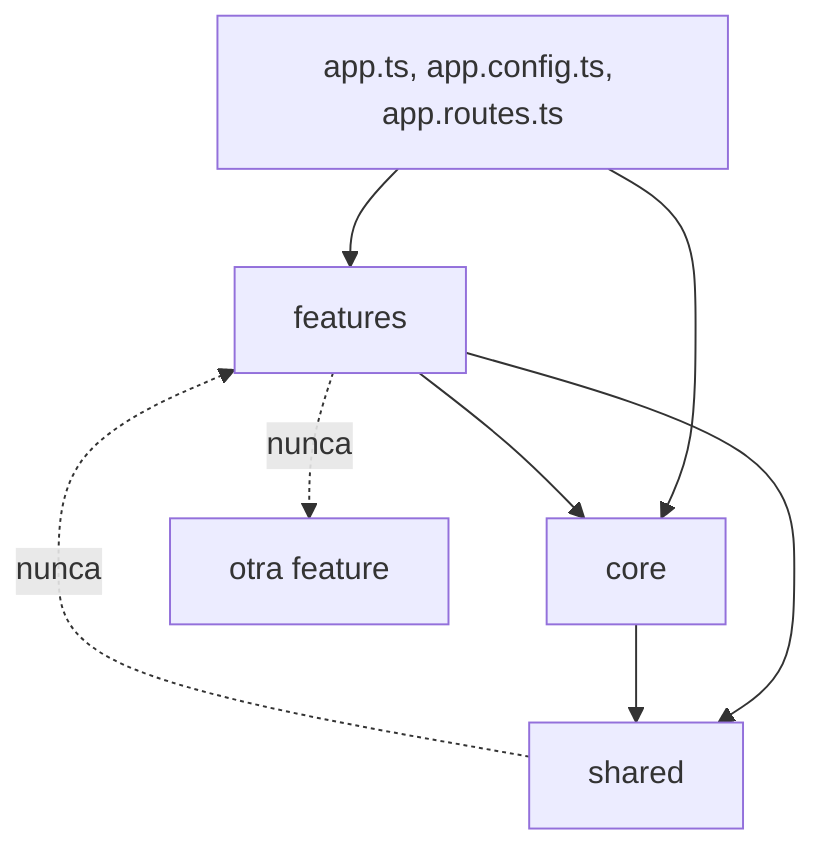

Al principio tu app cabe en `src/app/`: diez archivos, todo a la vista. Seis meses después hay 200. Buscas «el componente del carrito» y encuentras `carrito.ts`, `carrito-store.ts`, `resumen-carrito/`, `boton-carrito/` y `carrito-api.ts`… repartidos entre carpetas llamadas `components/`, `services/` y `models/`. Para cambiar una sola funcionalidad abres cinco carpetas. Y cuando entra alguien nuevo al equipo, no sabe dónde poner nada.

La **arquitectura** de una app es la respuesta a «¿dónde va cada cosa y quién puede usar a quién?». No hace falta para 10 archivos; es imprescindible para 200.

> [!analogia]
> Una casa no se ordena por **tipo de objeto** (todas las sillas en una habitación, todas las mesas en otra, todas las camas en otra), sino por **uso**: la cocina tiene su mesa, sus sillas y sus platos; el dormitorio, su cama y su armario. Si quieres cocinar, vas a la cocina y lo tienes todo. Con las carpetas pasa lo mismo.

## Por tipo o por funcionalidad

Organizar **por tipo** parece ordenado, pero mezcla funcionalidades:

```arbol
src/app/
  components/          # Todos los componentes de la app, de todas las pantallas
    tarjeta-producto/  # Del catálogo
    resumen-carrito/   # Del carrito
    login-form/        # De la autenticación
  services/            # Todos los servicios juntos, sin relación entre sí
  models/              # Todas las interfaces juntas
```

Organizar **por funcionalidad** (*feature*) agrupa lo que cambia junto:

```arbol
src/app/
  core/                       # Lo que existe UNA vez en toda la app y se carga al arrancar
    layout/                   # La cabecera, el menú y el pie
    auth/                     # La sesión del usuario, el guard y el interceptor del token
  shared/                     # Piezas reutilizables SIN lógica de negocio
    ui/                       # Botones, tarjetas, diálogos genéricos
    pipes/                    # Pipes de formato que usa cualquiera
  features/                   # Una carpeta por funcionalidad del negocio
    productos/                # Todo el catálogo: si lo borras, desaparece el catálogo entero
      data/                   # Modelos, acceso a la API y estado (servicios)
        producto.ts           # La interfaz Producto
        productos-api.ts      # El servicio que habla con el backend
        carrito-store.ts      # El estado del carrito con signals
      ui/                     # Componentes de presentación de esta funcionalidad
        tarjeta-producto.ts   # Recibe un producto y avisa de los clics
      pages/                  # Componentes que hace aparecer el router
        catalogo-page.ts      # La pantalla del catálogo: junta datos y UI
      productos.routes.ts     # Las rutas de la funcionalidad, cargadas de forma diferida
    pedidos/                  # Otra funcionalidad, con la misma estructura
  app.ts                      # El componente raíz
  app.config.ts               # Los providers globales
  app.routes.ts               # Las rutas principales: una entrada por funcionalidad
```

Esta estructura no es una norma de Angular: es una convención muy extendida. Lo importante es la idea: **lo que cambia junto, vive junto**.

## Para qué sirve cada carpeta

- **`core/`**: servicios y componentes que existen una sola vez y se usan desde la raíz: la sesión, el *layout*, los interceptores, el manejo global de errores. No se importan desde las *features* para pintar cosas; se configuran en `app.config.ts` o en `app.ts`.
- **`shared/`**: piezas que podrías copiar a otro proyecto sin cambiarlas. Un botón, un pipe de formato, una directiva. Si una pieza sabe qué es un «producto» o un «pedido», **no** va en `shared/`.
- **`features/<nombre>/`**: cada funcionalidad del negocio. Dentro, se separan los datos (`data/`), la presentación (`ui/`) y las pantallas (`pages/`). Lo verás en detalle en la lección siguiente.

Cada *feature* expone sus rutas y el router las carga solo cuando hacen falta:

```typescript
// src/app/app.routes.ts
import { Routes } from '@angular/router';

export const routes: Routes = [
  {
    path: 'productos',
    loadChildren: () =>
      import('./features/productos/productos.routes').then((m) => m.PRODUCTOS_ROUTES),
  },
];
```

```typescript
// src/app/features/productos/productos.routes.ts
import { Routes } from '@angular/router';
import { CatalogoPage } from './pages/catalogo-page';

export const PRODUCTOS_ROUTES: Routes = [{ path: '', component: CatalogoPage }];
```

`loadChildren` (módulo 11) hace que todo el código del catálogo vaya en un archivo aparte que solo se descarga al entrar en `/productos`. Una carpeta por funcionalidad encaja de forma natural con un *chunk* por funcionalidad.

## Las reglas de dependencia

Una estructura solo sirve si se respeta quién puede importar a quién:



- `shared/` no importa nada de `features/` ni de `core/`: es la base.
- Una *feature* no importa archivos de otra *feature*. Si dos la necesitan, esa pieza sube a `shared/` (si es genérica) o a `core/` (si es un servicio global).
- Las flechas van siempre hacia abajo. Si alguna vuelve hacia arriba, aparece un **ciclo** y cada cambio empieza a romper cosas lejanas.

> [!cuidado]
> El error más común es convertir `shared/` en un cajón de sastre: «lo pongo en shared porque lo usan dos sitios». Al cabo de un año `shared/` tiene 80 archivos con lógica de negocio y todo depende de todo. Antes de mover algo a `shared/`, pregúntate: ¿lo entendería alguien que no conoce nuestro negocio?

## Convenciones de nombres de Angular 22

La guía de estilo oficial (*Angular coding style guide*, en angular.dev) y la CLI de Angular 22 siguen estas reglas, y conviene respetarlas:

- Archivos en minúsculas con guiones (*kebab-case*): `tarjeta-producto.ts`. La clase en *PascalCase*: `TarjetaProducto`.
- **Sin sufijos** de tipo en componentes, directivas y servicios: `tarjeta-producto.ts`, no `tarjeta-producto.component.ts`. Elige nombres que digan **qué hace** la pieza (`ProductosApi`, `CarritoStore`, `CatalogoPage`).
- La plantilla, los estilos y las pruebas comparten nombre con su componente: `tarjeta-producto.html`, `.css`, `.spec.ts`.
- Un concepto por archivo. Las pruebas, al lado del archivo que prueban.
- Los selectores llevan prefijo (`app-` por defecto, en `angular.json`), para no chocar con etiquetas HTML ni con otras librerías.

En proyectos anteriores a Angular 20 verás `producto-list.component.ts` con `class ProductoListComponent` y `productos.service.ts`. Es el mismo concepto con el estilo antiguo.

> [!prueba]
> En tu proyecto, ejecuta `ng g c features/productos/ui/tarjeta-producto --dry-run`. La CLI te muestra las rutas exactas que crearía, sin escribir nada. Prueba con varias rutas hasta que la estructura te convenza.

> [!resumen]
> - Organiza por funcionalidad: lo que cambia junto vive junto.
> - `core/` para lo único y global, `shared/` para lo genérico y reutilizable, `features/` para el negocio.
> - Las dependencias van en un solo sentido: una *feature* no importa otra y `shared/` no importa a nadie.
> - Sigue los nombres de Angular 22: *kebab-case*, sin sufijos, nombres que dicen qué hace cada pieza.
