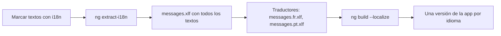

Tu tienda funciona en España y ahora quiere vender en Francia y Brasil. Además, el equipo ha pasado de 2 a 12 personas: hay tres funcionalidades en marcha a la vez y cada semana alguien rompe algo de otro sin querer. Son dos problemas de crecimiento: hablar varios idiomas y trabajar muchas manos sobre el mismo código. Esta lección es un panorama de los dos.

> [!analogia]
> Un restaurante que se hace famoso. Para recibir turistas, traduce la carta: los platos son los mismos, cambian los textos (y los precios se escriben con coma o con punto según el país). Para crecer, deja de ser un cocinero que lo hace todo y pasa a tener partidas (carnes, postres) con normas comunes de cocina. Lo primero es la internacionalización; lo segundo, escalar el equipo.

## Internacionalización (i18n)

**i18n** es la abreviatura de *internationalization* (una i, 18 letras y una n): preparar la app para varios idiomas y regiones. Tiene dos partes.

**1. Formatos regionales.** Fechas, números y monedas cambian por país: `1,234.5` en EE. UU. es `1.234,5` en España. Los pipes `date`, `number` y `currency` (módulo 9) ya lo resuelven con el `LOCALE_ID`.

**2. Traducir los textos.** Angular trae su propia solución en el paquete `@angular/localize`:

```bash
ng add @angular/localize
```

Marcas los textos que hay que traducir con el atributo `i18n` en las plantillas, o con `$localize` en el código TypeScript:

```html
<h1 i18n="Título de la portada">Bienvenido a la tienda</h1>
<button i18n>Añadir al carrito</button>
```

```typescript
const aviso = $localize`Producto añadido al carrito`;
```

El flujo de trabajo es:



- `ng extract-i18n` recorre el código y crea un archivo `messages.xlf` (un formato estándar de traducción) con cada texto marcado.
- Los traductores crean una copia por idioma con las traducciones.
- `ng build --localize` compila **una versión de la app por idioma**, cada una en su subcarpeta (`es/`, `fr/`…), con los textos ya sustituidos. No hay que descargar traducciones al arrancar: la app francesa ya está escrita en francés.

La contrapartida: para cambiar de idioma hay que cargar **otra** versión de la app (otra URL). Si necesitas cambiar de idioma al vuelo sin recargar, hay librerías externas que traducen en tiempo de ejecución (Transloco o ngx-translate son las más conocidas). Ninguna opción es «la buena»: depende de si prefieres rendimiento y SEO por idioma, o cambiar de idioma sin recargar.

> [!idea]
> Aunque hoy tu app solo hable español, escribir los textos marcados con `i18n` desde el principio cuesta poco. Añadirlo después a 300 plantillas es un proyecto entero.

## Escalar el equipo

Cuando muchas personas tocan el mismo código, la arquitectura deja de ser una opinión y pasa a ser un **acuerdo escrito y comprobado por máquinas**. Lo que suele funcionar:

- **Una estructura conocida por todos** (lección 1): `core/`, `shared/`, `features/`. Cada funcionalidad tiene un equipo o una persona responsable. Así sabes a quién preguntar y los cambios de un equipo rara vez pisan a otro.
- **Formato automático.** El proyecto ya trae Prettier (`.prettierrc`). Si todos formatean igual, las revisiones de código hablan de lógica y no de espacios.
- **Un linter.** ESLint con las reglas de Angular (`ng add angular-eslint`) avisa de errores comunes y del estilo de Angular. Con herramientas como Nx, o con reglas de ESLint de *imports*, también puede **prohibir** que una *feature* importe otra.
- **Pruebas en cada cambio** (módulo 18) e **integración continua** (módulo 21): nada entra en la rama principal sin pasar `lint`, `test` y `build`.
- **Revisión de código** (*pull requests*): al menos otra persona lee cada cambio. Es el mejor momento para detectar un `bypassSecurityTrustHtml` sospechoso o una dependencia entre *features*.
- **Decisiones escritas.** Un documento corto por cada decisión importante («usamos signals para el estado, no NgRx, porque…») evita repetir la misma discusión cada seis meses.
- **La guía de estilo de Angular** (en angular.dev) como base común, en vez de inventar convenciones propias.

> [!cuidado]
> No copies la arquitectura de una empresa de 500 personas para un equipo de 3. Monorepos con 40 librerías, capas y más capas, reglas para todo… cuestan tiempo de mantener. Empieza simple (carpetas por funcionalidad y un linter) y añade estructura cuando duela su ausencia.

> [!prueba]
> En tu proyecto, ejecuta `ng lint`. Si no tienes linter, la CLI te dirá cómo añadirlo (`ng add angular-eslint`). Añádelo, vuelve a ejecutar `ng lint` y lee los avisos que te da sobre tu propio código.

> [!resumen]
> - i18n tiene dos partes: formatos regionales (pipes y `LOCALE_ID`) y traducción de textos.
> - `@angular/localize` marca textos con `i18n` y `$localize`, los extrae con `ng extract-i18n` y compila una app por idioma con `ng build --localize`.
> - Para escalar un equipo: estructura común, formato y lint automáticos, pruebas y CI, revisiones de código y decisiones escritas.
> - Añade complejidad solo cuando el tamaño del proyecto la justifique.
