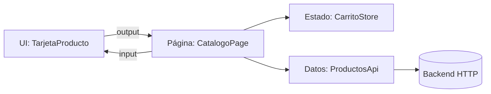

Tu tienda tiene una tarjeta de producto. Al principio la tarjeta lo hace todo: pide el producto a la API, guarda el carrito, calcula el precio con descuento y pinta el resultado. Funciona. Hasta que te piden la misma tarjeta en la lista de deseos (con otros datos), en el correo de ofertas (sin botón) y en las pruebas (sin servidor). Cada vez tienes que tocar el componente entero, y cada cambio rompe otra pantalla.

El problema es que el componente **sabe demasiado**. La solución es separar dos papeles.

> [!analogia]
> Un restaurante. El **camarero** sabe a qué cocina pedir, qué mesa espera qué plato y cuándo cobrar. El **plato** solo sabe presentarse bien: no sabe de dónde viene ni quién lo comerá. Puedes servir el mismo plato en la terraza o en un catering sin cambiarlo. Los componentes contenedores son camareros; los de presentación, platos.

## Componentes de presentación

Un componente de presentación (también *dumb* o «tonto», o simplemente *UI*) **recibe datos por `input()` y avisa de lo que pasa por `output()`**. No inyecta servicios de datos ni sabe de dónde vienen las cosas.

```typescript
// src/app/features/productos/ui/tarjeta-producto.ts
import { CurrencyPipe } from '@angular/common';
import { Component, input, output } from '@angular/core';
import { Producto } from '../data/producto';

@Component({
  selector: 'app-tarjeta-producto',
  imports: [CurrencyPipe],
  template: `
    <h3>{{ producto().nombre }}</h3>
    <p>{{ producto().precio | currency: 'EUR' }}</p>
    <button (click)="anadir.emit(producto())">Añadir al carrito</button>
  `,
})
export class TarjetaProducto {
  readonly producto = input.required<Producto>();
  readonly anadir = output<Producto>();
}
```

- `input.required<Producto>()`: el producto llega desde fuera. Sin él, el componente no se puede usar.
- `output<Producto>()`: cuando el usuario pulsa el botón, la tarjeta **no** añade nada al carrito. Solo avisa: «han pedido añadir este producto». Quién lo use decidirá qué hacer.
- Los imports solo traen cosas de presentación (`CurrencyPipe`, de `@angular/common`, para formatear el precio).

Se ve así:

```pantalla
@url localhost:4200/productos
<h3>Taza de cerámica</h3>
<p>€12.50</p>
<button>Añadir al carrito</button>
```

## Componentes contenedores

Un contenedor (*smart*, o «página» cuando lo carga el router) **obtiene los datos, guarda el estado y reacciona a los eventos**. Casi no tiene HTML propio: junta piezas de presentación.

```typescript
// src/app/features/productos/pages/catalogo-page.ts
import { Component, inject } from '@angular/core';
import { toSignal } from '@angular/core/rxjs-interop';
import { CarritoStore } from '../data/carrito-store';
import { Producto } from '../data/producto';
import { ProductosApi } from '../data/productos-api';
import { TarjetaProducto } from '../ui/tarjeta-producto';

@Component({
  selector: 'app-catalogo-page',
  imports: [TarjetaProducto],
  template: `
    <h2>Catálogo</h2>
    <p>Total del carrito: {{ carrito.total() }} €</p>
    @for (producto of productos(); track producto.id) {
      <app-tarjeta-producto [producto]="producto" (anadir)="alAnadir($event)" />
    }
  `,
})
export class CatalogoPage {
  private readonly api = inject(ProductosApi);
  protected readonly carrito = inject(CarritoStore);
  protected readonly productos = toSignal(this.api.listar(), { initialValue: [] });

  protected alAnadir(producto: Producto): void {
    this.carrito.anadir(producto);
  }
}
```

- Inyecta dos servicios: `ProductosApi` (habla con el backend) y `CarritoStore` (guarda el estado del carrito).
- `toSignal` (de `@angular/core/rxjs-interop`, módulo 14) convierte el *observable* de la API en un signal que la plantilla puede leer.
- Pasa cada producto a una tarjeta con `[producto]` y escucha su aviso con `(anadir)`. Cuando llega, decide qué hacer: añadirlo al carrito.

## Las capas

Detrás del contenedor hay más papeles separados. En una app mediana es habitual tener tres capas:



```typescript
// src/app/features/productos/data/productos-api.ts
import { HttpClient } from '@angular/common/http';
import { Service, inject } from '@angular/core';
import { Observable } from 'rxjs';
import { Producto } from './producto';

@Service()
export class ProductosApi {
  private readonly http = inject(HttpClient);

  listar(): Observable<Producto[]> {
    return this.http.get<Producto[]>('/api/productos');
  }
}
```

```typescript
// src/app/features/productos/data/carrito-store.ts
import { Service, computed, signal } from '@angular/core';
import { Producto } from './producto';

@Service()
export class CarritoStore {
  private readonly _lineas = signal<Producto[]>([]);

  readonly lineas = this._lineas.asReadonly();
  readonly total = computed(() => this._lineas().reduce((suma, p) => suma + p.precio, 0));

  anadir(producto: Producto): void {
    this._lineas.update((lineas) => [...lineas, producto]);
  }
}
```

- **Datos** (`ProductosApi`): la única pieza que conoce las URL y el formato del backend. Si mañana la API cambia de `/api/productos` a `/v2/catalogo`, solo cambia este archivo.
- **Estado** (`CarritoStore`): guarda la información en signals privados y la expone de solo lectura, con métodos para cambiarla (módulo 15).
- **UI**: no sabe que existen las otras dos.

`@Service()` es el decorador con el que la CLI de Angular 22 genera los servicios (módulo 10). En código anterior verás `@Injectable({ providedIn: 'root' })`, que hace lo mismo.

> [!idea]
> La regla de oro: **los datos bajan por `input()`, los eventos suben por `output()`**. Si un componente de presentación necesita inyectar `HttpClient` o un *store*, probablemente está haciendo el trabajo de un contenedor.

> [!cuidado]
> No lleves la separación al extremo. Un componente pequeño que solo se usa en un sitio y no tiene lógica no necesita dividirse en contenedor y presentación «por si acaso». Separa cuando lo pida el código: cuando quieras reutilizar la vista, probarla sin servidor o cuando el componente crezca demasiado.

> [!prueba]
> En tu proyecto, busca un componente que inyecte un servicio **y** tenga mucho HTML. Saca la parte visual a un componente nuevo con `ng g c`, pásale los datos con `input()` y devuelve los clics con `output()`. Comprueba que la pantalla se ve igual.

> [!resumen]
> - Los componentes de presentación reciben `input()`, emiten `output()` y no inyectan servicios de datos.
> - Los contenedores (o páginas) obtienen los datos, guardan el estado y reaccionan a los eventos.
> - Separa también datos (servicio de API) y estado (*store* con signals): cada capa cambia por un motivo distinto.
> - Datos hacia abajo, eventos hacia arriba.
