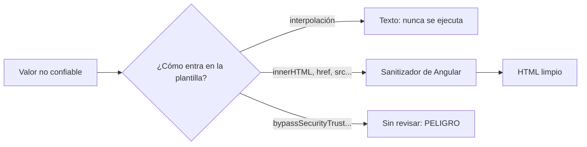

Tu tienda deja escribir reseñas de los productos. Un día alguien escribe esta «reseña»:

```html
¡Me encanta!
```

Si tu página insertara ese texto tal cual como HTML, el navegador intentaría cargar la imagen `x`, fallaría y ejecutaría el `onerror`: enviaría las cookies de **cada visitante** que lea la reseña a un servidor ajeno. Esto se llama **XSS** (*Cross-Site Scripting*): un atacante consigue que su JavaScript se ejecute en tu página, con los permisos de tus usuarios.

La buena noticia: Angular te protege por defecto. La mala: puedes desactivar esa protección sin darte cuenta.

> [!analogia]
> Un buzón de sugerencias en una oficina. Si el conserje lee en voz alta cada nota **como texto**, una nota que diga «abre la caja fuerte» no pasa de ser una frase. El peligro aparece si alguien trata las notas como **órdenes**. Angular, por defecto, lee todo como texto.

## Interpolar es seguro

```typescript
// src/app/comentario.ts
import { Component } from '@angular/core';

@Component({
  selector: 'app-comentario',
  template: `
    <p>{{ comentario }}</p>
    <p [innerHTML]="comentario"></p>
  `,
})
export class Comentario {
  comentario = '<b>Hola</b> Ada<script>alert("te robo")</script>';
}
```

```pantalla
@url localhost:4200/
<p>&lt;b&gt;Hola&lt;/b&gt; Ada&lt;script&gt;alert("te robo")&lt;/script&gt;</p>
<p><b>Hola</b> Ada</p>
```

- **`{{ comentario }}`** inserta el valor como **texto**. Los `<` y `>` se ven como caracteres: nada se interpreta. Es lo que usarás el 99 % de las veces.
- **`[innerHTML]="comentario"`** inserta el valor como **HTML**. Aun así, Angular lo **sanea** (*sanitiza*) antes: quita todo lo peligroso (`<script>`, atributos `on…`, URL `javascript:`) y deja lo inofensivo (`<b>`). En la consola aparece el aviso:

```text
WARNING: sanitizing HTML stripped some content, see https://angular.dev/best-practices/security#preventing-cross-site-scripting-xss
```



## La puerta trasera: bypassSecurityTrust*

A veces el sanitizador quita algo que tú quieres: un `<iframe>` de vídeo, un `style`. Angular ofrece el servicio `DomSanitizer` (de `@angular/platform-browser`) con métodos para saltarse la revisión: `bypassSecurityTrustHtml`, `bypassSecurityTrustUrl`, `bypassSecurityTrustResourceUrl`, `bypassSecurityTrustStyle` y `bypassSecurityTrustScript`.

```typescript
// Así NO
protected readonly seguro = computed(() =>
  this.sanitizer.bypassSecurityTrustHtml(this.html()),
);
```

El nombre lo dice todo: **bypass**, «saltarse». Le estás diciendo a Angular «confía en este valor, yo respondo». Si ese valor viene, aunque sea en parte, de un usuario, de la URL o de una API que no controlas, acabas de abrir la puerta al XSS.

> [!cuidado]
> Usa `bypassSecurityTrust*` solo con valores que **tú** escribiste en el código (una URL de vídeo fija) y nunca con datos de usuarios. Si necesitas mostrar HTML enriquecido escrito por usuarios (por ejemplo, Markdown), conviértelo y límpialo con una librería de saneado, y deja que Angular lo sanee también con `[innerHTML]`. Revisa con lupa cualquier `bypassSecurityTrust` en una revisión de código.

Tampoco pases por encima de Angular manipulando el DOM a mano: `elementRef.nativeElement.innerHTML = texto` **no** pasa por el sanitizador.

## CSRF: peticiones en tu nombre

**CSRF** (*Cross-Site Request Forgery*) es otro ataque: una web maliciosa hace que tu navegador envíe una petición a tu banco (por ejemplo, un formulario oculto que se envía solo). El navegador adjunta tus cookies de sesión y el banco cree que la petición es tuya.

La defensa habitual es un **token** que el servidor guarda en una cookie y que el cliente debe devolver en una cabecera: una web ajena no puede leer esa cookie, así que no puede copiar el token. `HttpClient` lo hace por ti: si el servidor pone una cookie `XSRF-TOKEN`, Angular la copia en la cabecera `X-XSRF-TOKEN` de las peticiones que modifican datos (POST, PUT, DELETE…) a tu propio dominio. Si tu backend usa otros nombres, se configuran con `provideHttpClient(withXsrfConfiguration({ cookieName: '…', headerName: '…' }))`. La otra mitad, comprobar el token, la hace el servidor.

## Nada de secretos en el frontend

Todo el código de tu app Angular **se descarga en el navegador** de cada visitante. Cualquiera puede abrir las herramientas de desarrollo y leerlo, aunque esté minificado. Por tanto:

- Nunca pongas en el código (ni en `environment.ts`, módulo 21) claves privadas de APIs, contraseñas de bases de datos o tokens de servicios de pago.
- Las comprobaciones de permisos del frontend (un *guard*, ocultar un botón) son **comodidad**, no seguridad. El backend debe comprobar siempre, en cada petición, que el usuario puede hacer lo que pide.
- Si necesitas llamar a una API con clave secreta, hazlo desde tu servidor (por ejemplo, el `server.ts` del módulo 19) y que tu app llame a tu servidor.

> [!prueba]
> En tu proyecto, crea un componente con `texto = '<i>hola</i>'` y muéstralo de las dos formas: con `{{ texto }}` y con `[innerHTML]="texto"`. Abre la consola (`F12`): verás el aviso de saneado y ninguna alerta. Inspecciona el ``: no tiene `onerror`.

> [!resumen]
> - XSS es conseguir que JavaScript ajeno se ejecute en tu página. Angular trata todo como no confiable por defecto.
> - La interpolación `{{ }}` siempre inserta texto; `[innerHTML]` sanea el HTML antes de insertarlo.
> - `bypassSecurityTrust*` desactiva esa protección: nunca con datos de usuarios.
> - `HttpClient` ayuda contra CSRF con el token `XSRF-TOKEN`; y en el frontend no hay secretos: el backend decide los permisos.
