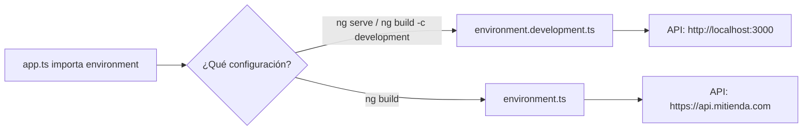

Mientras desarrollas, tu app habla con un backend en tu ordenador: `http://localhost:3000`. En producción tiene que hablar con `https://api.mitienda.com`. No quieres cambiar la URL a mano antes de cada publicación (un día se te olvidará y publicarás una app que llama a `localhost`). Necesitas que la URL **dependa del tipo de build**.

Para eso existen los **entornos** (*environments*): archivos con la configuración de cada entorno, que el build intercambia automáticamente.

> [!analogia]
> Un actor con dos vestuarios: uno para los ensayos y otro para el estreno. El guion (tu código) no cambia. El regidor (el build) le pone un vestuario u otro según la función. Y el actor no tiene que acordarse de cambiarse.

## Crearlos

Los proyectos nuevos de Angular 22 no traen entornos. Se crean con:

```bash
ng generate environments
```

```text
CREATE src/environments/environment.ts (31 bytes)
CREATE src/environments/environment.development.ts (31 bytes)
UPDATE angular.json (2100 bytes)
```

Los dos archivos nacen casi vacíos:

```typescript
// src/environments/environment.ts
export const environment = {};
```

Y en `angular.json`, dentro de la configuración `development` del build, aparece esto:

```json
"development": {
  "optimization": false,
  "extractLicenses": false,
  "sourceMap": true,
  "fileReplacements": [
    {
      "replace": "src/environments/environment.ts",
      "with": "src/environments/environment.development.ts"
    }
  ]
}
```

`fileReplacements` significa: «cuando compiles en `development`, cada vez que alguien importe `environment.ts`, usa en su lugar `environment.development.ts`». En `production` no hay reemplazo, así que se usa `environment.ts` tal cual. Por eso **`environment.ts` es el de producción**.

## Rellenarlos

Los dos archivos deben tener **la misma forma** (las mismas propiedades), solo con valores distintos:

```typescript
// src/environments/environment.ts
export const environment = {
  produccion: true,
  apiUrl: 'https://api.mitienda.com',
};
```

```typescript
// src/environments/environment.development.ts
export const environment = {
  produccion: false,
  apiUrl: 'http://localhost:3000',
};
```

Y en tu código **siempre** importas `environment` (nunca `environment.development`):

```typescript
// src/app/app.ts
import { Component } from '@angular/core';
import { environment } from '../environments/environment';

@Component({
  selector: 'app-root',
  template: `<p>API: {{ api }}</p>`,
})
export class App {
  protected readonly api = environment.apiUrl;
}
```



Con `ng serve`:

```pantalla
@url localhost:4200/
<p>API: http://localhost:3000</p>
```

Y en la versión publicada, compilada con `ng build`:

```pantalla
@url mitienda.com/
<p>API: https://api.mitienda.com</p>
```

El reemplazo ocurre **al compilar**. En el `main-….js` de producción solo está la URL de producción; la de desarrollo ni siquiera aparece.

> [!cuidado]
> Los entornos **no son secretos**. Todo lo que pongas en `environment.ts` acaba dentro del JavaScript que descarga cualquier visitante. Una URL pública o el nombre de la app, sí. Una clave privada de una API o una contraseña, **nunca** (módulo 20).

## Más entornos y otra alternativa

Puedes tener más: por ejemplo `environment.staging.ts` (un entorno de pruebas antes de producción). Crea el archivo, añade una configuración `staging` en `angular.json` con su `fileReplacements` y compila con `ng build -c staging`.

Ten en cuenta una limitación: como el valor se fija al compilar, para cambiar la URL de la API tienes que **volver a compilar**. Si necesitas desplegar el mismo build en varios sitios con URLs distintas, la alternativa es cargar la configuración al arrancar, desde un archivo JSON en `public/` (por ejemplo `config.json`) que cada servidor sirve con sus valores.

> [!prueba]
> En tu proyecto, ejecuta `ng generate environments`, añade `apiUrl` a los dos archivos con valores distintos y muéstralo en `app.html`. Mira el resultado con `ng serve`. Después ejecuta `ng build`, abre `dist/<app>/browser/main-….js` con el editor y busca las dos URLs: solo encontrarás la de producción.

> [!resumen]
> - `ng generate environments` crea `environment.ts` y `environment.development.ts` y añade `fileReplacements` a la configuración `development`.
> - En el código se importa siempre `environment`; el build lo sustituye según la configuración.
> - `environment.ts` es el de producción; los dos archivos deben tener las mismas propiedades.
> - Los valores quedan dentro del JavaScript público: nada de secretos.
