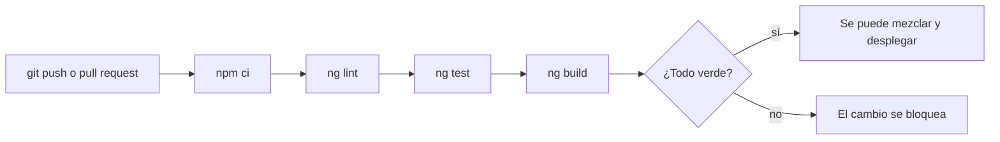

Montar y mantener tu propio servidor con nginx está bien, pero para muchas apps es más trabajo del necesario. Una app Angular sin SSR son **archivos estáticos**: HTML, JS, CSS e imágenes. Y hay servicios especializados en servir archivos estáticos rápido, desde servidores repartidos por todo el mundo, con HTTPS incluido y, muchas veces, gratis para proyectos pequeños.

Y una vez publicada, surge la segunda pregunta: ¿cómo te aseguras de que cada cambio que publicas compila, pasa las pruebas y no rompe nada? Publicar «a mano desde mi portátil» funciona hasta el día en que se te olvida ejecutar las pruebas.

> [!analogia]
> Un hosting estático es una empresa de mensajería con almacenes en cada ciudad: dejas tu paquete una vez y ellos lo entregan desde el almacén más cercano a cada cliente. La integración continua es el control de calidad de la fábrica: ninguna caja sale sin pasar por la báscula y el escáner, aunque el encargado tenga prisa.

## Hostings estáticos

Algunos de los más usados (todos ofrecen un plan gratuito para empezar):

| Servicio | Cómo se publica | Fallback de SPA |
| --- | --- | --- |
| **Firebase Hosting** (Google) | `ng add @angular/fire` y `ng deploy`, o su CLI | `rewrites` a `/index.html` en `firebase.json` |
| **Netlify** | Conectando el repositorio de GitHub; compila en cada *push* | Archivo `_redirects` con `/* /index.html 200` |
| **Vercel** | Conectando el repositorio; detecta Angular | Lo configura solo para Angular |
| **GitHub Pages** | `ng add angular-cli-ghpages` y `ng deploy` | Truco: copiar `index.html` como `404.html` |
| **Cloudflare Pages** | Conectando el repositorio | Lo hace solo si no hay un `404.html` |

Todos piden lo mismo: el **comando de build** (`npm run build`) y la **carpeta que se publica** (`dist/mi-app/browser`). Y todos necesitan el fallback a `index.html` de la lección anterior; cada uno lo configura a su manera.

## ng deploy

La CLI tiene un comando para publicar, pero no sabe publicar en ningún sitio por sí sola. Si lo ejecutas en un proyecto recién creado:

```bash
ng deploy
```

```text
Cannot find "deploy" target for the specified project.
You can add a package that implements these capabilities.

For example:
  Amazon S3: ng add @jefiozie/ngx-aws-deploy
  Firebase: ng add @angular/fire
  Netlify: ng add @netlify-builder/deploy
  GitHub Pages: ng add angular-cli-ghpages
```

Cada paquete de `ng add` añade un *target* `deploy` a `angular.json`. Después, `ng deploy` compila y sube la app a ese servicio.

Si tu app usa **SSR** (módulo 19), ya no es solo estática: necesita un servidor Node.js. Firebase App Hosting, Netlify, Vercel, Cloud Run o cualquier servidor con Node pueden ejecutarla; el `server.ts` exporta `reqHandler` precisamente para que estas plataformas lo arranquen a su manera.

## Integración continua (CI)

La **integración continua** (*Continuous Integration*, CI) es un servidor que, cada vez que alguien sube código al repositorio, lo descarga en una máquina limpia y ejecuta los mismos pasos: instalar, revisar, probar y compilar. Si algo falla, el cambio se marca en rojo y no se mezcla.



Con **GitHub Actions** (la CI integrada en GitHub), se describe en un archivo YAML dentro de `.github/workflows/`:

```text
# .github/workflows/ci.yml
name: CI

on:
  push:
    branches: [main]
  pull_request:

jobs:
  build:
    runs-on: ubuntu-latest
    steps:
      - uses: actions/checkout@v4
      - uses: actions/setup-node@v4
        with:
          node-version: 22
          cache: npm
      - run: npm ci
      - run: npx ng lint
      - run: npx ng test --watch=false
      - run: npx ng build
```

- `on`: cuándo se ejecuta. En cada `push` a `main` y en cada *pull request*.
- `runs-on: ubuntu-latest`: una máquina Linux limpia, nueva cada vez.
- `actions/checkout`: descarga tu código. `actions/setup-node`: instala Node.js 22 y guarda en caché las descargas de npm.
- `npm ci`: instala **exactamente** lo que dice `package-lock.json`. Nunca `npm install` en CI: podría instalar otras versiones.
- `ng lint`: revisa el estilo y los errores comunes. Necesita un linter instalado (`ng add angular-eslint`); sin él, quita este paso.
- `ng test --watch=false`: ejecuta las pruebas de Vitest **una vez** y termina. Sin `--watch=false` se quedaría esperando cambios para siempre.
- `ng build`: compila en producción. Si los *budgets* fallan, falla aquí.

Si los cuatro pasos pasan, puedes añadir un último paso que despliegue (con `ng deploy` o con la herramienta del hosting). A eso se le llama **despliegue continuo** (CD).

> [!cuidado]
> Si el despliegue necesita una contraseña o un token (para Firebase, para un servidor…), no la escribas en el YAML: el repositorio la vería todo el mundo con acceso. Guárdala como **secreto** del repositorio (en GitHub: Settings → Secrets) y úsala como `${{ secrets.MI_TOKEN }}`.

> [!prueba]
> Si tu proyecto está en GitHub, crea el archivo `.github/workflows/ci.yml` de arriba (quita la línea de `ng lint` si no tienes linter), haz *commit* y *push*, y abre la pestaña **Actions** del repositorio. Verás cada paso ejecutándose. Después rompe una prueba a propósito y sube el cambio: el círculo se pondrá rojo.

> [!resumen]
> - Una app Angular sin SSR es estática: cualquier hosting estático la sirve (Firebase, Netlify, Vercel, GitHub Pages…), siempre con fallback a `index.html`.
> - `ng deploy` necesita un paquete que añada el target `deploy` (`ng add @angular/fire`, `angular-cli-ghpages`…).
> - La CI ejecuta en cada cambio `npm ci`, `ng lint`, `ng test --watch=false` y `ng build` en una máquina limpia.
> - Los tokens de despliegue van en los secretos del repositorio, nunca en el código.
