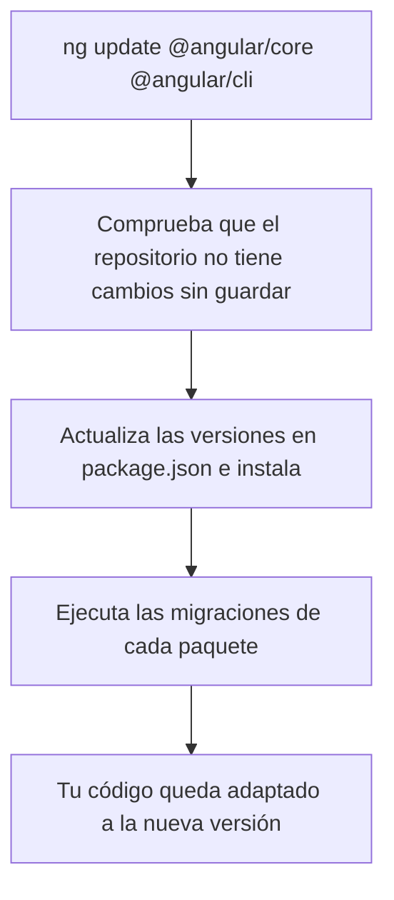

Angular publica una **versión mayor** cada seis meses (la 21, la 22, la 23…), con versiones menores y parches entre medias. Cada versión mayor tiene unos 18 meses de soporte: después deja de recibir arreglos, incluidos los de seguridad. Si tu app se queda en una versión vieja, cada año será más difícil ponerla al día: las librerías nuevas ya no la soportan y los cambios se acumulan.

La buena noticia es que Angular tiene una herramienta que no solo cambia los números de versión, sino que **reescribe tu código** para adaptarlo: `ng update`.

> [!analogia]
> Una mudanza con una empresa que, además de transportar los muebles, los adapta a la casa nueva: acorta las patas de la mesa si el techo es más bajo, cambia los enchufes al tipo del país nuevo. `npm install` solo transporta; `ng update` transporta y adapta.

## Ver qué hay que actualizar

Dentro de tu proyecto, sin argumentos:

```bash
ng update
```

Si todo está al día:

```text
Using package manager: npm
Collecting installed dependencies...
Found 15 dependencies.
We analyzed your package.json and everything seems to be in order. Good work!
```

Si hay versiones nuevas, te muestra una tabla con cada paquete, su versión actual, la nueva y el comando para actualizarlo.

## Actualizar

```bash
ng update @angular/core @angular/cli
```

Esto hace tres cosas en orden:



1. **Comprueba Git.** Si tienes cambios sin hacer *commit*, se niega a continuar (salvo con `--allow-dirty`). Así siempre puedes deshacer la actualización.
2. **Actualiza** `package.json` y ejecuta la instalación.
3. **Ejecuta las migraciones**: pequeños programas (*schematics*) que vienen con cada versión y modifican tu código. Por ejemplo, cuando Angular introdujo el control de flujo `@if`, una migración convertía los `*ngIf`; cuando cambió el nombre de una opción en `angular.json`, otra la renombraba. Al terminar, la terminal te lista qué migraciones se ejecutaron y qué archivos tocaron.

Con `--create-commits` (o `-C`) hace un *commit* por cada migración, para que puedas revisar los cambios uno a uno.

> [!cuidado]
> Actualiza **de una versión mayor en una**: de la 20 a la 21, prueba, y de la 21 a la 22. Saltar varias de golpe se salta migraciones intermedias y los errores se mezclan. Si tu proyecto está en la 19, son tres actualizaciones seguidas, no una. Para cada salto, la guía oficial en `angular.dev/update-guide` te dice los pasos manuales que la herramienta no puede hacer por ti.

## Las demás librerías

Las librerías del ecosistema de Angular (Angular Material, `@angular/fire`, NgRx…) también traen migraciones y se actualizan igual: `ng update @angular/material`. Suelen publicar su versión compatible pocos días después de cada versión de Angular. Las demás dependencias (por ejemplo, una librería de gráficos) se actualizan con npm: `npm outdated` te dice cuáles tienen versiones nuevas.

## Una rutina segura

1. Rama nueva en Git: `git switch -c actualizar-angular-23`.
2. `ng update` para ver el estado, y `ng update @angular/core @angular/cli` para subir **una** versión mayor.
3. Lee el resumen de las migraciones y revisa los cambios con `git diff`.
4. `ng build` y `ng test --watch=false`. Arregla lo que falle.
5. Prueba la app a mano con `ng serve`: las pantallas principales y los formularios.
6. *Pull request*: la CI (lección anterior) vuelve a comprobarlo todo.
7. Repite para la siguiente librería o la siguiente versión.

> [!prueba]
> En tu proyecto, haz *commit* de todo y ejecuta `ng update`. Lee la tabla (o el mensaje de «todo en orden»). Después ejecuta `ng version` para ver qué versión exacta de cada paquete de Angular tienes instalada.

> [!resumen]
> - Angular saca una versión mayor cada seis meses; quedarse atrás complica cada actualización.
> - `ng update` sin argumentos muestra qué se puede actualizar; con paquetes, actualiza y ejecuta migraciones que adaptan tu código.
> - Actualiza de una versión mayor en una, con el repositorio limpio y en una rama.
> - Después: revisar el diff, compilar, probar y dejar que la CI lo confirme.
