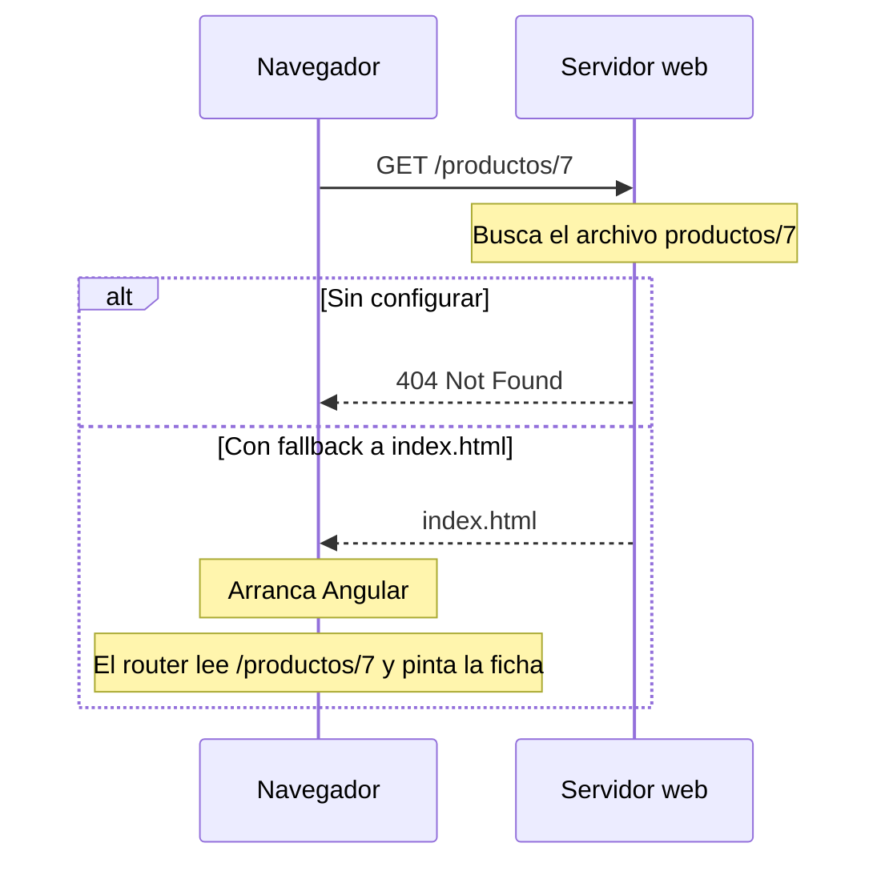

Subes el contenido de `dist/mi-app/browser/` a un servidor. Abres `https://mitienda.com` y todo funciona: navegas a «Productos», a la ficha de una taza… Entonces copias la dirección `https://mitienda.com/productos/7`, la pegas en otra pestaña y aparece:

```pantalla
@url mitienda.com/productos/7
<h1>404 Not Found</h1>
<hr>
<p>nginx</p>
```

¿Por qué funciona al navegar y falla al entrar directamente?

## El problema: una sola página de verdad

Tu app es una **SPA** (*Single Page Application*, módulo 1): en el servidor solo hay **un** HTML, `index.html`. Cuando navegas desde dentro de la app, el router de Angular cambia la URL de la barra de direcciones **sin pedir nada al servidor**. Pero al pegar la URL en otra pestaña, el navegador sí pide `/productos/7` al servidor, y el servidor busca un archivo llamado `productos/7`… que no existe.



La solución es configurar el servidor con un **fallback** (plan B): «si piden un archivo que existe (`main-….js`, `favicon.ico`), envíalo; si no, envía `index.html`». Angular arranca, el router mira la URL y pinta la pantalla correcta. La página 404 de verdad la decide tu ruta `'**'` de Angular.

> [!analogia]
> Un edificio de oficinas con una sola recepción. Si un mensajero pregunta por «planta 3, despacho 7», el portero no le dice «aquí no hay ningún despacho 7»: lo manda a recepción, y la recepcionista (el router) sabe a dónde llevarlo.

## nginx

**nginx** es uno de los servidores web más usados. Esta es una configuración mínima para una app Angular:

```text
# nginx.conf
server {
  listen 80;
  root /usr/share/nginx/html;
  index index.html;

  location / {
    try_files $uri $uri/ /index.html;
  }

  location ~* \.(js|css|ico|png|svg|woff2)$ {
    expires 1y;
    add_header Cache-Control "public, immutable";
  }
}
```

- `listen 80`: escucha en el puerto 80, el de HTTP.
- `root`: la carpeta donde están los archivos de `dist/mi-app/browser/`.
- `try_files $uri $uri/ /index.html`: la línea clave. Prueba el archivo pedido (`$uri`), después una carpeta con ese nombre (`$uri/`) y, si no existe ninguno, envía `/index.html`.
- El segundo `location` dice que los archivos estáticos se pueden cachear un año. Es seguro gracias a los hashes en los nombres (lección 1). `index.html` no entra en esta regla: debe pedirse siempre de nuevo para descubrir los nombres nuevos.

## Base href: publicar en una subcarpeta

¿Y si tu app no vive en la raíz del dominio, sino en `https://miempresa.com/tienda/`? Recuerda la etiqueta de `index.html` (módulo 4):

```html
<base href="/" />
```

Le dice al navegador y al router dónde empieza la app. Si la dejas en `/`, la página pedirá `/main-….js` en vez de `/tienda/main-….js` y no cargará nada. Se cambia al compilar:

```bash
ng build --base-href /tienda/
```

Y el `index.html` de `dist/` queda así:

```html
<base href="/tienda/">
```

(Fíjate en las dos barras, delante y detrás: sin la última, las rutas relativas se calculan mal.) El fallback del servidor también debe apuntar a `/tienda/index.html`.

## Docker: el servidor en una caja

**Docker** empaqueta una aplicación con todo lo que necesita para ejecutarse (sistema, servidor, archivos) en una **imagen** que funciona igual en tu portátil y en cualquier nube. Un `Dockerfile` es la receta para construir esa imagen. Este usa dos **etapas** (*multi-stage*): una con Node.js para compilar y otra, mucho más pequeña, solo con nginx para servir:

```text
# Dockerfile
FROM node:22-alpine AS build
WORKDIR /app
COPY package.json package-lock.json ./
RUN npm ci
COPY . .
RUN npm run build

FROM nginx:alpine
COPY nginx.conf /etc/nginx/conf.d/default.conf
COPY --from=build /app/dist/mi-app/browser /usr/share/nginx/html
EXPOSE 80
```

- **Etapa 1 (`build`)**: parte de una imagen con Node.js 22. Copia primero solo `package.json` y `package-lock.json` y ejecuta `npm ci` (instala exactamente las versiones del *lock*, módulo 3). Copiarlos antes que el resto permite a Docker reutilizar esa capa si solo cambia tu código. Después copia todo y compila.
- **Etapa 2**: parte de nginx, copia la configuración de arriba y, de la etapa 1, **solo** la carpeta `browser/`. Node.js, `node_modules` y tu código fuente se quedan fuera: la imagen final pesa unos pocos megas.

```bash
docker build -t mi-tienda .
docker run -p 8080:80 mi-tienda
```

Abre `http://localhost:8080/productos/7`: esta vez la ficha aparece.

> [!cuidado]
> Añade un archivo `.dockerignore` con `node_modules`, `dist` y `.angular`. Si no, `COPY . .` copia también tus `node_modules` locales (cientos de megas, y quizá compilados para otro sistema) dentro de la imagen.

> [!prueba]
> En tu proyecto, ejecuta `ng build` y después `npx http-server dist/mi-app/browser` (un servidor estático sencillo, sin fallback). Navega por la app y luego recarga la página estando en una ruta interna: verás el error. Repite con `npx http-server dist/mi-app/browser --proxy "http://localhost:8080?"`, que sí reenvía las rutas desconocidas a `index.html`.

> [!resumen]
> - En una SPA solo existe `index.html`; las demás rutas las resuelve el router en el navegador.
> - El servidor debe devolver `index.html` para cualquier ruta que no sea un archivo (`try_files … /index.html` en nginx).
> - Si publicas en una subcarpeta, compila con `--base-href /subcarpeta/`.
> - Un `Dockerfile` de dos etapas compila con Node y sirve solo `dist/<app>/browser` con nginx.
